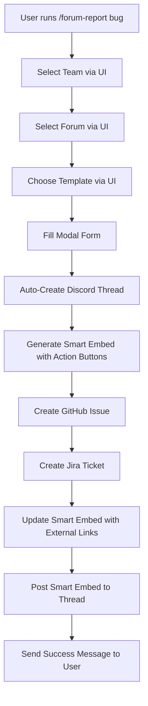

# 🚀 Enhanced Forum System with Smart Embeds & Unified Integration

## Overview

The Enhanced Forum System seamlessly integrates smart embeds and unified tracking into the existing forum-based issue reporting workflow. Users continue to use the familiar `/forum-report` command with UI-based selection, but now automatically get smart embeds with action buttons and unified GitHub/Jira integration.

## 🎯 Key Features

### 1. **Team-Based Forum Routing**

- **3 Core Teams**: Platform, Backend/AI, Plugin
- **7 Specialized Forums**: Team-specific channels for different issue types
- **Smart Filtering**: Automatically shows relevant forums based on issue type
- **Auto-Assignment**: Issues are automatically assigned to the appropriate team

### 2. **Smart Embeds with Action Buttons**

- **Dynamic Status Updates**: Real-time synchronization across platforms
- **Interactive Controls**: Assign, prioritize, comment, and close issues directly from Discord
- **External Links**: Direct access to GitHub issues and Jira tickets
- **Visual Indicators**: Priority levels, status badges, and team assignments

### 3. **Unified Platform Integration**

- **Discord**: Interactive forum threads with smart embeds
- **GitHub**: Automatically created issues with proper labels and assignments
- **Jira**: Synchronized tickets with custom fields and workflows
- **Real-time Sync**: Status updates propagate across all platforms

## 📋 Enhanced Commands

### `/forum-report` - Enhanced Team-Based Issue Creation

```bash
# Report a bug with team selection (now with smart embeds!)
/forum-report bug [team:frontend]

# Request a feature with team selection (now with unified tracking!)
/forum-report feature [team:backend]

# View all available forums and teams
/forum-report forums
```

**What's New:**

- **Same familiar UI** - No learning curve for existing users
- **Automatic smart embeds** - Every issue now gets interactive action buttons
- **Unified tracking** - GitHub and Jira issues created automatically
- **Real-time sync** - Status updates across all platforms
- **Auto-assignment** - Issues routed to correct teams automatically

### `/smart-forum-post` - Advanced Demo & Testing

```bash
# View demo of smart forum functionality
/smart-forum-post demo

# Advanced bug report (for testing)
/smart-forum-post bug forum:frontend-bugs title:"Login issue" priority:high

# Advanced feature request (for testing)
/smart-forum-post feature forum:backend-features title:"API enhancement" priority:medium
```

**Note:** The `/smart-forum-post` commands are primarily for demonstration and testing. Most users should use the enhanced `/forum-report` commands for the best experience.

## 🏗️ System Architecture

### Forum Configuration

```typescript
// Team Configuration
{
  id: 'frontend',
  name: 'Frontend Team',
  description: 'UI/UX development and design',
  color: 0x61dafb,
  emoji: '🎨',
  forums: ['frontend-bugs', 'frontend-features'],
  members: ['frontend-team', 'ui-designers']
}

// Forum Configuration
{
  id: 'frontend-bugs',
  name: '🎨 Frontend Bug Reports',
  description: 'UI/UX bugs and frontend issues',
  category: 'bug-reports',
  team: 'frontend',
  tags: [
    { name: 'ui-bug', emoji: '🎨' },
    { name: 'responsive', emoji: '📱' },
    { name: 'accessibility', emoji: '♿' }
  ],
  autoAssign: ['frontend-team'],
  labels: ['bug', 'frontend']
}
```

### Smart Embed Structure

```typescript
// Smart Embed with Action Buttons
{
  title: "🐛 Login button not working on mobile",
  description: "Detailed bug description...",
  fields: [
    { name: "📋 Type", value: "🐛 BUG", inline: true },
    { name: "⚡ Priority", value: "🟠 HIGH", inline: true },
    { name: "👥 Team", value: "🎨 Frontend Team", inline: true },
    { name: "📊 Status", value: "🟡 Open", inline: true, dynamic: true },
    { name: "🔗 External Links", value: "🐙 GitHub #1234\n🎫 PROJ-567" }
  ],
  actionButtons: [
    { id: "assign_issue", label: "👤 Assign", style: "Primary" },
    { id: "update_priority", label: "⚡ Priority", style: "Secondary" },
    { id: "add_comment", label: "💬 Comment", style: "Secondary" },
    { id: "close_issue", label: "✅ Close", style: "Success" }
  ]
}
```

## 🔧 Configuration

### Environment Variables

```env
# Forum Channel IDs - Set these to your Discord forum channel IDs
Note: DB-first mapping is recommended. Use `/setup forums set forum_id:<id> channel:<#forum>` and `/setup team add …` to configure forums and teams. The environment variables below are legacy and optional.
GENERAL_SUPPORT_CHANNEL_ID=1234567890123456789

# Team Role IDs - Set these to your Discord role IDs
Note: Team roles are created/linked via `/setup team add` or `/setup team role-set`. Role env IDs are no longer required.
INFRASTRUCTURE_ENGINEERS_ROLE_ID=1234567890123456789
ML_ENGINEERS_ROLE_ID=1234567890123456789
API_DEVELOPERS_ROLE_ID=1234567890123456789
SDK_DEVELOPERS_ROLE_ID=1234567890123456789
EXTENSION_DEVELOPERS_ROLE_ID=1234567890123456789

# Forum Settings
FORUM_AUTO_CREATE=false          # Set to 'true' to auto-create Discord forums
FORUM_AUTO_ASSIGN=true           # Auto-assign issues to teams
FORUM_NOTIFY_ASSIGNEES=true      # Notify team members of assignments
ENABLE_FORUM_SELECTION=true      # Enable forum selection UI
```

### 🏗️ Auto-Create Functionality

The system can automatically create Discord forum channels for you:

**To Enable Auto-Create:**

1. Set `FORUM_AUTO_CREATE=true` in your `.env` file
2. Restart the bot
3. Forums will be created automatically when the bot starts

**What Gets Created:**

- **Platform Bugs** - 🏗️ Platform Bug Reports
- **Platform Features** - 🚀 Platform Feature Requests
- **Backend/AI Bugs** - 🧠 Backend/AI Bug Reports
- **Backend/AI Features** - 🤖 Backend/AI Feature Requests
- **Plugin Bugs** - 🔌 Plugin Bug Reports
- **Plugin Features** - 🧩 Plugin Feature Requests
- **General Support** - ❓ General Support

**Forum Features:**

- Proper permissions for team access
- Pre-configured tags for categorization
- Team-specific descriptions and emojis
- Auto-assignment rules for team routing

### Custom Team/Forum Configuration

Edit `src/discord/components/ForumConfig.ts` to customize:

- Team definitions and descriptions
- Forum categories and routing
- Auto-assignment rules
- Labels and tags
- Priority mappings

## 🎮 Enhanced User Workflow

### 1. **Enhanced Issue Creation**



**Key Improvements:**

- **Same familiar UI** - Users continue using the existing interface
- **Automatic enhancement** - Smart embeds and unified tracking happen automatically
- **No learning curve** - Existing users don't need to change their workflow

### 2. **Issue Management**

- **Assign**: Click assign button → Select team member → Updates all platforms
- **Priority**: Click priority button → Select new priority → Syncs everywhere
- **Comment**: Click comment button → Add comment → Appears on all platforms
- **Close**: Click close button → Closes issue → Updates status everywhere

### 3. **Status Synchronization**

- Discord smart embed updates automatically
- GitHub issue status reflects Discord changes
- Jira ticket workflow follows Discord updates
- Real-time notifications to assigned team members

## 🔗 Integration Details

### GitHub Integration

- **Issue Creation**: Automatic with proper labels and assignments
- **Status Sync**: Discord actions update GitHub issue status
- **Comments**: Discord comments appear as GitHub issue comments
- **Labels**: Automatic labeling based on forum and priority
- **Assignees**: Team members automatically assigned

### Jira Integration

- **Ticket Creation**: Automatic with custom fields populated
- **Workflow Sync**: Discord status changes trigger Jira transitions
- **Field Mapping**: Priority, type, and team mapped to Jira fields
- **Comments**: Bidirectional comment synchronization
- **Sprint Integration**: Issues can be added to active sprints

### Discord Features

- **Forum Threads**: Organized by team and category
- **Smart Embeds**: Dynamic, interactive issue cards
- **Action Buttons**: Direct issue management from Discord
- **Notifications**: Team mentions and status updates
- **Search**: Easy issue discovery and filtering

## 📊 Benefits

### For Development Teams

- **Centralized Tracking**: All issues visible in one Discord location
- **Reduced Context Switching**: Manage issues without leaving Discord
- **Automatic Routing**: Issues go to the right team immediately
- **Real-time Updates**: Instant visibility into issue status

### For Project Managers

- **Unified Dashboard**: See all issues across platforms
- **Team Metrics**: Track team performance and workload
- **Priority Management**: Easy priority adjustment and tracking
- **Audit Trail**: Complete history across all platforms

### For Organizations

- **Improved Efficiency**: Faster issue resolution and communication
- **Better Collaboration**: Teams work together in shared spaces
- **Data Consistency**: Single source of truth across platforms
- **Scalable Process**: Easy to add new teams and forums

## 🚀 Getting Started

1. **Configure Environment**: Set up Discord channel and role IDs
2. **Customize Teams**: Edit ForumConfig.ts for your organization
3. **Deploy Commands**: Run `npm run deploy-commands`
4. **Create Forums**: Set up Discord forum channels (or enable auto-creation)
5. **Test Integration**: Use `/smart-forum-post demo` to verify functionality
6. **Train Teams**: Show teams how to use the new commands

## 🔮 Future Enhancements

- **AI-Powered Routing**: Automatic team assignment based on issue content
- **Advanced Analytics**: Team performance metrics and issue trends
- **Custom Workflows**: Configurable approval processes and escalation
- **Mobile Support**: Optimized mobile Discord experience
- **Integration Expansion**: Support for additional platforms (Linear, Notion, etc.)

---

_The Smart Forum System transforms Discord into a powerful project management hub while maintaining seamless integration with existing development tools._
