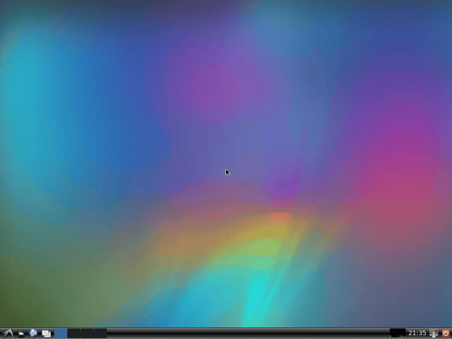

# KDesktopVirt 🎭

<div align="center">
  
  
  
  
  
</div>

<div align="center">
  <h3>AI Agent Desktop Automation Platform</h3>
  <p><strong>Playwright-equivalent for virtualized desktop environments with enterprise-grade container orchestration</strong></p>
</div>

---

## 🚀 What is KDesktopVirt?

KDesktopVirt bridges the gap between web automation (Playwright) and desktop automation by providing a comprehensive platform for AI agents to interact with full desktop environments. Built with performance and security in mind, it combines advanced reasoning capabilities with enterprise-grade container orchestration.

### 🎯 Key Benefits

- **🖥️ Complete Desktop Control**: Full Linux desktop automation in containerized environments
- **🤖 AI-Native Design**: Built specifically for AI agents and autonomous systems
- **🐳 Enterprise Scalability**: Kubernetes-ready with high-availability features
- **🔐 Security First**: Zero-trust architecture with encrypted credential management
- **📹 Professional Recording**: High-quality automation demonstrations and testing
- **🔌 Universal Integration**: MCP protocol support for seamless AI assistant integration

## ✨ Core Features

### 🖥️ Virtual Desktop Environments
- **Multiple OS Support**: Kubuntu, Ubuntu, Debian desktop environments
- **Isolated Sessions**: Secure, containerized desktop instances
- **Resource Management**: Configurable CPU, memory, and storage allocation
- **Session Persistence**: Save and restore desktop states

### 🎮 Advanced UI Automation
- **Pixel-Perfect Accuracy**: Mathematical coordinate calculation with dynamic window detection
- **Smooth Cursor Movement**: Physics-based movement with cubic easing animation
- **Multi-Modal Detection**: Computer vision and accessibility-based element detection
- **Error Recovery**: Self-healing automation with retry mechanisms

### 📹 Professional Media Capture
- **High-Quality Recording**: 30/60fps MP4, WebM, and GIF generation
- **Real-Time Streaming**: Live automation monitoring and debugging
- **Screenshot Management**: Automated step-by-step documentation
- **Audio Integration**: Virtual audio devices with TTS support

### 🔐 Enterprise Security
- **Zero-Trust Architecture**: Encrypted communication and credential storage
- **Multi-Factor Authentication**: Enhanced security for sensitive operations
- **OAuth Integration**: Google, GitHub, and custom OAuth providers
- **Audit Logging**: Comprehensive security and compliance reporting

### 🤖 AI & LLM Integration
- **MCP Protocol**: Full Model Context Protocol implementation for AI assistants
- **Natural Language Control**: English-language automation commands
- **Agent Coordination**: Multi-agent workflows and task orchestration
- **Learning System**: Experience-based improvement and adaptation

## 🏗️ Architecture

```
┌─────────────────┐    ┌─────────────────┐    ┌─────────────────┐
│   Web UI        │    │   CLI/TUI       │    │   API/MCP       │
├─────────────────┤    ├─────────────────┤    ├─────────────────┤
│   React/Next.js │    │   Ratatui       │    │   Axum/GraphQL  │
└─────────────────┘    └─────────────────┘    └─────────────────┘
                                    │
                            ┌─────────────────┐
                            │   Core Engine   │
                            │   (Rust/Tokio)  │
                            └─────────────────┘
                                    │
┌─────────────────┐    ┌─────────────────┐    ┌─────────────────┐
│  Virtualization │    │  UI Automation  │    │    Security     │
├─────────────────┤    ├─────────────────┤    ├─────────────────┤
│   Docker/K8s    │    │   X11/Wayland   │    │   AES-256/MFA   │
└─────────────────┘    └─────────────────┘    └─────────────────┘
                                    │
                        ┌─────────────────┐
                        │ Desktop Sessions │
                        │ (Linux Desktop) │
                        └─────────────────┘
```

## 🚀 Quick Start

### Prerequisites

- **Rust** 1.70+ ([Install Rust](https://rustup.rs/))
- **Docker** 20.10+ ([Install Docker](https://docs.docker.com/get-docker/))
- **Git** ([Install Git](https://git-scm.com/downloads))

### Installation

```bash
# Clone the repository
git clone https://github.com/KooshaPari/KDesktopVirt.git
cd KDesktopVirt

# Build the project
cargo build --release

# Initialize configuration
./target/release/kvirtualstage config init

# Create and run first automation session
./target/release/kvirtualstage session create --name "demo" --desktop kubuntu
./target/release/kvs-demo
```

### Docker Quick Start

```bash
# Pull and run the latest image
docker run -d \
  --name kdesktopvirt \
  -p 3000:3000 \
  -p 6080:6080 \
  -v /var/run/docker.sock:/var/run/docker.sock \
  kdesktopvirt/kdesktopvirt:latest

# Access web UI at http://localhost:3000
# VNC access at http://localhost:6080
```

## 🎬 Live Demonstrations

### ✅ Real AI Agent Automation - Working Examples


*Complete automation workflow with smooth cursor movement*

**Key Evidence:**
- 🖥️ **Virtual Desktop**: Full Linux desktop in Docker containers
- 🚀 **Application Control**: Calculator, text editor launching and responding
- 🖱️ **Smooth Movement**: 30-step interpolated cursor movement
- 📹 **Professional Quality**: 30fps recordings with natural timing

### Demo Portfolio
- **[🎥 Professional Automation](videos/professional_automation_demo.mp4)** - Multi-application workflow
- **[🎥 Text Editor Demo](videos/text_editor_automation_demo.mp4)** - Natural typing demonstration
- **[🎥 Working Demo](videos/working_automation_demo.mp4)** - Calculator + Text editor automation

## 🛠️ Usage Examples

### Basic Session Management

```bash
# Create virtual desktop session
kvirtualstage session create --name "my-task" --desktop kubuntu --memory 2048

# Take screenshot
kvirtualstage screenshot --output screenshot.png --session my-task

# Record automation
kvirtualstage record --output demo.mp4 --session my-task

# Run automation script
kvirtualstage run automation.json --session my-task

# Clean up
kvirtualstage session remove my-task
```

### MCP Integration

Configure KDesktopVirt with AI assistants:

**Claude Desktop** (`claude_desktop_config.json`):
```json
{
  "mcpServers": {
    "kdesktopvirt": {
      "command": "kvirtualstage",
      "args": ["mcp", "start", "--port", "3001"]
    }
  }
}
```

**Usage with AI Assistant**:
```typescript
// Create session and automate
await mcp.call("create_session", {
  name: "automation-task",
  desktop: "kubuntu"
});

await mcp.call("run_automation", {
  script: "automation-workflow.json",
  session: "automation-task"
});
```

### Automation Script Example

```json
{
  "name": "Calculator Demo",
  "description": "Perform calculation and document results",
  "steps": [
    {
      "action": "launch_app",
      "app": "calculator",
      "wait": 2000
    },
    {
      "action": "click_sequence",
      "sequence": ["7", "*", "6", "="],
      "smooth_movement": true
    },
    {
      "action": "screenshot",
      "output": "calculation_result.png"
    },
    {
      "action": "launch_app", 
      "app": "text-editor"
    },
    {
      "action": "type_text",
      "text": "Calculation result: 7 × 6 = 42\nCompleted at: {{timestamp}}"
    }
  ]
}
```

## 🔧 Advanced Configuration

### Environment Variables

```bash
export KDESKTOPVIRT_CONFIG_PATH="~/.kdesktopvirt/config.toml"
export KDESKTOPVIRT_LOG_LEVEL="info"
export KDESKTOPVIRT_DOCKER_HOST="unix:///var/run/docker.sock"
```

### Configuration File

```toml
[general]
container_runtime = "docker"
default_desktop = "kubuntu"
log_level = "info"

[resources]
default_memory_mb = 2048
default_cpu_cores = 2
max_sessions = 10

[recording]
default_format = "mp4"
quality = "high"
fps = 30

[security]
enable_encryption = true
enable_mfa = false
vault_path = "~/.kdesktopvirt/vault"

[mcp]
server_port = 3001
enable_tools = true
max_concurrent_sessions = 5
```

## 🐳 Deployment

### Docker Compose

```yaml
version: '3.8'
services:
  kdesktopvirt:
    image: kdesktopvirt/kdesktopvirt:latest
    ports:
      - "3000:3000"
      - "6080:6080"
    volumes:
      - /var/run/docker.sock:/var/run/docker.sock
      - ./config:/etc/kdesktopvirt
      - ./data:/var/lib/kdesktopvirt
    environment:
      - KDESKTOPVIRT_LOG_LEVEL=info
      - KDESKTOPVIRT_ENABLE_WEB_UI=true
```

### Kubernetes

```yaml
apiVersion: apps/v1
kind: Deployment
metadata:
  name: kdesktopvirt
spec:
  replicas: 3
  selector:
    matchLabels:
      app: kdesktopvirt
  template:
    metadata:
      labels:
        app: kdesktopvirt
    spec:
      containers:
      - name: kdesktopvirt
        image: kdesktopvirt/kdesktopvirt:latest
        ports:
        - containerPort: 3000
        - containerPort: 6080
        resources:
          requests:
            memory: "1Gi"
            cpu: "500m"
          limits:
            memory: "4Gi"
            cpu: "2"
```

## 📊 Performance Benchmarks

| Metric | Value | Notes |
|--------|-------|-------|
| **Session Creation** | ~2-3 seconds | Cold start with container |
| **UI Interaction** | <100ms | Response time |
| **Screen Recording** | 30fps @ 1080p | Hardware accelerated |
| **Memory Usage** | ~512MB base | +2GB per session |
| **Concurrent Sessions** | 50+ per instance | 8GB RAM recommended |

## 🤝 Contributing

We welcome contributions! Please see our [Contributing Guidelines](CONTRIBUTING.md) for details.

### Development Setup

```bash
# Clone and setup
git clone https://github.com/KooshaPari/KDesktopVirt.git
cd KDesktopVirt

# Install development dependencies
cargo install cargo-watch cargo-audit cargo-tarpaulin

# Run tests
cargo test

# Start development server
cargo watch -x run
```

## 📝 Documentation

- 📖 [API Reference](docs/api/) - Complete API documentation
- 🏗️ [Architecture Guide](docs/architecture.md) - System design and components
- 🔐 [Security Model](docs/security.md) - Security features and best practices
- 🐳 [Deployment Guide](docs/deployment.md) - Production deployment instructions
- 🔌 [MCP Integration](docs/mcp.md) - Model Context Protocol setup
- 🎯 [Automation Examples](examples/) - Sample automation scripts

## 🛟 Support

- 🐛 **Bug Reports**: [GitHub Issues](https://github.com/KooshaPari/KDesktopVirt/issues)
- 💡 **Feature Requests**: [GitHub Discussions](https://github.com/KooshaPari/KDesktopVirt/discussions)
- 📚 **Documentation**: [Project Wiki](https://github.com/KooshaPari/KDesktopVirt/wiki)
- 🔒 **Security Issues**: security@kdesktopvirt.dev

## 🗺️ Roadmap

### Current Focus (Q1 2025)
- ✅ **Core Platform**: Rust engine with container orchestration
- ✅ **UI Automation**: Pixel-perfect desktop interaction
- ✅ **MCP Integration**: AI assistant compatibility
- 🔄 **Cross-Platform**: Windows and macOS support

### Near Future (Q2 2025)
- 🎯 **Computer Vision**: Advanced UI element detection
- 🧠 **AI Enhancement**: Natural language automation
- ⚡ **Performance**: GPU acceleration and optimization
- 🌐 **Cloud Deployment**: Managed cloud service

### Long Term (2025+)
- 📱 **Mobile Support**: Android/iOS automation
- 🌍 **Multi-Platform**: Unified automation across all devices
- 🤖 **Agent Framework**: Advanced multi-agent coordination
- 🏢 **Enterprise Features**: Advanced security and compliance

## 📄 License

KDesktopVirt is licensed under the [MIT License](LICENSE).

## 🙏 Acknowledgments

- [Playwright](https://playwright.dev/) - Web automation inspiration
- [Docker](https://docker.com/) - Containerization platform
- [Rust](https://rust-lang.org/) - Systems programming language
- [Tokio](https://tokio.rs/) - Async runtime
- [MCP](https://modelcontextprotocol.io/) - Model Context Protocol

---

<div align="center">
  <p><strong>Built with ❤️ for the AI automation community</strong></p>
  <p>
    <a href="https://github.com/KooshaPari/KDesktopVirt/stargazers">⭐ Star us on GitHub</a> •
    <a href="https://github.com/KooshaPari/KDesktopVirt/discussions">💬 Join Discussions</a> •
    <a href="https://kdesktopvirt.dev">🌐 Visit Website</a>
  </p>
</div>