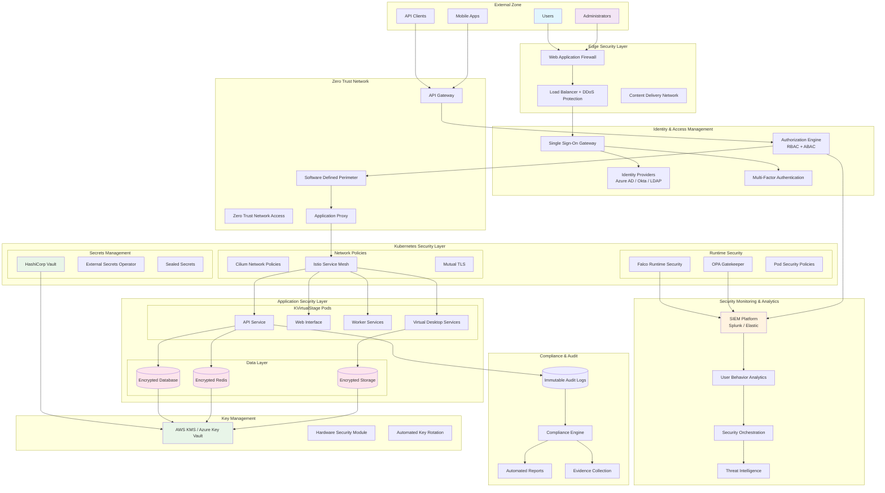
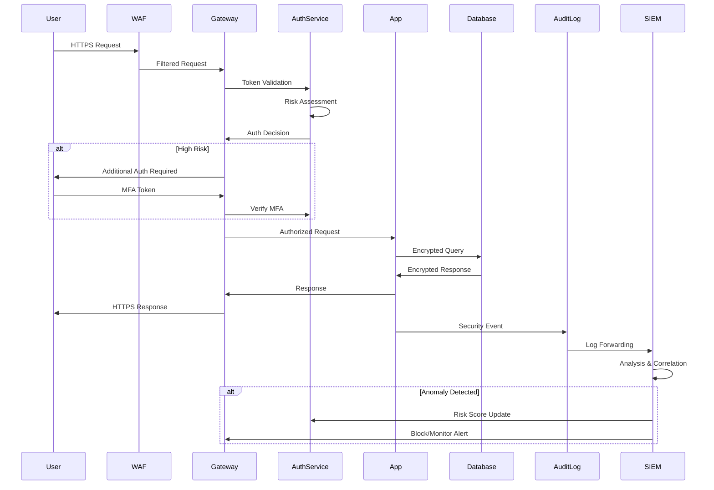

# KVirtualStage Enterprise Security Architecture

## High-Level Security Architecture Diagram



## Detailed Security Components Architecture

```mermaid
graph LR
    subgraph "Authentication Flow"
        A1[User Login] --> A2[Identity Provider]
        A2 --> A3[MFA Challenge]
        A3 --> A4[Risk Assessment]
        A4 --> A5[Token Generation]
        A5 --> A6[Session Establishment]
    end

    subgraph "Authorization Flow"
        B1[Resource Request] --> B2[Token Validation]
        B2 --> B3[RBAC Check]
        B3 --> B4[ABAC Evaluation]
        B4 --> B5[Policy Decision]
        B5 --> B6[Access Grant/Deny]
    end

    subgraph "Data Protection Flow"
        C1[Data Input] --> C2[Classification]
        C2 --> C3[Encryption]
        C3 --> C4[Storage]
        C4 --> C5[Access Control]
        C5 --> C6[Audit Logging]
    end

    subgraph "Threat Detection Flow"
        D1[Event Collection] --> D2[Correlation]
        D2 --> D3[Behavioral Analysis]
        D3 --> D4[Anomaly Detection]
        D4 --> D5[Risk Scoring]
        D5 --> D6[Automated Response]
    end
```



## Network Security Architecture

```mermaid
graph TB
    subgraph "DMZ (Demilitarized Zone)"
        WAF_DMZ[WAF]
        LB_DMZ[Load Balancer]
        Proxy_DMZ[Reverse Proxy]
    end

    subgraph "Management Network"
        Jump[Jump Server]
        Monitoring[Monitoring Systems]
        SIEM_Net[SIEM Collectors]
    end

    subgraph "Application Network"
        subgraph "Web Tier"
            Web1[Web Pod 1]
            Web2[Web Pod 2]
            Web3[Web Pod 3]
        end
        
        subgraph "API Tier"
            API1[API Pod 1]
            API2[API Pod 2]
            API3[API Pod 3]
        end
        
        subgraph "Service Tier"
            Worker1[Worker Pod 1]
            Worker2[Worker Pod 2]
            VD1[VirtDesktop Pod 1]
            VD2[VirtDesktop Pod 2]
        end
    end

    subgraph "Data Network"
        DB_Primary[(Database Primary)]
        DB_Replica[(Database Replica)]
        Redis_Cluster[(Redis Cluster)]
        FileStorage[(File Storage)]
    end

    subgraph "Security Services Network"
        Vault_Cluster[Vault Cluster]
        Auth_Service[Auth Service]
        Policy_Engine[Policy Engine]
    end

    Internet --> WAF_DMZ
    WAF_DMZ --> LB_DMZ
    LB_DMZ --> Proxy_DMZ
    
    Proxy_DMZ --> Web1
    Proxy_DMZ --> Web2
    Proxy_DMZ --> Web3
    
    Web1 --> API1
    Web2 --> API2
    Web3 --> API3
    
    API1 --> Worker1
    API1 --> VD1
    API2 --> Worker2
    API2 --> VD2
    
    API1 --> DB_Primary
    API2 --> DB_Primary
    API3 --> DB_Primary
    
    Worker1 --> Redis_Cluster
    Worker2 --> Redis_Cluster
    VD1 --> FileStorage
    VD2 --> FileStorage

    Jump --> Management
    Monitoring --> SIEM_Net
    
    Auth_Service --> Vault_Cluster
    Policy_Engine --> Vault_Cluster

    style DMZ fill:#ffebee
    style "Management Network" fill:#e8f5e8
    style "Application Network" fill:#e3f2fd
    style "Data Network" fill:#fce4ec
    style "Security Services Network" fill:#fff3e0
```

## Data Flow Security Architecture



## Compliance Architecture Mapping

```mermaid
graph TB
    subgraph "SOX Compliance"
        SOX_Access[Access Controls]
        SOX_Change[Change Management]
        SOX_Audit[Audit Trails]
        SOX_Segregation[Segregation of Duties]
    end

    subgraph "GDPR Compliance"
        GDPR_Consent[Consent Management]
        GDPR_Rights[Data Subject Rights]
        GDPR_Privacy[Privacy by Design]
        GDPR_Breach[Breach Notification]
    end

    subgraph "Security Controls"
        IAM[Identity & Access Management]
        Encryption[Data Encryption]
        Monitoring[Security Monitoring]
        DLP[Data Loss Prevention]
    end

    subgraph "Technical Implementation"
        RBAC[Role-Based Access Control]
        Audit[Audit Logging]
        KMS[Key Management]
        SIEM[Security Information & Event Management]
    end

    SOX_Access --> IAM
    SOX_Change --> Monitoring
    SOX_Audit --> Audit
    SOX_Segregation --> RBAC

    GDPR_Consent --> IAM
    GDPR_Rights --> DLP
    GDPR_Privacy --> Encryption
    GDPR_Breach --> SIEM

    IAM --> RBAC
    Encryption --> KMS
    Monitoring --> SIEM
    DLP --> Audit

    style "SOX Compliance" fill:#e8f5e8
    style "GDPR Compliance" fill:#e3f2fd
    style "Security Controls" fill:#fff3e0
    style "Technical Implementation" fill:#fce4ec
```

## Zero Trust Architecture Layers

```mermaid
graph TB
    subgraph "Zero Trust Layers"
        subgraph "Identity Layer"
            Users[Users]
            Devices[Devices]
            Services[Services]
        end
        
        subgraph "Network Layer"
            Microsegmentation[Micro-segmentation]
            SDP[Software Defined Perimeter]
            NetworkPolicies[Network Policies]
        end
        
        subgraph "Application Layer"
            AppGateway[Application Gateway]
            APIM[API Management]
            WAF_ZT[Web Application Firewall]
        end
        
        subgraph "Data Layer"
            DataClassification[Data Classification]
            FieldEncryption[Field-Level Encryption]
            DLP_ZT[Data Loss Prevention]
        end
        
        subgraph "Analytics Layer"
            UEBA_ZT[User Behavior Analytics]
            RiskEngine[Risk Assessment Engine]
            ThreatDetection[Threat Detection]
        end
    end

    subgraph "Policy Enforcement"
        PolicyEngine[Policy Engine]
        DecisionPoint[Policy Decision Point]
        EnforcementPoint[Policy Enforcement Point]
    end

    subgraph "Continuous Monitoring"
        EventCollection[Event Collection]
        Correlation[Event Correlation]
        Response[Automated Response]
    end

    Users --> PolicyEngine
    Devices --> PolicyEngine
    Services --> PolicyEngine
    
    Microsegmentation --> EnforcementPoint
    SDP --> EnforcementPoint
    NetworkPolicies --> EnforcementPoint
    
    AppGateway --> DecisionPoint
    APIM --> DecisionPoint
    WAF_ZT --> DecisionPoint
    
    DataClassification --> PolicyEngine
    FieldEncryption --> PolicyEngine
    DLP_ZT --> EnforcementPoint
    
    UEBA_ZT --> RiskEngine
    RiskEngine --> PolicyEngine
    ThreatDetection --> Response
    
    PolicyEngine --> DecisionPoint
    DecisionPoint --> EnforcementPoint
    
    EnforcementPoint --> EventCollection
    EventCollection --> Correlation
    Correlation --> Response
    Response --> PolicyEngine

    style "Identity Layer" fill:#e1f5fe
    style "Network Layer" fill:#e8f5e8
    style "Application Layer" fill:#fff3e0
    style "Data Layer" fill:#fce4ec
    style "Analytics Layer" fill:#f3e5f5
```

## Key Security Metrics Dashboard

```mermaid
graph LR
    subgraph "Authentication Metrics"
        AM1[Login Success Rate]
        AM2[MFA Challenge Rate]
        AM3[Failed Auth Attempts]
        AM4[Account Lockouts]
    end

    subgraph "Authorization Metrics"
        AZ1[Policy Decisions/sec]
        AZ2[Access Denials]
        AZ3[Privilege Escalations]
        AZ4[Role Assignments]
    end

    subgraph "Security Metrics"
        SM1[Security Events/hour]
        SM2[Threat Detections]
        SM3[Risk Score Distribution]
        SM4[Incident Response Time]
    end

    subgraph "Compliance Metrics"
        CM1[Policy Violations]
        CM2[Audit Findings]
        CM3[Control Effectiveness]
        CM4[Remediation Status]
    end

    subgraph "Operational Metrics"
        OM1[System Availability]
        OM2[Response Times]
        OM3[Resource Utilization]
        OM4[Backup Success Rate]
    end

    Dashboard[Security Dashboard]
    
    AM1 --> Dashboard
    AM2 --> Dashboard
    AM3 --> Dashboard
    AM4 --> Dashboard
    
    AZ1 --> Dashboard
    AZ2 --> Dashboard
    AZ3 --> Dashboard
    AZ4 --> Dashboard
    
    SM1 --> Dashboard
    SM2 --> Dashboard
    SM3 --> Dashboard
    SM4 --> Dashboard
    
    CM1 --> Dashboard
    CM2 --> Dashboard
    CM3 --> Dashboard
    CM4 --> Dashboard
    
    OM1 --> Dashboard
    OM2 --> Dashboard
    OM3 --> Dashboard
    OM4 --> Dashboard

    style Dashboard fill:#ff6b35
    style "Authentication Metrics" fill:#e1f5fe
    style "Authorization Metrics" fill:#e8f5e8
    style "Security Metrics" fill:#fff3e0
    style "Compliance Metrics" fill:#fce4ec
    style "Operational Metrics" fill:#f3e5f5
```

## Deployment Architecture

The security architecture is designed to be deployed across multiple environments:

### Production Environment
- **High Availability**: Multi-region deployment with active-passive failover
- **Scalability**: Auto-scaling security services based on load
- **Performance**: Optimized for sub-100ms authentication decisions
- **Compliance**: Full audit logging and compliance reporting

### Staging Environment
- **Testing**: Complete security stack for pre-production validation
- **Integration**: End-to-end security testing capabilities
- **Performance**: Load testing with security controls enabled

### Development Environment
- **Security by Design**: Basic security controls for development
- **Developer Tools**: Security testing and validation tools
- **Compliance**: Simplified compliance checking for development workflows

## Security Control Matrix

| Control Category | Implementation | Technology | Compliance |
|-----------------|----------------|------------|------------|
| Authentication | Multi-Factor | TOTP, FIDO2, Biometric | SOX, GDPR |
| Authorization | RBAC + ABAC | OPA, Casbin | SOX, HIPAA |
| Encryption | End-to-End | AES-256, TLS 1.3 | PCI DSS, GDPR |
| Network Security | Zero Trust | Istio, Cilium | SOX, HIPAA |
| Data Protection | DLP + Classification | ML-based scanning | GDPR, CCPA |
| Monitoring | SIEM + UEBA | Splunk, ML analytics | SOX, PCI DSS |
| Incident Response | SOAR | Automated workflows | ISO 27001 |
| Key Management | Enterprise KMS | HashiCorp Vault, AWS KMS | FIPS 140-2 |

This architecture provides comprehensive enterprise-grade security while maintaining performance, scalability, and compliance with major regulatory frameworks.