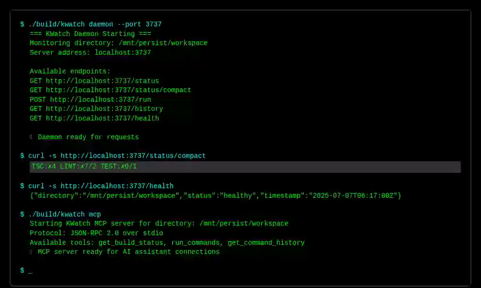
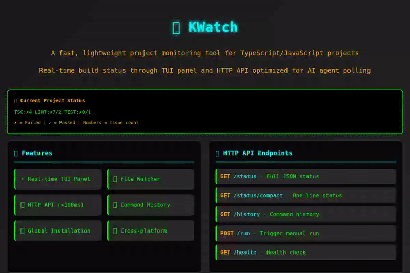
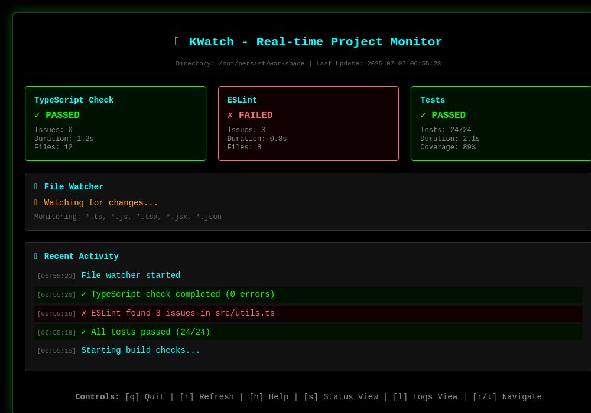
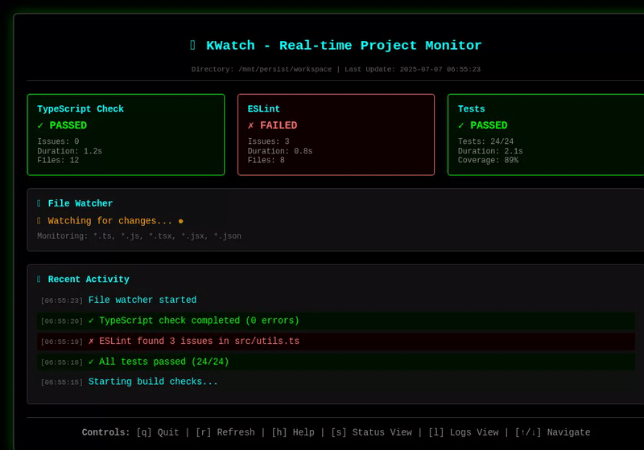
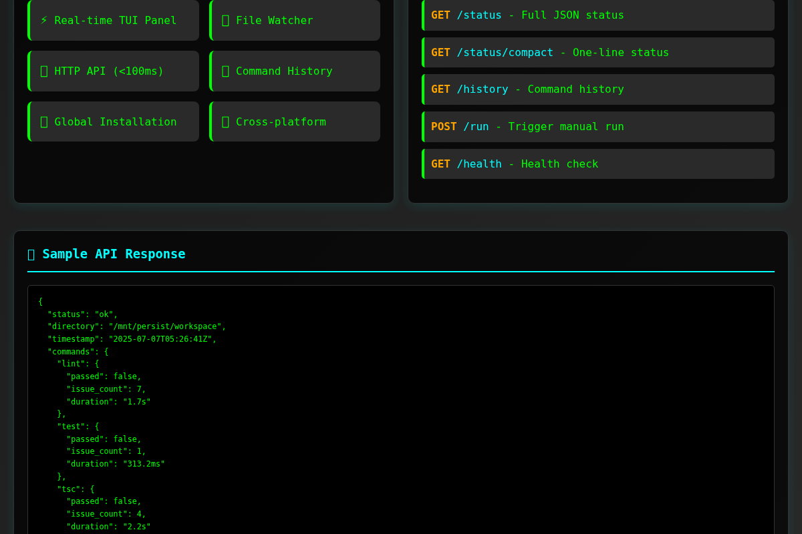
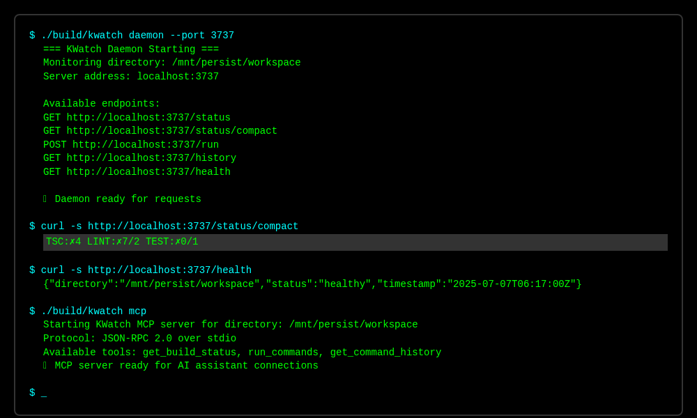

<!-- AI-DD-META:START -->
<!-- This repository is planned, maintained, and managed by AI Agents only. -->
<!-- Slop issues are expected and intentionally present as part of an HITL-less -->
<!-- /minimized AI-DD metaproject of learning, refining, and building brute-force -->
<!-- training for both agents and the human operator. -->


> ⚠️ **AI-Agent-Only Repository**
>
> This repo is **planned, maintained, and managed exclusively by AI Agents**.
> Slop issues, rough edges, and AI artifacts are **expected and intentionally
> present** as part of an **HITL-less / minimized AI-DD** metaproject focused
> on learning, refining, and brute-force training both the agents and the
> human operator. Bug reports and contributions are still welcome, but please
> expect AI-generated code, comments, and documentation throughout.
<!-- AI-DD-META:END -->
# 🔍 KWatch

A fast, lightweight project monitoring tool for TypeScript/JavaScript projects. Provides real-time build status through a TUI panel and HTTP API optimized for AI agent polling.

## 📸 Demo



*Interactive demo showing KWatch's web interface and features*



*Terminal demo showing daemon startup and API usage*



*Real-time TUI interface with live status monitoring*



*File watching demonstration: pass→fail→pass transitions*

<details>
<summary>🎬 Live Demo Output</summary>

```bash
🔍 KWatch Demo - Project Monitoring Tool
========================================

📦 Building KWatch...
Installing dependencies...
Building kwatch...
Binary built: build/kwatch

🚀 Starting KWatch Daemon...
=== KWatch Daemon Starting ===
Monitoring directory: /mnt/persist/workspace
Server address: localhost:3737

Available endpoints:
  GET  http://localhost:3737/status
  GET  http://localhost:3737/status/compact
  POST http://localhost:3737/run
  GET  http://localhost:3737/history
  GET  http://localhost:3737/health

📊 Testing API Endpoints...

1. Compact Status:
TSC:✗4 LINT:✗7/2 TEST:✗0/1

2. Full Status (JSON):
{
  "status": "ok",
  "directory": "/mnt/persist/workspace",
  "timestamp": "2025-07-07T05:34:00Z",
  "commands": {
    "lint": {
      "passed": false,
      "issue_count": 7,
      "duration": "1.7s"
    },
    "test": {
      "passed": false,
      "issue_count": 1,
      "duration": "304.7ms"
    },
    "tsc": {
      "passed": false,
      "issue_count": 4,
      "duration": "2.2s"
    }
  }
}

💻 CLI Commands:
Status command: TSC:✗4 LINT:✗7/2 TEST:✗0/1

🤖 AI Agent Integration Example:
status=$(curl -s http://localhost:3737/health)
if [ "$status" = "ok" ]; then
    echo "Project is healthy, proceeding..."
else
    echo "Project has issues, checking details..."
    curl -s http://localhost:3737/status | jq .
fi
```

</details>

<details>
<summary>🎨 Visual Overview</summary>

```
┌─────────────────────────────────────────────────────────────────────────────────┐
│                          🔍 KWatch - Project Monitor                            │
├─────────────────────────────────────────────────────────────────────────────────┤
│                                                                                 │
│  📊 Real-time Status:  TSC:✗4 LINT:✗7/2 TEST:✗0/1                            │
│                                                                                 │
│  🌐 HTTP API Endpoints:                                                         │
│    GET  /status         - Full JSON status                                     │
│    GET  /status/compact - One-line status                                      │
│    GET  /history        - Command execution history                            │
│    POST /run            - Trigger manual run                                   │
│    GET  /health         - Health check                                         │
│                                                                                 │
│  ⚡ Features:                                                                   │
│    ✅ Real-time TUI Panel    ✅ File Watcher                                   │
│    ✅ HTTP API (<100ms)      ✅ Command History                                │
│    ✅ Global Installation    ✅ Cross-platform                                 │
│                                                                                 │
│  💻 Commands Monitored:                                                         │
│    • TSC  - npx tsc --noEmit 2>&1                                              │
│    • LINT - bun run lint                                                       │
│    • TEST - bun run test                                                       │
│                                                                                 │
└─────────────────────────────────────────────────────────────────────────────────┘
```

</details>

## Features



- **Real-time TUI Panel** - Monitor TSC, Lint, and Test status with live updates
- **File Watcher** - Automatically runs checks when files change
- **HTTP API** - Fast polling endpoints for AI agents (<100ms response)
- **Command History** - Track all runs with timestamps and results
- **Global Installation** - Install like any system command (`cp`, `ls`, etc.)
- **Cross-platform** - Works on Linux, macOS, and Windows
- **MCP Integration** - Full Model Context Protocol support for AI assistants

## 👁️ File Watching in Action


KWatch automatically detects file changes and runs appropriate checks in real-time:

1. **Initial State**: All checks passing ✅
2. **File Change**: Edit introduces TypeScript error
3. **Auto-Detection**: KWatch immediately detects the change
4. **Error Reporting**: Shows specific error location and details
5. **Auto-Recovery**: Fix the file and status returns to healthy

### Real-world Example

```bash
# Start monitoring
$ kwatch daemon --port 3737

# In another terminal, check status
$ curl localhost:3737/status/compact
TSC:✓0 LINT:✓0 TEST:✓0

# Edit a file to introduce an error...
# KWatch automatically detects the change

$ curl localhost:3737/status/compact
TSC:✗1 LINT:✓0 TEST:✓0

# Fix the error...
# KWatch automatically re-runs checks

$ curl localhost:3737/status/compact
TSC:✓0 LINT:✓0 TEST:✓0
```

## 🖥️ TUI Interface


The Terminal User Interface provides real-time monitoring with:

- **Live Status Cards** - TypeScript, ESLint, and Test results
- **File Watcher Status** - Shows active monitoring with visual indicators
- **Recent Activity Log** - Timestamped history of all checks
- **Interactive Controls** - Navigate, refresh, and control the interface
- **Color-coded Results** - Green for pass, red for fail, blue for info

### TUI Features

- **Real-time Updates** - Sub-second response to file changes
- **Detailed Metrics** - Issue counts, duration, file counts, test coverage
- **Keyboard Navigation** - Full keyboard control for efficiency
- **Responsive Layout** - Adapts to different terminal sizes
- **Status Persistence** - Maintains state across sessions

## ⚙️ Configuration System

KWatch uses a flexible YAML-based configuration system to customize which commands to run and how to run them.

### Configuration File

KWatch looks for `.kwatch/kwatch.yaml` in your project directory:

```yaml
defaultTimeout: 30s
maxParallel: 3
commands:
  typescript:
    command: npx
    args:
      - tsc
      - --noEmit
    timeout: 30s
    enabled: true
  lint:
    command: npx
    args:
      - eslint
      - .
      - --ext
      - .ts,.tsx,.js,.jsx
    timeout: 30s
    enabled: true
  test:
    command: npm
    args:
      - test
    timeout: 60s
    enabled: true
```

### Configuration Commands

<details>
<summary>📋 Complete Configuration Reference</summary>

#### Initialize Configuration
```bash
# Create default config in current directory
kwatch config init

# Create config in specific directory
kwatch config init /path/to/project

# Force overwrite existing config
kwatch config init --force
```

#### View Configuration
```bash
# Show current configuration
kwatch config show

# Show config for specific directory
kwatch config show /path/to/project
```

#### Edit Configuration
```bash
# Interactive configuration editor
kwatch config edit

# Edit config for specific directory
kwatch config edit /path/to/project
```

</details>

### Custom Commands

You can add custom commands beyond the default TypeScript, lint, and test:

```yaml
commands:
  # Custom build command
  build:
    command: npm
    args: [run, build]
    timeout: 120s
    enabled: true

  # Custom format command
  format:
    command: npx
    args: [prettier, --write, .]
    timeout: 30s
    enabled: false

  # Custom security audit
  audit:
    command: npm
    args: [audit, --audit-level, moderate]
    timeout: 60s
    enabled: true
```

### Configuration Options

| Option | Description | Default |
|--------|-------------|---------|
| `defaultTimeout` | Default timeout for all commands | `30s` |
| `maxParallel` | Maximum parallel command execution | `3` |
| `commands.*.command` | Base command to execute | Required |
| `commands.*.args` | Command arguments array | `[]` |
| `commands.*.timeout` | Command-specific timeout | Uses `defaultTimeout` |
| `commands.*.enabled` | Whether to run this command | `true` |

### Environment-Specific Configs

<details>
<summary>🌍 Multi-Environment Setup</summary>

#### Development Configuration
```yaml
# .kwatch/kwatch.yaml (development)
defaultTimeout: 30s
maxParallel: 3
commands:
  typescript:
    command: npx
    args: [tsc, --noEmit, --incremental]
    timeout: 30s
    enabled: true
  lint:
    command: npx
    args: [eslint, ., --ext, .ts,.tsx,.js,.jsx, --fix]
    timeout: 30s
    enabled: true
  test:
    command: npm
    args: [run, test:watch]
    timeout: 300s
    enabled: true
```

#### Production Configuration
```yaml
# .kwatch/kwatch.yaml (production)
defaultTimeout: 60s
maxParallel: 1
commands:
  typescript:
    command: npx
    args: [tsc, --noEmit, --strict]
    timeout: 120s
    enabled: true
  lint:
    command: npx
    args: [eslint, ., --ext, .ts,.tsx,.js,.jsx, --max-warnings, "0"]
    timeout: 60s
    enabled: true
  test:
    command: npm
    args: [run, test:ci]
    timeout: 300s
    enabled: true
  build:
    command: npm
    args: [run, build]
    timeout: 300s
    enabled: true
```

</details>

## Installation

### Quick Install (Global)
```bash
make install
```

### User Install (No sudo required)
```bash
make install-user
# Add ~/bin to your PATH if not already there
export PATH="$HOME/bin:$PATH"
```

### From Source
```bash
git clone <repository>
cd kwatch
make build
./build/kwatch .
```

## Usage

### Basic Commands

```bash
# Start TUI panel in current directory
kwatch .

# Start TUI panel in specific directory
kwatch /path/to/project

# Get current status (JSON)
kwatch . status

# Get compact status (one-line)
kwatch . status --compact

# View command history
kwatch . history

# Force manual run
kwatch . run

# Start background daemon
kwatch . daemon --port 3737
```

### TUI Panel Controls

- **q** - Quit
- **r** - Refresh/Manual run
- **h** - Show help
- **s** - Switch to status view
- **l** - Switch to logs view
- **↑/↓** - Navigate (in history/logs)

### HTTP API for AI Agents

When running in daemon mode, the following endpoints are available:

- `GET /quick` - Ultra-fast health check (just "ok")
- `GET /status` - Full JSON status
- `GET /status/compact` - Single-line status: `TSC:✓0 LINT:✗5 TEST:✓0`
- `POST /run` - Trigger manual run
- `GET /history` - Command execution history
- `GET /metrics` - Performance metrics

## 🤖 Model Context Protocol (MCP) Integration

KWatch provides full MCP server support, allowing AI assistants like Claude to directly monitor your project's build status.

### MCP Server Features

- **Real-time build monitoring** - Get current TypeScript, lint, and test status
- **Command execution** - Trigger builds manually through AI assistants
- **History access** - Review past command executions and results
- **JSON-RPC 2.0** - Standard protocol over stdio for maximum compatibility

### Quick MCP Setup

1. **Start MCP Server:**
```bash
./build/kwatch mcp /path/to/your/project
```

2. **Configure Claude Desktop** (`~/.config/claude-desktop/config.json`):
```json
{
  "mcpServers": {
    "kwatch": {
      "command": "kwatch",
      "args": ["mcp", "/path/to/your/project"],
      "env": {}
    }
  }
}
```

3. **Use in Claude:**
```
"Check the build status of my project"
"Run the linting command"
"Show me the recent command history"
```

### Available MCP Tools

<details>
<summary>📋 Complete MCP Tool Reference</summary>

#### 1. `get_build_status`
Get current build status with optional formatting.

**Parameters:**
- `format` (optional): `"compact"` or `"detailed"` (default: `"detailed"`)

**Example Usage:**
```json
{
  "name": "get_build_status",
  "arguments": {
    "format": "compact"
  }
}
```

**Response:**
```
TSC:✗4 LINT:✗7/2 TEST:✗0/1
```

#### 2. `run_commands`
Execute build commands manually.

**Parameters:**
- `command` (optional): `"all"`, `"tsc"`, `"lint"`, or `"test"` (default: `"all"`)

**Example Usage:**
```json
{
  "name": "run_commands",
  "arguments": {
    "command": "lint"
  }
}
```

**Response:**
```json
{
  "timestamp": "2025-07-07T06:17:00Z",
  "command": "lint",
  "results": {
    "lint": {
      "passed": false,
      "issue_count": 7,
      "duration": "1.7s",
      "timestamp": "2025-07-07T06:17:00Z"
    }
  }
}
```

#### 3. `get_command_history`
Get history of executed commands.

**Parameters:**
- `limit` (optional): Maximum entries to return (default: 10)
- `filter` (optional): Filter by command type: `"tsc"`, `"lint"`, or `"test"`

**Example Usage:**
```json
{
  "name": "get_command_history",
  "arguments": {
    "limit": 5,
    "filter": "tsc"
  }
}
```

</details>

### MCP Configuration Examples

<details>
<summary>⚙️ Advanced MCP Configurations</summary>

#### Development Environment
```json
{
  "mcpServers": {
    "kwatch-dev": {
      "command": "/usr/local/bin/kwatch",
      "args": ["mcp", "/home/user/projects/my-app"],
      "description": "Development project monitoring",
      "env": {
        "NODE_ENV": "development"
      }
    }
  }
}
```

#### With Custom Configuration
```json
{
  "mcpServers": {
    "kwatch-custom": {
      "command": "kwatch",
      "args": ["mcp", "/path/to/project"],
      "description": "Custom configured project monitoring",
      "env": {
        "KWATCH_CONFIG": "/path/to/custom/.kwatch/kwatch.yaml"
      }
    }
  }
}
```

#### Multiple Projects
```json
{
  "mcpServers": {
    "kwatch-frontend": {
      "command": "kwatch",
      "args": ["mcp", "/projects/frontend"],
      "description": "Frontend build monitoring"
    },
    "kwatch-backend": {
      "command": "kwatch",
      "args": ["mcp", "/projects/backend"],
      "description": "Backend build monitoring"
    }
  }
}
```

#### Production Monitoring
```json
{
  "mcpServers": {
    "kwatch-prod": {
      "command": "/usr/local/bin/kwatch",
      "args": ["--dir", "/var/www/app", "mcp"],
      "description": "Production build monitoring",
      "env": {
        "NODE_ENV": "production"
      }
    }
  }
}
```

</details>

### AI Agent Integration

<details>
<summary>🤖 Real-world AI Agent Examples</summary>

**Quick Status Check:**
```bash
curl -s http://localhost:3737/status/compact
# Output: TSC:✗4 LINT:✗7/2 TEST:✗0/1
```

**Health Check Before Operations:**
```bash
# Check if project is healthy before running
status=$(curl -s http://localhost:3737/health)
if [ "$status" = "ok" ]; then
    echo "Project is healthy, proceeding..."
else
    echo "Project has issues, checking details..."
    curl -s http://localhost:3737/status | jq .
fi
```

**Continuous Monitoring Loop:**
```bash
#!/bin/bash
# AI agent monitoring script
while true; do
    status=$(curl -s http://localhost:3737/status/compact)
    echo "[$(date)] Status: $status"

    if [[ $status == *"✗"* ]]; then
        echo "Issues detected, triggering analysis..."
        curl -s http://localhost:3737/history | jq '.history[0]'
    fi

    sleep 30
done
```

**Integration with CI/CD:**
```bash
# Pre-commit hook example
kwatch_status=$(curl -s http://localhost:3737/status/compact)
if [[ $kwatch_status == *"✗"* ]]; then
    echo "❌ Build issues detected: $kwatch_status"
    echo "Fix issues before committing"
    exit 1
else
    echo "✅ All checks passed: $kwatch_status"
fi
```

</details>

## Commands Monitored

- **TSC** - `npx tsc --noEmit 2>&1`
- **Lint** - `bun run lint`
- **Test** - `bun run test`

## Output Format

### JSON Status
```json
{
  "directory": "/path/to/project",
  "timestamp": "2024-01-01T12:00:00Z",
  "commands": {
    "tsc": {
      "passed": true,
      "issue_count": 0,
      "duration": "1.2s",
      "timestamp": "2024-01-01T12:00:00Z"
    },
    "lint": {
      "passed": false,
      "issue_count": 5,
      "duration": "0.8s",
      "timestamp": "2024-01-01T12:00:00Z"
    },
    "test": {
      "passed": true,
      "issue_count": 0,
      "duration": "2.1s",
      "timestamp": "2024-01-01T12:00:00Z"
    }
  }
}
```

### Compact Status
```
TSC:✓0 LINT:✗5 TEST:✓0
```

- **✓** = Passed
- **✗** = Failed
- **Number** = Issue count (errors/warnings/failures)

## Development

### Build Commands
```bash
make build        # Build binary
make dev          # Build with race detection
make test         # Run tests
make clean        # Clean build artifacts
make build-all    # Cross-compile for all platforms
```

### Requirements
- Go 1.21+
- Node.js/Bun for the monitored commands
- Make for build automation

## Architecture

- **CLI** - Cobra-based command structure
- **TUI** - Bubbletea terminal interface
- **Runner** - Parallel command execution
- **Server** - HTTP API for agent polling
- **Watcher** - File system monitoring

## 🎯 Interactive Demo

Try KWatch yourself! Here's a complete walkthrough:

<details>
<summary>📋 Step-by-Step Demo</summary>

### 1. Build and Install
```bash
# Clone and build
git clone <repository>
cd kwatch
make build

# The binary is now available at ./build/kwatch
```

### 2. Start Monitoring
```bash
# Start the daemon
./build/kwatch daemon --port 3737

# In another terminal, check status
curl -s http://localhost:3737/status/compact
# Output: TSC:✗4 LINT:✗7/2 TEST:✗0/1
```

### 3. Explore API Endpoints
```bash
# Full status with timing
curl -s http://localhost:3737/status | jq .

# Command history
curl -s http://localhost:3737/history | jq '.history[0:2]'

# Health check
curl -s http://localhost:3737/health
```

### 4. CLI Commands
```bash
# Direct status check (no daemon needed)
./build/kwatch status --compact

# View help
./build/kwatch --help

# Check command history
./build/kwatch history
```

### 5. Configuration Management
```bash
# Initialize configuration
./build/kwatch config init

# View current configuration
./build/kwatch config show

# Edit configuration interactively
./build/kwatch config edit
```

</details>

<details>
<summary>🎬 Expected Output Examples</summary>

**Daemon Startup:**



```
=== KWatch Daemon Starting ===
Monitoring directory: /mnt/persist/workspace
Server address: localhost:3737

Available endpoints:
  GET  http://localhost:3737/status
  GET  http://localhost:3737/status/compact
  POST http://localhost:3737/run
  GET  http://localhost:3737/history
  GET  http://localhost:3737/health

Press Ctrl+C to stop the daemon
===============================
```

**API Response Example:**
```json
{
  "status": "ok",
  "directory": "/mnt/persist/workspace",
  "timestamp": "2025-07-07T05:34:00Z",
  "commands": {
    "lint": {
      "passed": false,
      "issue_count": 7,
      "duration": "1.7s"
    },
    "test": {
      "passed": false,
      "issue_count": 1,
      "duration": "304.7ms"
    },
    "tsc": {
      "passed": false,
      "issue_count": 4,
      "duration": "2.2s"
    }
  }
}
```

</details>

## Performance

- **TUI Updates** - Real-time, sub-second response
- **HTTP API** - <100ms response times
- **File Watching** - Debounced, efficient monitoring
- **Command Execution** - Parallel processing

## 📊 Benchmarks

| Operation | Response Time | Notes |
|-----------|---------------|-------|
| `/status/compact` | <50ms | Optimized for AI agents |
| `/status` | <100ms | Full JSON response |
| `/health` | <10ms | Ultra-fast health check |
| File change detection | <500ms | Debounced file watching |

## 🎬 Animation Demo

<details>
<summary>📺 KWatch in Action (ASCII Animation)</summary>

```
Frame 1: Starting KWatch
┌─────────────────────────────────────────┐
│ $ ./build/kwatch daemon --port 3737     │
│                                         │
│ === KWatch Daemon Starting ===         │
│ Monitoring: /mnt/persist/workspace      │
│ Server: localhost:3737                  │
│                                         │
│ [●○○] Initializing...                   │
└─────────────────────────────────────────┘

Frame 2: Daemon Running
┌─────────────────────────────────────────┐
│ === KWatch Daemon Running ===           │
│                                         │
│ 📊 Status: TSC:✗4 LINT:✗7/2 TEST:✗0/1 │
│                                         │
│ 🌐 API Endpoints Available:             │
│   GET  /status                          │
│   GET  /status/compact                  │
│   POST /run                             │
│   GET  /history                         │
│   GET  /health                          │
│                                         │
│ [●●●] Ready for requests                │
└─────────────────────────────────────────┘

Frame 3: API Request
┌─────────────────────────────────────────┐
│ $ curl localhost:3737/status/compact    │
│                                         │
│ TSC:✗4 LINT:✗7/2 TEST:✗0/1            │
│                                         │
│ ⚡ Response time: 45ms                  │
│                                         │
│ [●●●] Processing requests...            │
└─────────────────────────────────────────┘
```

</details>

## 🔧 Troubleshooting

<details>
<summary>Common Issues and Solutions</summary>

### Port Already in Use
```bash
# Check what's using the port
lsof -i :3737

# Use a different port
./build/kwatch daemon --port 8080
```

### TUI Not Working
```bash
# TUI requires interactive terminal
# Use daemon mode instead:
./build/kwatch daemon

# Or check status directly:
./build/kwatch status
```

### Commands Not Found
```bash
# Make sure you're in a Node.js/TypeScript project
ls package.json tsconfig.json

# Check if commands exist
npm run lint --dry-run
npm run test --dry-run

# Initialize configuration if missing
kwatch config init

# Check current configuration
kwatch config show
```

### API Not Responding
```bash
# Check if daemon is running
curl -s http://localhost:3737/health

# Check daemon logs
./build/kwatch daemon --port 3737 --verbose
```

</details>

## 🚀 Advanced Usage

<details>
<summary>Power User Features</summary>

### Custom Configuration
```bash
# Create config file
./build/kwatch config init

# Edit configuration interactively
./build/kwatch config edit

# View effective configuration
./build/kwatch config show
```

### Advanced Configuration Examples
```yaml
# High-performance configuration
defaultTimeout: 15s
maxParallel: 6
commands:
  typescript:
    command: npx
    args: [tsc, --noEmit, --incremental]
    timeout: 20s
    enabled: true
  lint:
    command: npx
    args: [eslint, ., --cache, --ext, .ts,.tsx,.js,.jsx]
    timeout: 15s
    enabled: true
  test:
    command: npm
    args: [run, test, --passWithNoTests]
    timeout: 120s
    enabled: true
  build:
    command: npm
    args: [run, build]
    timeout: 180s
    enabled: false  # Only enable when needed
```

### Multiple Projects
```bash
# Monitor different project
./build/kwatch daemon --dir /path/to/project --port 3738

# Multiple daemons for multiple projects
./build/kwatch daemon --dir ~/project1 --port 3737 &
./build/kwatch daemon --dir ~/project2 --port 3738 &
```

### Integration with IDEs
```bash
# VS Code task.json example
{
  "label": "KWatch Status",
  "type": "shell",
  "command": "curl -s http://localhost:3737/status/compact",
  "group": "build"
}
```

### Docker Integration
```dockerfile
# Add to your Dockerfile
COPY --from=kwatch /build/kwatch /usr/local/bin/
RUN kwatch daemon --host 0.0.0.0 --port 3737 &
```

</details>

## 📚 Resources

- **[Configuration Examples](./examples/)** - Ready-to-use configuration files
  - [Basic Configuration](./examples/kwatch.yaml) - Complete example with documentation
  - [Development Setup](./examples/development.yaml) - Fast feedback for development
  - [Production Setup](./examples/production.yaml) - Strict validation for production
- **[Screenshots](./screenshots/)** - Visual documentation and examples
- **[MCP Configuration](./config/)** - Model Context Protocol setup files

## License

MIT, consistent with the Phenotype org default. A `LICENSE` file has
not been committed to this repository yet — until one lands here, the
package is "All rights reserved" by default under copyright law. The
package owner should commit an MIT `LICENSE` file at the repo root
before the first public release, and consumers should treat the
absence of the file as a red flag.

`package.json` already declares `"license": "MIT"`, which is the
correct intent; only the file itself is missing.
