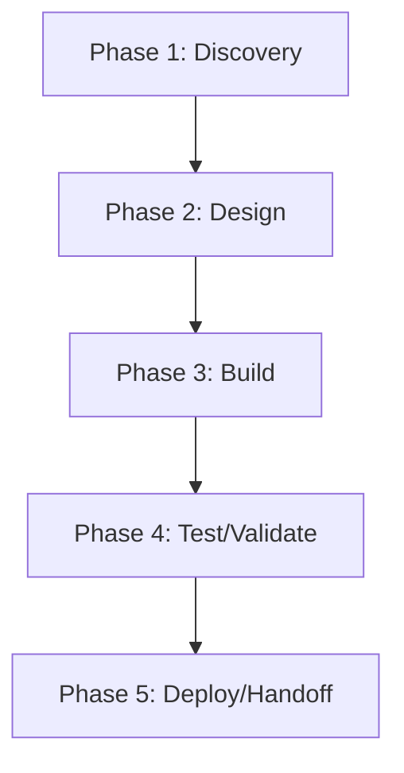

# BytePort — Action Plan

> **Generated 2026-06-17.** Score grid: [`FLEET-AUDIT-30-PILLAR.md`](../FLEET-AUDIT-30-PILLAR.md). Source: [`BytePort.json`](../../audits_data/BytePort.json).

## Current state

- **Language:** Svelte
- **Mean score:** 0.73 (median 0)
- **Zero-pillar count:** 55 of 109
- **Three-pillar count:** 4 of 109
- **Blockers:** G1: no CODEOWNERS, D1-D6: minimal docs/architecture, T1-T6: light testing, S7: no threat model

## Notes

Svelte frontend app. Moderate governance, light testing, no production runtime concerns.

## Pillar distribution

| Score | Count | % |
|----|----:|----:|
| 3 (measured) | 4 | 3.7% |
| 2 (wired) | 18 | 16.5% |
| 1 (ad-hoc) | 32 | 29.4% |
| 0 (absent) | 55 | 50.5% |

## Phased WBS

### Phase 1: Discovery (≤3 tool calls per task)

- [ ] Read existing pillar evidence for each 0/1 score below
- [ ] Confirm scope of remediation with code owner

### Phase 2: Design (≤5 tool calls per task)

- [ ] Write ADR/decision record for any architectural change (A1-A5)
- [ ] Document coverage/SLO targets before writing the CI gate

### Phase 3: Build (≤15 tool calls per task)

**Tasks by role:**

#### agentic (2 tasks)

- [ ] **BYT-008** `AS1` (Agentic safety) — score 0 → target 2: Lift AS1 (Agentic safety) from 0 to ≥2. Evidence: N/A
- [ ] **BYT-009** `AS2` (Agentic safety) — score 0 → target 2: Lift AS2 (Agentic safety) from 0 to ≥2. Evidence: N/A

#### api (2 tasks)

- [ ] **BYT-006** `AP1` (API surface) — score 0 → target 2: Lift AP1 (API surface) from 0 to ≥2. Evidence: N/A — frontend
- [ ] **BYT-007** `AP2` (API surface) — score 0 → target 2: Lift AP2 (API surface) from 0 to ≥2. Evidence: N/A

#### ci-ops (4 tasks)

- [ ] **BYT-034** `E1` (Engineering practice) — score 1 → target 2: Lift E1 (Engineering practice) from 1 to ≥2. Evidence: BytePort-wtrees/ in repos/
- [ ] **BYT-057** `Q2` (Quality eng) — score 0 → target 2: Lift Q2 (Quality eng) from 0 to ≥2. Evidence: no ratchet
- [ ] **BYT-058** `Q3` (Quality eng) — score 0 → target 2: Lift Q3 (Quality eng) from 0 to ≥2. Evidence: no allowlist
- [ ] **BYT-059** `Q4` (Quality eng) — score 0 → target 2: Lift Q4 (Quality eng) from 0 to ≥2. Evidence: no coverage

#### data (3 tasks)

- [ ] **BYT-029** `DA1` (Data/contracts) — score 0 → target 2: Lift DA1 (Data/contracts) from 0 to ≥2. Evidence: N/A
- [ ] **BYT-030** `DA2` (Data/contracts) — score 0 → target 2: Lift DA2 (Data/contracts) from 0 to ≥2. Evidence: N/A
- [ ] **BYT-031** `DA3` (Data/contracts) — score 0 → target 2: Lift DA3 (Data/contracts) from 0 to ≥2. Evidence: N/A

#### docs (6 tasks)

- [ ] **BYT-023** `D1` (Documentation) — score 0 → target 2: Lift D1 (Documentation) from 0 to ≥2. Evidence: no spec tracker
- [ ] **BYT-024** `D2` (Documentation) — score 0 → target 2: Lift D2 (Documentation) from 0 to ≥2. Evidence: no journeys
- [ ] **BYT-025** `D6` (Documentation) — score 0 → target 2: Lift D6 (Documentation) from 0 to ≥2. Evidence: no arch map
- [ ] **BYT-026** `D3` (Documentation) — score 1 → target 2: Lift D3 (Documentation) from 1 to ≥2. Evidence: JSDoc sparse
- [ ] **BYT-027** `D4` (Documentation) — score 1 → target 2: Lift D4 (Documentation) from 1 to ≥2. Evidence: CHANGELOG.md
- [ ] **BYT-028** `D5` (Documentation) — score 1 → target 2: Lift D5 (Documentation) from 1 to ≥2. Evidence: no API ref

#### frontend (6 tasks)

- [ ] **BYT-010** `AT4` (Accessibility & i18n) — score 0 → target 2: Lift AT4 (Accessibility & i18n) from 0 to ≥2. Evidence: no i18n
- [ ] **BYT-011** `AT5` (Accessibility & i18n) — score 0 → target 2: Lift AT5 (Accessibility & i18n) from 0 to ≥2. Evidence: no RTL
- [ ] **BYT-012** `AT1` (Accessibility & i18n) — score 1 → target 2: Lift AT1 (Accessibility & i18n) from 1 to ≥2. Evidence: basic Svelte a11y
- [ ] **BYT-013** `AT3` (Accessibility & i18n) — score 1 → target 2: Lift AT3 (Accessibility & i18n) from 1 to ≥2. Evidence: basic aria-*
- [ ] **BYT-083** `UX2` (User experience) — score 1 → target 2: Lift UX2 (User experience) from 1 to ≥2. Evidence: Svelte default progressive disclosure
- [ ] **BYT-084** `UX3` (User experience) — score 1 → target 2: Lift UX3 (User experience) from 1 to ≥2. Evidence: Svelte default gallery/list

#### governance (2 tasks)

- [ ] **BYT-037** `G1` (Governance) — score 0 → target 2: Lift G1 (Governance) from 0 to ≥2. Evidence: no CODEOWNERS
- [ ] **BYT-038** `G6` (Governance) — score 1 → target 2: Lift G6 (Governance) from 1 to ≥2. Evidence: CHANGELOG.md

#### perf (7 tasks)

- [ ] **BYT-016** `C2` (Cost) — score 0 → target 2: Lift C2 (Cost) from 0 to ≥2. Evidence: no cache configured (Node)
- [ ] **BYT-017** `C3` (Cost) — score 0 → target 2: Lift C3 (Cost) from 0 to ≥2. Evidence: no ratchet
- [ ] **BYT-048** `P1` (Performance) — score 0 → target 2: Lift P1 (Performance) from 0 to ≥2. Evidence: no benches
- [ ] **BYT-049** `P2` (Performance) — score 0 → target 2: Lift P2 (Performance) from 0 to ≥2. Evidence: no profiling
- [ ] **BYT-050** `P3` (Performance) — score 0 → target 2: Lift P3 (Performance) from 0 to ≥2. Evidence: no bundle budget
- [ ] **BYT-051** `P4` (Performance) — score 0 → target 2: Lift P4 (Performance) from 0 to ≥2. Evidence: no SLOs
- [ ] **BYT-052** `P5` (Performance) — score 0 → target 2: Lift P5 (Performance) from 0 to ≥2. Evidence: no cache hit

#### qa (6 tasks)

- [ ] **BYT-077** `T3` (Testing) — score 0 → target 2: Lift T3 (Testing) from 0 to ≥2. Evidence: no E2E
- [ ] **BYT-078** `T4` (Testing) — score 0 → target 2: Lift T4 (Testing) from 0 to ≥2. Evidence: no contract
- [ ] **BYT-079** `T6` (Testing) — score 0 → target 2: Lift T6 (Testing) from 0 to ≥2. Evidence: no multi-runner
- [ ] **BYT-080** `T1` (Testing) — score 1 → target 2: Lift T1 (Testing) from 1 to ≥2. Evidence: 5 test files; low coverage
- [ ] **BYT-081** `T2` (Testing) — score 1 → target 2: Lift T2 (Testing) from 1 to ≥2. Evidence: some integration
- [ ] **BYT-082** `T5` (Testing) — score 1 → target 2: Lift T5 (Testing) from 1 to ≥2. Evidence: some bug-fix repro

#### rust-dev (21 tasks)

- [ ] **BYT-001** `A2` (Architecture) — score 0 → target 2: Lift A2 (Architecture) from 0 to ≥2. Evidence: no ADRs
- [ ] **BYT-002** `A1` (Architecture) — score 1 → target 2: Lift A1 (Architecture) from 1 to ≥2. Evidence: Svelte app; no clear domain/adapter
- [ ] **BYT-003** `A3` (Architecture) — score 1 → target 2: Lift A3 (Architecture) from 1 to ≥2. Evidence: src/ structure; flat modules
- [ ] **BYT-004** `A4` (Architecture) — score 1 → target 2: Lift A4 (Architecture) from 1 to ≥2. Evidence: components/ + routes/ separation
- [ ] **BYT-005** `A5` (Architecture) — score 1 → target 2: Lift A5 (Architecture) from 1 to ≥2. Evidence: basic types
- [ ] **BYT-020** `CN1` (Concurrency) — score 0 → target 2: Lift CN1 (Concurrency) from 0 to ≥2. Evidence: no race detection
- [ ] **BYT-021** `CN2` (Concurrency) — score 0 → target 2: Lift CN2 (Concurrency) from 0 to ≥2. Evidence: no async cancellation pattern
- [ ] **BYT-022** `CN3` (Concurrency) — score 0 → target 2: Lift CN3 (Concurrency) from 0 to ≥2. Evidence: N/A — no mutating endpoints
- [ ] **BYT-032** `DM1` (Domain model) — score 1 → target 2: Lift DM1 (Domain model) from 1 to ≥2. Evidence: basic types
- [ ] **BYT-033** `DM2` (Domain model) — score 1 → target 2: Lift DM2 (Domain model) from 1 to ≥2. Evidence: TS types
- [ ] **BYT-035** `EH1` (Error handling) — score 1 → target 2: Lift EH1 (Error handling) from 1 to ≥2. Evidence: SvelteKit error boundaries
- [ ] **BYT-036** `EH2` (Error handling) — score 1 → target 2: Lift EH2 (Error handling) from 1 to ≥2. Evidence: Svelte auto-escapes
- [ ] **BYT-055** `PS1` (Persistence) — score 0 → target 2: Lift PS1 (Persistence) from 0 to ≥2. Evidence: N/A
- [ ] **BYT-056** `PS2` (Persistence) — score 0 → target 2: Lift PS2 (Persistence) from 0 to ≥2. Evidence: N/A
- [ ] **BYT-060** `RE1` (Reproducibility) — score 1 → target 2: Lift RE1 (Reproducibility) from 1 to ≥2. Evidence: package-lock.json committed (if present)
- [ ] **BYT-061** `RE2` (Reproducibility) — score 1 → target 2: Lift RE2 (Reproducibility) from 1 to ≥2. Evidence: Vite/Svelte reproducible
- [ ] **BYT-065** `RT1` (Runtime compat) — score 1 → target 2: Lift RT1 (Runtime compat) from 1 to ≥2. Evidence: Node version implicit
- [ ] **BYT-066** `RT2` (Runtime compat) — score 1 → target 2: Lift RT2 (Runtime compat) from 1 to ≥2. Evidence: Linux only
- [ ] **BYT-085** `X3` (Code quality) — score 0 → target 2: Lift X3 (Code quality) from 0 to ≥2. Evidence: no complexity
- [ ] **BYT-086** `X4` (Code quality) — score 0 → target 2: Lift X4 (Code quality) from 0 to ≥2. Evidence: no duplication
- [ ] **BYT-087** `X5` (Code quality) — score 0 → target 2: Lift X5 (Code quality) from 0 to ≥2. Evidence: no dead code

#### security (16 tasks)

- [ ] **BYT-014** `AU2` (Auditability) — score 0 → target 2: Lift AU2 (Auditability) from 0 to ≥2. Evidence: no ADRs
- [ ] **BYT-015** `AU1` (Auditability) — score 1 → target 2: Lift AU1 (Auditability) from 1 to ≥2. Evidence: git log; CHANGELOG
- [ ] **BYT-018** `CF2` (Config) — score 0 → target 2: Lift CF2 (Config) from 0 to ≥2. Evidence: no secrets
- [ ] **BYT-019** `CF1` (Config) — score 1 → target 2: Lift CF1 (Config) from 1 to ≥2. Evidence: SvelteKit env vars
- [ ] **BYT-053** `PR1` (Privacy) — score 0 → target 2: Lift PR1 (Privacy) from 0 to ≥2. Evidence: no PII
- [ ] **BYT-054** `PR2` (Privacy) — score 0 → target 2: Lift PR2 (Privacy) from 0 to ≥2. Evidence: no retention
- [ ] **BYT-067** `S7` (Security) — score 0 → target 2: Lift S7 (Security) from 0 to ≥2. Evidence: no threat model
- [ ] **BYT-068** `S8` (Security) — score 0 → target 2: Lift S8 (Security) from 0 to ≥2. Evidence: no SLSA
- [ ] **BYT-069** `S2` (Security) — score 1 → target 2: Lift S2 (Security) from 1 to ≥2. Evidence: deny.toml present (Rust deps if any)
- [ ] **BYT-070** `S4` (Security) — score 1 → target 2: Lift S4 (Security) from 1 to ≥2. Evidence: GitHub auth
- [ ] **BYT-071** `S5` (Security) — score 1 → target 2: Lift S5 (Security) from 1 to ≥2. Evidence: CODEOWNERS gate (not present)
- [ ] **BYT-072** `S6` (Security) — score 1 → target 2: Lift S6 (Security) from 1 to ≥2. Evidence: Svelte auto-escapes
- [ ] **BYT-073** `SC2` (Supply chain) — score 0 → target 2: Lift SC2 (Supply chain) from 0 to ≥2. Evidence: no SBOM
- [ ] **BYT-074** `SC3` (Supply chain) — score 0 → target 2: Lift SC3 (Supply chain) from 0 to ≥2. Evidence: no attestation
- [ ] **BYT-075** `SC4` (Supply chain) — score 0 → target 2: Lift SC4 (Supply chain) from 0 to ≥2. Evidence: no provenance
- [ ] **BYT-076** `SC1` (Supply chain) — score 1 → target 2: Lift SC1 (Supply chain) from 1 to ≥2. Evidence: package.json versioned

#### sre (12 tasks)

- [ ] **BYT-039** `O2` (Operations) — score 0 → target 2: Lift O2 (Operations) from 0 to ≥2. Evidence: no runbooks
- [ ] **BYT-040** `O3` (Operations) — score 0 → target 2: Lift O3 (Operations) from 0 to ≥2. Evidence: N/A
- [ ] **BYT-041** `O4` (Operations) — score 0 → target 2: Lift O4 (Operations) from 0 to ≥2. Evidence: N/A
- [ ] **BYT-042** `O5` (Operations) — score 0 → target 2: Lift O5 (Operations) from 0 to ≥2. Evidence: N/A
- [ ] **BYT-043** `O1` (Operations) — score 1 → target 2: Lift O1 (Operations) from 1 to ≥2. Evidence: minimal release flow
- [ ] **BYT-044** `OB1` (Observability) — score 0 → target 2: Lift OB1 (Observability) from 0 to ≥2. Evidence: no observability
- [ ] **BYT-045** `OB2` (Observability) — score 0 → target 2: Lift OB2 (Observability) from 0 to ≥2. Evidence: no metrics
- [ ] **BYT-046** `OB3` (Observability) — score 0 → target 2: Lift OB3 (Observability) from 0 to ≥2. Evidence: no traces
- [ ] **BYT-047** `OB4` (Observability) — score 0 → target 2: Lift OB4 (Observability) from 0 to ≥2. Evidence: no SLOs
- [ ] **BYT-062** `RL1` (Resilience) — score 0 → target 2: Lift RL1 (Resilience) from 0 to ≥2. Evidence: N/A — frontend
- [ ] **BYT-063** `RL2` (Resilience) — score 0 → target 2: Lift RL2 (Resilience) from 0 to ≥2. Evidence: N/A
- [ ] **BYT-064** `RL3` (Resilience) — score 0 → target 2: Lift RL3 (Resilience) from 0 to ≥2. Evidence: N/A

### Phase 4: Test/Validate (≤5 tool calls per task)

- [ ] Run the new CI gate; verify it fails when evidence is removed
- [ ] Re-score the lifted pillars; confirm the audit JSON reflects the change

### Phase 5: Deploy/Handoff (≤3 tool calls per task)

- [ ] Commit + push the gate
- [ ] Open a PR with the action plan referenced in the body

## DAG (mermaid)

## Top 5 biggest deltas (pillars to lift first)

1. **A2** — no ADRs
1. **AP1** — N/A — frontend
1. **AP2** — N/A
1. **AS1** — N/A
1. **AS2** — N/A

## Backlog of unaddressed items

Total 87 tasks across 12 roles. See "Build" phase above for the full list.
