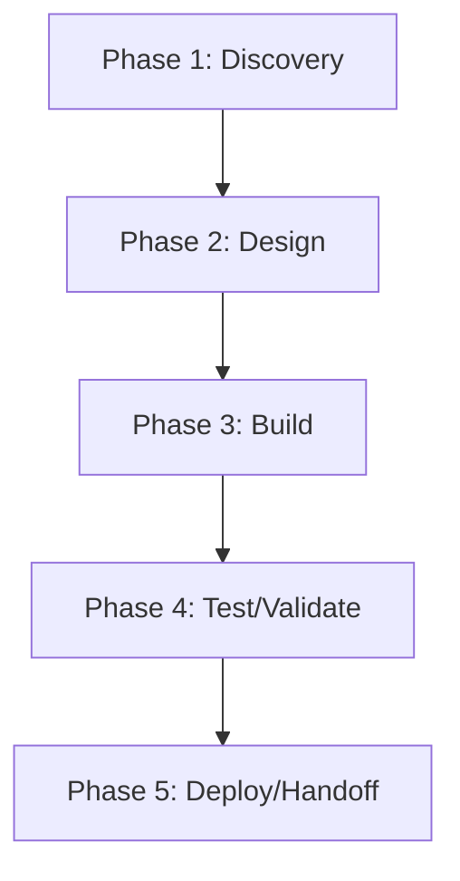

# Conft — Action Plan

> **Generated 2026-06-17.** Score grid: [`FLEET-AUDIT-30-PILLAR.md`](../FLEET-AUDIT-30-PILLAR.md). Source: [`Conft.json`](../../audits_data/Conft.json).

## Current state

- **Language:** Unknown (no Cargo.toml, package.json, pyproject.toml, or go.mod)
- **Mean score:** 0.42 (median 0)
- **Zero-pillar count:** 85 of 109
- **Three-pillar count:** 7 of 109
- **Blockers:** No manifest (Cargo.toml/package.json/pyproject.toml/go.mod) — cannot determine language/stack, 0 test files; 0 quality gates in CI, Q1: 10 workflows but 0/10 have quality gates

## Notes

Conft has strong SHA-pinning + CODEOWNERS but zero tests, zero quality gates, no manifest. Mostly config/workflows scaffolding. Investigate: is this an empty/scaffolding repo?

## Pillar distribution

| Score | Count | % |
|----|----:|----:|
| 3 (measured) | 7 | 6.4% |
| 2 (wired) | 8 | 7.3% |
| 1 (ad-hoc) | 9 | 8.3% |
| 0 (absent) | 85 | 78.0% |

## Phased WBS

### Phase 1: Discovery (≤3 tool calls per task)

- [ ] Read existing pillar evidence for each 0/1 score below
- [ ] Confirm scope of remediation with code owner

### Phase 2: Design (≤5 tool calls per task)

- [ ] Write ADR/decision record for any architectural change (A1-A5)
- [ ] Document coverage/SLO targets before writing the CI gate

### Phase 3: Build (≤15 tool calls per task)

**Tasks by role:**

#### agentic (2 tasks)

- [ ] **CON-008** `AS1` (Agentic safety) — score 0 → target 2: Lift AS1 (Agentic safety) from 0 to ≥2. Evidence: N/A
- [ ] **CON-009** `AS2` (Agentic safety) — score 0 → target 2: Lift AS2 (Agentic safety) from 0 to ≥2. Evidence: N/A

#### api (2 tasks)

- [ ] **CON-006** `AP1` (API surface) — score 0 → target 2: Lift AP1 (API surface) from 0 to ≥2. Evidence: N/A
- [ ] **CON-007** `AP2` (API surface) — score 0 → target 2: Lift AP2 (API surface) from 0 to ≥2. Evidence: N/A

#### ci-ops (5 tasks)

- [ ] **CON-034** `E1` (Engineering practice) — score 0 → target 2: Lift E1 (Engineering practice) from 0 to ≥2. Evidence: no -wtrees/ in repos/
- [ ] **CON-056** `Q2` (Quality eng) — score 0 → target 2: Lift Q2 (Quality eng) from 0 to ≥2. Evidence: no ratchet
- [ ] **CON-057** `Q3` (Quality eng) — score 0 → target 2: Lift Q3 (Quality eng) from 0 to ≥2. Evidence: no allowlist
- [ ] **CON-058** `Q1` (Quality eng) — score 1 → target 2: Lift Q1 (Quality eng) from 1 to ≥2. Evidence: 10 workflows but 0 have quality gates; configured but not enforced
- [ ] **CON-059** `Q4` (Quality eng) — score 1 → target 2: Lift Q4 (Quality eng) from 1 to ≥2. Evidence: 1 coverage workflow

#### data (3 tasks)

- [ ] **CON-029** `DA1` (Data/contracts) — score 0 → target 2: Lift DA1 (Data/contracts) from 0 to ≥2. Evidence: N/A
- [ ] **CON-030** `DA2` (Data/contracts) — score 0 → target 2: Lift DA2 (Data/contracts) from 0 to ≥2. Evidence: N/A
- [ ] **CON-031** `DA3` (Data/contracts) — score 0 → target 2: Lift DA3 (Data/contracts) from 0 to ≥2. Evidence: N/A

#### docs (5 tasks)

- [ ] **CON-024** `D1` (Documentation) — score 0 → target 2: Lift D1 (Documentation) from 0 to ≥2. Evidence: no spec tracker
- [ ] **CON-025** `D2` (Documentation) — score 0 → target 2: Lift D2 (Documentation) from 0 to ≥2. Evidence: no journeys
- [ ] **CON-026** `D3` (Documentation) — score 0 → target 2: Lift D3 (Documentation) from 0 to ≥2. Evidence: unknown
- [ ] **CON-027** `D5` (Documentation) — score 0 → target 2: Lift D5 (Documentation) from 0 to ≥2. Evidence: no API ref
- [ ] **CON-028** `D6` (Documentation) — score 0 → target 2: Lift D6 (Documentation) from 0 to ≥2. Evidence: no arch map

#### frontend (12 tasks)

- [ ] **CON-010** `AT1` (Accessibility & i18n) — score 0 → target 2: Lift AT1 (Accessibility & i18n) from 0 to ≥2. Evidence: unknown
- [ ] **CON-011** `AT2` (Accessibility & i18n) — score 0 → target 2: Lift AT2 (Accessibility & i18n) from 0 to ≥2. Evidence: unknown
- [ ] **CON-012** `AT3` (Accessibility & i18n) — score 0 → target 2: Lift AT3 (Accessibility & i18n) from 0 to ≥2. Evidence: unknown
- [ ] **CON-013** `AT4` (Accessibility & i18n) — score 0 → target 2: Lift AT4 (Accessibility & i18n) from 0 to ≥2. Evidence: unknown
- [ ] **CON-014** `AT5` (Accessibility & i18n) — score 0 → target 2: Lift AT5 (Accessibility & i18n) from 0 to ≥2. Evidence: unknown
- [ ] **CON-082** `U1` (UX/Frontend) — score 0 → target 2: Lift U1 (UX/Frontend) from 0 to ≥2. Evidence: unknown
- [ ] **CON-083** `U2` (UX/Frontend) — score 0 → target 2: Lift U2 (UX/Frontend) from 0 to ≥2. Evidence: unknown
- [ ] **CON-084** `U3` (UX/Frontend) — score 0 → target 2: Lift U3 (UX/Frontend) from 0 to ≥2. Evidence: unknown
- [ ] **CON-085** `U4` (UX/Frontend) — score 0 → target 2: Lift U4 (UX/Frontend) from 0 to ≥2. Evidence: unknown
- [ ] **CON-086** `UX1` (User experience) — score 0 → target 2: Lift UX1 (User experience) from 0 to ≥2. Evidence: unknown
- [ ] **CON-087** `UX2` (User experience) — score 0 → target 2: Lift UX2 (User experience) from 0 to ≥2. Evidence: unknown
- [ ] **CON-088** `UX3` (User experience) — score 0 → target 2: Lift UX3 (User experience) from 0 to ≥2. Evidence: unknown

#### governance (1 tasks)

- [ ] **CON-037** `G6` (Governance) — score 1 → target 2: Lift G6 (Governance) from 1 to ≥2. Evidence: CHANGELOG.md

#### perf (7 tasks)

- [ ] **CON-017** `C3` (Cost) — score 0 → target 2: Lift C3 (Cost) from 0 to ≥2. Evidence: no ratchet
- [ ] **CON-018** `C2` (Cost) — score 1 → target 2: Lift C2 (Cost) from 1 to ≥2. Evidence: minimal cache
- [ ] **CON-047** `P1` (Performance) — score 0 → target 2: Lift P1 (Performance) from 0 to ≥2. Evidence: no benches
- [ ] **CON-048** `P2` (Performance) — score 0 → target 2: Lift P2 (Performance) from 0 to ≥2. Evidence: no profiling
- [ ] **CON-049** `P3` (Performance) — score 0 → target 2: Lift P3 (Performance) from 0 to ≥2. Evidence: no bundle budget
- [ ] **CON-050** `P4` (Performance) — score 0 → target 2: Lift P4 (Performance) from 0 to ≥2. Evidence: no SLOs
- [ ] **CON-051** `P5` (Performance) — score 0 → target 2: Lift P5 (Performance) from 0 to ≥2. Evidence: no cache hit

#### qa (6 tasks)

- [ ] **CON-076** `T1` (Testing) — score 0 → target 2: Lift T1 (Testing) from 0 to ≥2. Evidence: 0 test files; no tests
- [ ] **CON-077** `T2` (Testing) — score 0 → target 2: Lift T2 (Testing) from 0 to ≥2. Evidence: no integration
- [ ] **CON-078** `T3` (Testing) — score 0 → target 2: Lift T3 (Testing) from 0 to ≥2. Evidence: no E2E
- [ ] **CON-079** `T4` (Testing) — score 0 → target 2: Lift T4 (Testing) from 0 to ≥2. Evidence: no contracts
- [ ] **CON-080** `T5` (Testing) — score 0 → target 2: Lift T5 (Testing) from 0 to ≥2. Evidence: no bug-fix repro
- [ ] **CON-081** `T6` (Testing) — score 0 → target 2: Lift T6 (Testing) from 0 to ≥2. Evidence: no multi-runner

#### rust-dev (24 tasks)

- [ ] **CON-001** `A1` (Architecture) — score 0 → target 2: Lift A1 (Architecture) from 0 to ≥2. Evidence: no manifest; structure unknown
- [ ] **CON-002** `A2` (Architecture) — score 0 → target 2: Lift A2 (Architecture) from 0 to ≥2. Evidence: no ADRs
- [ ] **CON-003** `A3` (Architecture) — score 0 → target 2: Lift A3 (Architecture) from 0 to ≥2. Evidence: unknown
- [ ] **CON-004** `A4` (Architecture) — score 0 → target 2: Lift A4 (Architecture) from 0 to ≥2. Evidence: unknown
- [ ] **CON-005** `A5` (Architecture) — score 0 → target 2: Lift A5 (Architecture) from 0 to ≥2. Evidence: unknown
- [ ] **CON-021** `CN1` (Concurrency) — score 0 → target 2: Lift CN1 (Concurrency) from 0 to ≥2. Evidence: unknown
- [ ] **CON-022** `CN2` (Concurrency) — score 0 → target 2: Lift CN2 (Concurrency) from 0 to ≥2. Evidence: unknown
- [ ] **CON-023** `CN3` (Concurrency) — score 0 → target 2: Lift CN3 (Concurrency) from 0 to ≥2. Evidence: unknown
- [ ] **CON-032** `DM1` (Domain model) — score 0 → target 2: Lift DM1 (Domain model) from 0 to ≥2. Evidence: unknown
- [ ] **CON-033** `DM2` (Domain model) — score 0 → target 2: Lift DM2 (Domain model) from 0 to ≥2. Evidence: unknown
- [ ] **CON-035** `EH1` (Error handling) — score 0 → target 2: Lift EH1 (Error handling) from 0 to ≥2. Evidence: unknown
- [ ] **CON-036** `EH2` (Error handling) — score 0 → target 2: Lift EH2 (Error handling) from 0 to ≥2. Evidence: unknown
- [ ] **CON-054** `PS1` (Persistence) — score 0 → target 2: Lift PS1 (Persistence) from 0 to ≥2. Evidence: N/A
- [ ] **CON-055** `PS2` (Persistence) — score 0 → target 2: Lift PS2 (Persistence) from 0 to ≥2. Evidence: N/A
- [ ] **CON-060** `RE1` (Reproducibility) — score 0 → target 2: Lift RE1 (Reproducibility) from 0 to ≥2. Evidence: no lockfile
- [ ] **CON-061** `RE2` (Reproducibility) — score 1 → target 2: Lift RE2 (Reproducibility) from 1 to ≥2. Evidence: build reproducible
- [ ] **CON-065** `RT1` (Runtime compat) — score 0 → target 2: Lift RT1 (Runtime compat) from 0 to ≥2. Evidence: unknown
- [ ] **CON-066** `RT2` (Runtime compat) — score 1 → target 2: Lift RT2 (Runtime compat) from 1 to ≥2. Evidence: Linux only
- [ ] **CON-089** `X1` (Code quality) — score 0 → target 2: Lift X1 (Code quality) from 0 to ≥2. Evidence: 0 of 10 workflows have quality gates
- [ ] **CON-090** `X2` (Code quality) — score 0 → target 2: Lift X2 (Code quality) from 0 to ≥2. Evidence: unknown
- [ ] **CON-091** `X3` (Code quality) — score 0 → target 2: Lift X3 (Code quality) from 0 to ≥2. Evidence: no complexity
- [ ] **CON-092** `X4` (Code quality) — score 0 → target 2: Lift X4 (Code quality) from 0 to ≥2. Evidence: no duplication
- [ ] **CON-093** `X5` (Code quality) — score 0 → target 2: Lift X5 (Code quality) from 0 to ≥2. Evidence: no dead code
- [ ] **CON-094** `X6` (Code quality) — score 0 → target 2: Lift X6 (Code quality) from 0 to ≥2. Evidence: no format check

#### security (15 tasks)

- [ ] **CON-015** `AU2` (Auditability) — score 0 → target 2: Lift AU2 (Auditability) from 0 to ≥2. Evidence: no ADRs
- [ ] **CON-016** `AU1` (Auditability) — score 1 → target 2: Lift AU1 (Auditability) from 1 to ≥2. Evidence: git log
- [ ] **CON-019** `CF1` (Config) — score 0 → target 2: Lift CF1 (Config) from 0 to ≥2. Evidence: unknown
- [ ] **CON-020** `CF2` (Config) — score 0 → target 2: Lift CF2 (Config) from 0 to ≥2. Evidence: no secrets
- [ ] **CON-052** `PR1` (Privacy) — score 0 → target 2: Lift PR1 (Privacy) from 0 to ≥2. Evidence: N/A
- [ ] **CON-053** `PR2` (Privacy) — score 0 → target 2: Lift PR2 (Privacy) from 0 to ≥2. Evidence: N/A
- [ ] **CON-067** `S4` (Security) — score 0 → target 2: Lift S4 (Security) from 0 to ≥2. Evidence: no auth
- [ ] **CON-068** `S6` (Security) — score 0 → target 2: Lift S6 (Security) from 0 to ≥2. Evidence: unknown
- [ ] **CON-069** `S7` (Security) — score 0 → target 2: Lift S7 (Security) from 0 to ≥2. Evidence: no threat model
- [ ] **CON-070** `S8` (Security) — score 0 → target 2: Lift S8 (Security) from 0 to ≥2. Evidence: no SLSA
- [ ] **CON-071** `S2` (Security) — score 1 → target 2: Lift S2 (Security) from 1 to ≥2. Evidence: deny.toml not present
- [ ] **CON-072** `SC1` (Supply chain) — score 0 → target 2: Lift SC1 (Supply chain) from 0 to ≥2. Evidence: no manifest
- [ ] **CON-073** `SC2` (Supply chain) — score 0 → target 2: Lift SC2 (Supply chain) from 0 to ≥2. Evidence: no SBOM
- [ ] **CON-074** `SC3` (Supply chain) — score 0 → target 2: Lift SC3 (Supply chain) from 0 to ≥2. Evidence: no attestation
- [ ] **CON-075** `SC4` (Supply chain) — score 0 → target 2: Lift SC4 (Supply chain) from 0 to ≥2. Evidence: no provenance

#### sre (12 tasks)

- [ ] **CON-038** `O2` (Operations) — score 0 → target 2: Lift O2 (Operations) from 0 to ≥2. Evidence: no runbooks
- [ ] **CON-039** `O3` (Operations) — score 0 → target 2: Lift O3 (Operations) from 0 to ≥2. Evidence: N/A
- [ ] **CON-040** `O4` (Operations) — score 0 → target 2: Lift O4 (Operations) from 0 to ≥2. Evidence: N/A
- [ ] **CON-041** `O5` (Operations) — score 0 → target 2: Lift O5 (Operations) from 0 to ≥2. Evidence: N/A
- [ ] **CON-042** `O1` (Operations) — score 1 → target 2: Lift O1 (Operations) from 1 to ≥2. Evidence: release flow minimal
- [ ] **CON-043** `OB1` (Observability) — score 0 → target 2: Lift OB1 (Observability) from 0 to ≥2. Evidence: no observability
- [ ] **CON-044** `OB2` (Observability) — score 0 → target 2: Lift OB2 (Observability) from 0 to ≥2. Evidence: no metrics
- [ ] **CON-045** `OB3` (Observability) — score 0 → target 2: Lift OB3 (Observability) from 0 to ≥2. Evidence: no traces
- [ ] **CON-046** `OB4` (Observability) — score 0 → target 2: Lift OB4 (Observability) from 0 to ≥2. Evidence: no SLOs
- [ ] **CON-062** `RL1` (Resilience) — score 0 → target 2: Lift RL1 (Resilience) from 0 to ≥2. Evidence: N/A
- [ ] **CON-063** `RL2` (Resilience) — score 0 → target 2: Lift RL2 (Resilience) from 0 to ≥2. Evidence: N/A
- [ ] **CON-064** `RL3` (Resilience) — score 0 → target 2: Lift RL3 (Resilience) from 0 to ≥2. Evidence: N/A

### Phase 4: Test/Validate (≤5 tool calls per task)

- [ ] Run the new CI gate; verify it fails when evidence is removed
- [ ] Re-score the lifted pillars; confirm the audit JSON reflects the change

### Phase 5: Deploy/Handoff (≤3 tool calls per task)

- [ ] Commit + push the gate
- [ ] Open a PR with the action plan referenced in the body

## DAG (mermaid)

## Top 5 biggest deltas (pillars to lift first)

1. **A1** — no manifest; structure unknown
1. **A2** — no ADRs
1. **A3** — unknown
1. **A4** — unknown
1. **A5** — unknown

## Backlog of unaddressed items

Total 94 tasks across 12 roles. See "Build" phase above for the full list.
