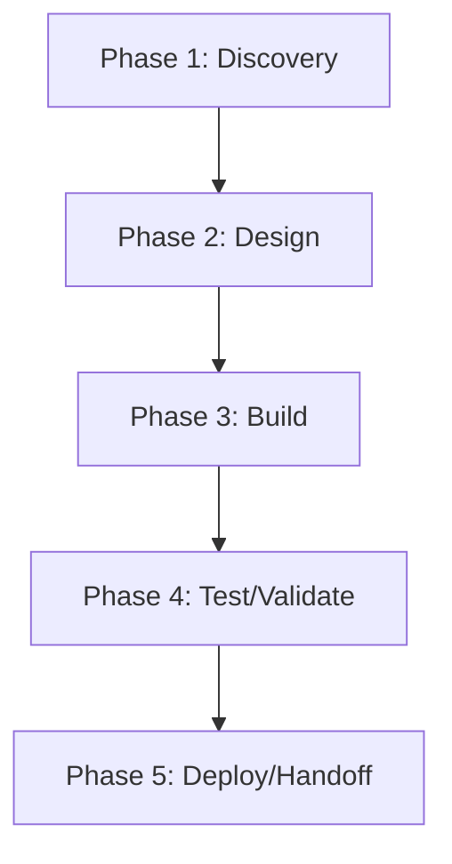

# HeliosCLI — Action Plan

> **Generated 2026-06-17.** Score grid: [`FLEET-AUDIT-30-PILLAR.md`](../FLEET-AUDIT-30-PILLAR.md). Source: [`HeliosCLI.json`](../../audits_data/HeliosCLI.json).

## Current state

- **Language:** Rust
- **Mean score:** 0.88 (median 1)
- **Zero-pillar count:** 54 of 109
- **Three-pillar count:** 9 of 109
- **Blockers:** A2/D2/D5/D6: no architecture docs/journeys/API ref/arch map, P1-P5: no perf infrastructure, S4-S7: minimal security work, OB2-OB4: no metrics/traces/SLOs, CN1: no race detection

## Notes

Rust CLI tool. Strong governance hygiene, minimal docs/journeys, no perf infrastructure.

## Pillar distribution

| Score | Count | % |
|----|----:|----:|
| 3 (measured) | 9 | 8.3% |
| 2 (wired) | 23 | 21.1% |
| 1 (ad-hoc) | 23 | 21.1% |
| 0 (absent) | 54 | 49.5% |

## Phased WBS

### Phase 1: Discovery (≤3 tool calls per task)

- [ ] Read existing pillar evidence for each 0/1 score below
- [ ] Confirm scope of remediation with code owner

### Phase 2: Design (≤5 tool calls per task)

- [ ] Write ADR/decision record for any architectural change (A1-A5)
- [ ] Document coverage/SLO targets before writing the CI gate

### Phase 3: Build (≤15 tool calls per task)

**Tasks by role:**

#### agentic (2 tasks)

- [ ] **HEL-007** `AS1` (Agentic safety) — score 0 → target 2: Lift AS1 (Agentic safety) from 0 to ≥2. Evidence: N/A
- [ ] **HEL-008** `AS2` (Agentic safety) — score 0 → target 2: Lift AS2 (Agentic safety) from 0 to ≥2. Evidence: N/A

#### api (2 tasks)

- [ ] **HEL-005** `AP1` (API surface) — score 0 → target 2: Lift AP1 (API surface) from 0 to ≥2. Evidence: N/A
- [ ] **HEL-006** `AP2` (API surface) — score 0 → target 2: Lift AP2 (API surface) from 0 to ≥2. Evidence: N/A

#### ci-ops (3 tasks)

- [ ] **HEL-048** `Q2` (Quality eng) — score 0 → target 2: Lift Q2 (Quality eng) from 0 to ≥2. Evidence: no ratchet
- [ ] **HEL-049** `Q3` (Quality eng) — score 0 → target 2: Lift Q3 (Quality eng) from 0 to ≥2. Evidence: no allowlist tracking
- [ ] **HEL-050** `Q4` (Quality eng) — score 0 → target 2: Lift Q4 (Quality eng) from 0 to ≥2. Evidence: no coverage reports

#### data (3 tasks)

- [ ] **HEL-025** `DA1` (Data/contracts) — score 0 → target 2: Lift DA1 (Data/contracts) from 0 to ≥2. Evidence: N/A — CLI
- [ ] **HEL-026** `DA2` (Data/contracts) — score 0 → target 2: Lift DA2 (Data/contracts) from 0 to ≥2. Evidence: N/A
- [ ] **HEL-027** `DA3` (Data/contracts) — score 0 → target 2: Lift DA3 (Data/contracts) from 0 to ≥2. Evidence: N/A

#### docs (4 tasks)

- [ ] **HEL-021** `D2` (Documentation) — score 0 → target 2: Lift D2 (Documentation) from 0 to ≥2. Evidence: no user journeys
- [ ] **HEL-022** `D6` (Documentation) — score 0 → target 2: Lift D6 (Documentation) from 0 to ≥2. Evidence: no architecture map
- [ ] **HEL-023** `D1` (Documentation) — score 1 → target 2: Lift D1 (Documentation) from 1 to ≥2. Evidence: SPEC_TRACKER.md absent; SPEC.md is minimal
- [ ] **HEL-024** `D5` (Documentation) — score 1 → target 2: Lift D5 (Documentation) from 1 to ≥2. Evidence: cargo doc available; not deployed

#### frontend (11 tasks)

- [ ] **HEL-009** `AT1` (Accessibility & i18n) — score 0 → target 2: Lift AT1 (Accessibility & i18n) from 0 to ≥2. Evidence: N/A — CLI
- [ ] **HEL-010** `AT2` (Accessibility & i18n) — score 0 → target 2: Lift AT2 (Accessibility & i18n) from 0 to ≥2. Evidence: N/A
- [ ] **HEL-011** `AT3` (Accessibility & i18n) — score 0 → target 2: Lift AT3 (Accessibility & i18n) from 0 to ≥2. Evidence: N/A
- [ ] **HEL-012** `AT4` (Accessibility & i18n) — score 0 → target 2: Lift AT4 (Accessibility & i18n) from 0 to ≥2. Evidence: N/A
- [ ] **HEL-013** `AT5` (Accessibility & i18n) — score 0 → target 2: Lift AT5 (Accessibility & i18n) from 0 to ≥2. Evidence: N/A
- [ ] **HEL-069** `U1` (UX/Frontend) — score 0 → target 2: Lift U1 (UX/Frontend) from 0 to ≥2. Evidence: N/A — CLI
- [ ] **HEL-070** `U2` (UX/Frontend) — score 0 → target 2: Lift U2 (UX/Frontend) from 0 to ≥2. Evidence: N/A
- [ ] **HEL-071** `U3` (UX/Frontend) — score 0 → target 2: Lift U3 (UX/Frontend) from 0 to ≥2. Evidence: N/A
- [ ] **HEL-072** `U4` (UX/Frontend) — score 1 → target 2: Lift U4 (UX/Frontend) from 1 to ≥2. Evidence: CLI output uses monospace
- [ ] **HEL-073** `UX3` (User experience) — score 0 → target 2: Lift UX3 (User experience) from 0 to ≥2. Evidence: N/A
- [ ] **HEL-074** `UX2` (User experience) — score 1 → target 2: Lift UX2 (User experience) from 1 to ≥2. Evidence: progressive disclosure via subcommands

#### governance (1 tasks)

- [ ] **HEL-031** `G6` (Governance) — score 1 → target 2: Lift G6 (Governance) from 1 to ≥2. Evidence: CHANGELOG.md

#### perf (6 tasks)

- [ ] **HEL-016** `C3` (Cost) — score 1 → target 2: Lift C3 (Cost) from 1 to ≥2. Evidence: no build time ratchet
- [ ] **HEL-039** `P1` (Performance) — score 0 → target 2: Lift P1 (Performance) from 0 to ≥2. Evidence: no benches
- [ ] **HEL-040** `P2` (Performance) — score 0 → target 2: Lift P2 (Performance) from 0 to ≥2. Evidence: no profiling
- [ ] **HEL-041** `P3` (Performance) — score 0 → target 2: Lift P3 (Performance) from 0 to ≥2. Evidence: N/A — CLI
- [ ] **HEL-042** `P4` (Performance) — score 0 → target 2: Lift P4 (Performance) from 0 to ≥2. Evidence: no SLOs
- [ ] **HEL-043** `P5` (Performance) — score 0 → target 2: Lift P5 (Performance) from 0 to ≥2. Evidence: N/A

#### qa (6 tasks)

- [ ] **HEL-063** `T3` (Testing) — score 0 → target 2: Lift T3 (Testing) from 0 to ≥2. Evidence: no E2E
- [ ] **HEL-064** `T4` (Testing) — score 0 → target 2: Lift T4 (Testing) from 0 to ≥2. Evidence: no contract tests
- [ ] **HEL-065** `T1` (Testing) — score 1 → target 2: Lift T1 (Testing) from 1 to ≥2. Evidence: 23 test files; no coverage gate
- [ ] **HEL-066** `T2` (Testing) — score 1 → target 2: Lift T2 (Testing) from 1 to ≥2. Evidence: basic integration tests
- [ ] **HEL-067** `T5` (Testing) — score 1 → target 2: Lift T5 (Testing) from 1 to ≥2. Evidence: tests for bug fixes; ad-hoc
- [ ] **HEL-068** `T6` (Testing) — score 1 → target 2: Lift T6 (Testing) from 1 to ≥2. Evidence: Linux CI only; no multi-runner

#### rust-dev (16 tasks)

- [ ] **HEL-001** `A2` (Architecture) — score 0 → target 2: Lift A2 (Architecture) from 0 to ≥2. Evidence: no docs/adr/
- [ ] **HEL-002** `A1` (Architecture) — score 1 → target 2: Lift A1 (Architecture) from 1 to ≥2. Evidence: CLI monolith; no clear domain/adapter split
- [ ] **HEL-003** `A3` (Architecture) — score 1 → target 2: Lift A3 (Architecture) from 1 to ≥2. Evidence: Cargo workspace; basic module layering
- [ ] **HEL-004** `A5` (Architecture) — score 1 → target 2: Lift A5 (Architecture) from 1 to ≥2. Evidence: domain types; minimal methods
- [ ] **HEL-018** `CN1` (Concurrency) — score 0 → target 2: Lift CN1 (Concurrency) from 0 to ≥2. Evidence: no loom/miri
- [ ] **HEL-019** `CN2` (Concurrency) — score 0 → target 2: Lift CN2 (Concurrency) from 0 to ≥2. Evidence: no async
- [ ] **HEL-020** `CN3` (Concurrency) — score 0 → target 2: Lift CN3 (Concurrency) from 0 to ≥2. Evidence: N/A
- [ ] **HEL-028** `DM1` (Domain model) — score 1 → target 2: Lift DM1 (Domain model) from 1 to ≥2. Evidence: basic types; no rich methods
- [ ] **HEL-029** `DM2` (Domain model) — score 1 → target 2: Lift DM2 (Domain model) from 1 to ≥2. Evidence: newtype wrappers used sparingly
- [ ] **HEL-030** `EH2` (Error handling) — score 1 → target 2: Lift EH2 (Error handling) from 1 to ≥2. Evidence: clap error display; minimal sanitization
- [ ] **HEL-046** `PS1` (Persistence) — score 0 → target 2: Lift PS1 (Persistence) from 0 to ≥2. Evidence: N/A
- [ ] **HEL-047** `PS2` (Persistence) — score 0 → target 2: Lift PS2 (Persistence) from 0 to ≥2. Evidence: N/A
- [ ] **HEL-054** `RT2` (Runtime compat) — score 1 → target 2: Lift RT2 (Runtime compat) from 1 to ≥2. Evidence: Linux only
- [ ] **HEL-075** `X4` (Code quality) — score 0 → target 2: Lift X4 (Code quality) from 0 to ≥2. Evidence: no duplication check
- [ ] **HEL-076** `X3` (Code quality) — score 1 → target 2: Lift X3 (Code quality) from 1 to ≥2. Evidence: no complexity gate
- [ ] **HEL-077** `X5` (Code quality) — score 1 → target 2: Lift X5 (Code quality) from 1 to ≥2. Evidence: no dead code check enforced

#### security (13 tasks)

- [ ] **HEL-014** `AU2` (Auditability) — score 0 → target 2: Lift AU2 (Auditability) from 0 to ≥2. Evidence: no ADRs
- [ ] **HEL-015** `AU1` (Auditability) — score 1 → target 2: Lift AU1 (Auditability) from 1 to ≥2. Evidence: git log; CHANGELOG
- [ ] **HEL-017** `CF2` (Config) — score 1 → target 2: Lift CF2 (Config) from 1 to ≥2. Evidence: no secrets in CLI
- [ ] **HEL-044** `PR1` (Privacy) — score 0 → target 2: Lift PR1 (Privacy) from 0 to ≥2. Evidence: N/A — CLI
- [ ] **HEL-045** `PR2` (Privacy) — score 0 → target 2: Lift PR2 (Privacy) from 0 to ≥2. Evidence: N/A
- [ ] **HEL-055** `S4` (Security) — score 0 → target 2: Lift S4 (Security) from 0 to ≥2. Evidence: no auth on CLI
- [ ] **HEL-056** `S5` (Security) — score 0 → target 2: Lift S5 (Security) from 0 to ≥2. Evidence: N/A
- [ ] **HEL-057** `S7` (Security) — score 0 → target 2: Lift S7 (Security) from 0 to ≥2. Evidence: no threat model
- [ ] **HEL-058** `S6` (Security) — score 1 → target 2: Lift S6 (Security) from 1 to ≥2. Evidence: input validation via clap
- [ ] **HEL-059** `S8` (Security) — score 1 → target 2: Lift S8 (Security) from 1 to ≥2. Evidence: 1 SLSA/provenance workflow
- [ ] **HEL-060** `SC2` (Supply chain) — score 0 → target 2: Lift SC2 (Supply chain) from 0 to ≥2. Evidence: no SBOM
- [ ] **HEL-061** `SC3` (Supply chain) — score 0 → target 2: Lift SC3 (Supply chain) from 0 to ≥2. Evidence: no attestation
- [ ] **HEL-062** `SC4` (Supply chain) — score 0 → target 2: Lift SC4 (Supply chain) from 0 to ≥2. Evidence: no provenance

#### sre (10 tasks)

- [ ] **HEL-032** `O2` (Operations) — score 0 → target 2: Lift O2 (Operations) from 0 to ≥2. Evidence: no runbooks
- [ ] **HEL-033** `O3` (Operations) — score 0 → target 2: Lift O3 (Operations) from 0 to ≥2. Evidence: N/A — CLI tool
- [ ] **HEL-034** `O4` (Operations) — score 0 → target 2: Lift O4 (Operations) from 0 to ≥2. Evidence: N/A
- [ ] **HEL-035** `O5` (Operations) — score 0 → target 2: Lift O5 (Operations) from 0 to ≥2. Evidence: N/A
- [ ] **HEL-036** `OB2` (Observability) — score 0 → target 2: Lift OB2 (Observability) from 0 to ≥2. Evidence: no metrics
- [ ] **HEL-037** `OB3` (Observability) — score 0 → target 2: Lift OB3 (Observability) from 0 to ≥2. Evidence: no traces
- [ ] **HEL-038** `OB4` (Observability) — score 0 → target 2: Lift OB4 (Observability) from 0 to ≥2. Evidence: no SLOs
- [ ] **HEL-051** `RL1` (Resilience) — score 0 → target 2: Lift RL1 (Resilience) from 0 to ≥2. Evidence: no downstream
- [ ] **HEL-052** `RL2` (Resilience) — score 0 → target 2: Lift RL2 (Resilience) from 0 to ≥2. Evidence: no retries
- [ ] **HEL-053** `RL3` (Resilience) — score 0 → target 2: Lift RL3 (Resilience) from 0 to ≥2. Evidence: no bulkheads

### Phase 4: Test/Validate (≤5 tool calls per task)

- [ ] Run the new CI gate; verify it fails when evidence is removed
- [ ] Re-score the lifted pillars; confirm the audit JSON reflects the change

### Phase 5: Deploy/Handoff (≤3 tool calls per task)

- [ ] Commit + push the gate
- [ ] Open a PR with the action plan referenced in the body

## DAG (mermaid)

## Top 5 biggest deltas (pillars to lift first)

1. **A2** — no docs/adr/
1. **AP1** — N/A
1. **AP2** — N/A
1. **AS1** — N/A
1. **AS2** — N/A

## Backlog of unaddressed items

Total 77 tasks across 12 roles. See "Build" phase above for the full list.
