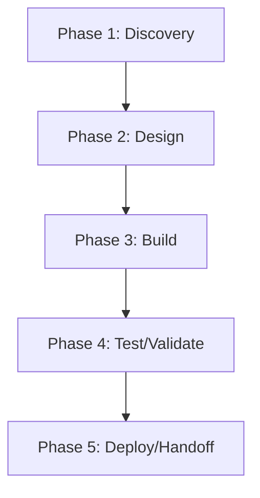

# Kwality — Action Plan

> **Generated 2026-06-17.** Score grid: [`FLEET-AUDIT-30-PILLAR.md`](../FLEET-AUDIT-30-PILLAR.md). Source: [`Kwality.json`](../../audits_data/Kwality.json).

## Current state

- **Language:** Unknown
- **Mean score:** 0.21 (median 0)
- **Zero-pillar count:** 96 of 109
- **Three-pillar count:** 3 of 109
- **Blockers:** No manifest (Cargo.toml/package.json/pyproject.toml/go.mod), 0 test files; 0 SHA pinning; 0 quality gates

## Notes

Kwality is largely a governance scaffold: SECURITY/CONTRIBUTING/LICENSE/CODEOWNERS all present, but no code, no tests, no manifest. Likely a placeholder or governance-only repo.

## Pillar distribution

| Score | Count | % |
|----|----:|----:|
| 3 (measured) | 3 | 2.8% |
| 2 (wired) | 4 | 3.7% |
| 1 (ad-hoc) | 6 | 5.5% |
| 0 (absent) | 96 | 88.1% |

## Phased WBS

### Phase 1: Discovery (≤3 tool calls per task)

- [ ] Read existing pillar evidence for each 0/1 score below
- [ ] Confirm scope of remediation with code owner

### Phase 2: Design (≤5 tool calls per task)

- [ ] Write ADR/decision record for any architectural change (A1-A5)
- [ ] Document coverage/SLO targets before writing the CI gate

### Phase 3: Build (≤15 tool calls per task)

**Tasks by role:**

#### agentic (2 tasks)

- [ ] **KWA-008** `AS1` (Agentic safety) — score 0 → target 2: Lift AS1 (Agentic safety) from 0 to ≥2. Evidence: N/A
- [ ] **KWA-009** `AS2` (Agentic safety) — score 0 → target 2: Lift AS2 (Agentic safety) from 0 to ≥2. Evidence: N/A

#### api (2 tasks)

- [ ] **KWA-006** `AP1` (API surface) — score 0 → target 2: Lift AP1 (API surface) from 0 to ≥2. Evidence: N/A
- [ ] **KWA-007** `AP2` (API surface) — score 0 → target 2: Lift AP2 (API surface) from 0 to ≥2. Evidence: N/A

#### ci-ops (8 tasks)

- [ ] **KWA-035** `E1` (Engineering practice) — score 0 → target 2: Lift E1 (Engineering practice) from 0 to ≥2. Evidence: no -wtrees/
- [ ] **KWA-036** `E2` (Engineering practice) — score 0 → target 2: Lift E2 (Engineering practice) from 0 to ≥2. Evidence: main unprotected or unknown
- [ ] **KWA-037** `E4` (Engineering practice) — score 0 → target 2: Lift E4 (Engineering practice) from 0 to ≥2. Evidence: no Co-Authored-By
- [ ] **KWA-038** `E5` (Engineering practice) — score 0 → target 2: Lift E5 (Engineering practice) from 0 to ≥2. Evidence: unknown
- [ ] **KWA-060** `Q1` (Quality eng) — score 0 → target 2: Lift Q1 (Quality eng) from 0 to ≥2. Evidence: 0/1 workflows have quality gates
- [ ] **KWA-061** `Q2` (Quality eng) — score 0 → target 2: Lift Q2 (Quality eng) from 0 to ≥2. Evidence: no ratchet
- [ ] **KWA-062** `Q3` (Quality eng) — score 0 → target 2: Lift Q3 (Quality eng) from 0 to ≥2. Evidence: no allowlist
- [ ] **KWA-063** `Q4` (Quality eng) — score 0 → target 2: Lift Q4 (Quality eng) from 0 to ≥2. Evidence: no coverage

#### data (3 tasks)

- [ ] **KWA-030** `DA1` (Data/contracts) — score 0 → target 2: Lift DA1 (Data/contracts) from 0 to ≥2. Evidence: N/A
- [ ] **KWA-031** `DA2` (Data/contracts) — score 0 → target 2: Lift DA2 (Data/contracts) from 0 to ≥2. Evidence: N/A
- [ ] **KWA-032** `DA3` (Data/contracts) — score 0 → target 2: Lift DA3 (Data/contracts) from 0 to ≥2. Evidence: N/A

#### docs (5 tasks)

- [ ] **KWA-025** `D1` (Documentation) — score 0 → target 2: Lift D1 (Documentation) from 0 to ≥2. Evidence: no spec
- [ ] **KWA-026** `D2` (Documentation) — score 0 → target 2: Lift D2 (Documentation) from 0 to ≥2. Evidence: no journeys
- [ ] **KWA-027** `D3` (Documentation) — score 0 → target 2: Lift D3 (Documentation) from 0 to ≥2. Evidence: unknown
- [ ] **KWA-028** `D5` (Documentation) — score 0 → target 2: Lift D5 (Documentation) from 0 to ≥2. Evidence: no API ref
- [ ] **KWA-029** `D6` (Documentation) — score 0 → target 2: Lift D6 (Documentation) from 0 to ≥2. Evidence: no arch map

#### frontend (12 tasks)

- [ ] **KWA-010** `AT1` (Accessibility & i18n) — score 0 → target 2: Lift AT1 (Accessibility & i18n) from 0 to ≥2. Evidence: N/A
- [ ] **KWA-011** `AT2` (Accessibility & i18n) — score 0 → target 2: Lift AT2 (Accessibility & i18n) from 0 to ≥2. Evidence: N/A
- [ ] **KWA-012** `AT3` (Accessibility & i18n) — score 0 → target 2: Lift AT3 (Accessibility & i18n) from 0 to ≥2. Evidence: N/A
- [ ] **KWA-013** `AT4` (Accessibility & i18n) — score 0 → target 2: Lift AT4 (Accessibility & i18n) from 0 to ≥2. Evidence: N/A
- [ ] **KWA-014** `AT5` (Accessibility & i18n) — score 0 → target 2: Lift AT5 (Accessibility & i18n) from 0 to ≥2. Evidence: N/A
- [ ] **KWA-090** `U1` (UX/Frontend) — score 0 → target 2: Lift U1 (UX/Frontend) from 0 to ≥2. Evidence: N/A
- [ ] **KWA-091** `U2` (UX/Frontend) — score 0 → target 2: Lift U2 (UX/Frontend) from 0 to ≥2. Evidence: N/A
- [ ] **KWA-092** `U3` (UX/Frontend) — score 0 → target 2: Lift U3 (UX/Frontend) from 0 to ≥2. Evidence: N/A
- [ ] **KWA-093** `U4` (UX/Frontend) — score 0 → target 2: Lift U4 (UX/Frontend) from 0 to ≥2. Evidence: N/A
- [ ] **KWA-094** `UX1` (User experience) — score 0 → target 2: Lift UX1 (User experience) from 0 to ≥2. Evidence: N/A
- [ ] **KWA-095** `UX2` (User experience) — score 0 → target 2: Lift UX2 (User experience) from 0 to ≥2. Evidence: N/A
- [ ] **KWA-096** `UX3` (User experience) — score 0 → target 2: Lift UX3 (User experience) from 0 to ≥2. Evidence: N/A

#### governance (1 tasks)

- [ ] **KWA-041** `G6` (Governance) — score 1 → target 2: Lift G6 (Governance) from 1 to ≥2. Evidence: CHANGELOG.md

#### perf (8 tasks)

- [ ] **KWA-017** `C2` (Cost) — score 0 → target 2: Lift C2 (Cost) from 0 to ≥2. Evidence: no cache
- [ ] **KWA-018** `C3` (Cost) — score 0 → target 2: Lift C3 (Cost) from 0 to ≥2. Evidence: no ratchet
- [ ] **KWA-019** `C1` (Cost) — score 1 → target 2: Lift C1 (Cost) from 1 to ≥2. Evidence: unknown runner
- [ ] **KWA-051** `P1` (Performance) — score 0 → target 2: Lift P1 (Performance) from 0 to ≥2. Evidence: no benches
- [ ] **KWA-052** `P2` (Performance) — score 0 → target 2: Lift P2 (Performance) from 0 to ≥2. Evidence: no profiling
- [ ] **KWA-053** `P3` (Performance) — score 0 → target 2: Lift P3 (Performance) from 0 to ≥2. Evidence: no bundle budget
- [ ] **KWA-054** `P4` (Performance) — score 0 → target 2: Lift P4 (Performance) from 0 to ≥2. Evidence: no SLOs
- [ ] **KWA-055** `P5` (Performance) — score 0 → target 2: Lift P5 (Performance) from 0 to ≥2. Evidence: no cache hit

#### qa (6 tasks)

- [ ] **KWA-084** `T1` (Testing) — score 0 → target 2: Lift T1 (Testing) from 0 to ≥2. Evidence: no test files
- [ ] **KWA-085** `T2` (Testing) — score 0 → target 2: Lift T2 (Testing) from 0 to ≥2. Evidence: no integration
- [ ] **KWA-086** `T3` (Testing) — score 0 → target 2: Lift T3 (Testing) from 0 to ≥2. Evidence: no E2E
- [ ] **KWA-087** `T4` (Testing) — score 0 → target 2: Lift T4 (Testing) from 0 to ≥2. Evidence: no contracts
- [ ] **KWA-088** `T5` (Testing) — score 0 → target 2: Lift T5 (Testing) from 0 to ≥2. Evidence: no bug-fix repro
- [ ] **KWA-089** `T6` (Testing) — score 0 → target 2: Lift T6 (Testing) from 0 to ≥2. Evidence: no multi-runner

#### rust-dev (24 tasks)

- [ ] **KWA-001** `A1` (Architecture) — score 0 → target 2: Lift A1 (Architecture) from 0 to ≥2. Evidence: no manifest
- [ ] **KWA-002** `A2` (Architecture) — score 0 → target 2: Lift A2 (Architecture) from 0 to ≥2. Evidence: no ADRs
- [ ] **KWA-003** `A3` (Architecture) — score 0 → target 2: Lift A3 (Architecture) from 0 to ≥2. Evidence: unknown
- [ ] **KWA-004** `A4` (Architecture) — score 0 → target 2: Lift A4 (Architecture) from 0 to ≥2. Evidence: unknown
- [ ] **KWA-005** `A5` (Architecture) — score 0 → target 2: Lift A5 (Architecture) from 0 to ≥2. Evidence: unknown
- [ ] **KWA-022** `CN1` (Concurrency) — score 0 → target 2: Lift CN1 (Concurrency) from 0 to ≥2. Evidence: unknown
- [ ] **KWA-023** `CN2` (Concurrency) — score 0 → target 2: Lift CN2 (Concurrency) from 0 to ≥2. Evidence: unknown
- [ ] **KWA-024** `CN3` (Concurrency) — score 0 → target 2: Lift CN3 (Concurrency) from 0 to ≥2. Evidence: unknown
- [ ] **KWA-033** `DM1` (Domain model) — score 0 → target 2: Lift DM1 (Domain model) from 0 to ≥2. Evidence: unknown
- [ ] **KWA-034** `DM2` (Domain model) — score 0 → target 2: Lift DM2 (Domain model) from 0 to ≥2. Evidence: unknown
- [ ] **KWA-039** `EH1` (Error handling) — score 0 → target 2: Lift EH1 (Error handling) from 0 to ≥2. Evidence: unknown
- [ ] **KWA-040** `EH2` (Error handling) — score 0 → target 2: Lift EH2 (Error handling) from 0 to ≥2. Evidence: unknown
- [ ] **KWA-058** `PS1` (Persistence) — score 0 → target 2: Lift PS1 (Persistence) from 0 to ≥2. Evidence: N/A
- [ ] **KWA-059** `PS2` (Persistence) — score 0 → target 2: Lift PS2 (Persistence) from 0 to ≥2. Evidence: N/A
- [ ] **KWA-064** `RE1` (Reproducibility) — score 0 → target 2: Lift RE1 (Reproducibility) from 0 to ≥2. Evidence: no lockfile
- [ ] **KWA-065** `RE2` (Reproducibility) — score 0 → target 2: Lift RE2 (Reproducibility) from 0 to ≥2. Evidence: unknown
- [ ] **KWA-069** `RT1` (Runtime compat) — score 0 → target 2: Lift RT1 (Runtime compat) from 0 to ≥2. Evidence: unknown
- [ ] **KWA-070** `RT2` (Runtime compat) — score 0 → target 2: Lift RT2 (Runtime compat) from 0 to ≥2. Evidence: unknown
- [ ] **KWA-097** `X1` (Code quality) — score 0 → target 2: Lift X1 (Code quality) from 0 to ≥2. Evidence: no CI gates
- [ ] **KWA-098** `X2` (Code quality) — score 0 → target 2: Lift X2 (Code quality) from 0 to ≥2. Evidence: unknown
- [ ] **KWA-099** `X3` (Code quality) — score 0 → target 2: Lift X3 (Code quality) from 0 to ≥2. Evidence: no complexity
- [ ] **KWA-100** `X4` (Code quality) — score 0 → target 2: Lift X4 (Code quality) from 0 to ≥2. Evidence: no duplication
- [ ] **KWA-101** `X5` (Code quality) — score 0 → target 2: Lift X5 (Code quality) from 0 to ≥2. Evidence: no dead code
- [ ] **KWA-102** `X6` (Code quality) — score 0 → target 2: Lift X6 (Code quality) from 0 to ≥2. Evidence: no format check

#### security (19 tasks)

- [ ] **KWA-015** `AU2` (Auditability) — score 0 → target 2: Lift AU2 (Auditability) from 0 to ≥2. Evidence: no ADRs
- [ ] **KWA-016** `AU1` (Auditability) — score 1 → target 2: Lift AU1 (Auditability) from 1 to ≥2. Evidence: git log
- [ ] **KWA-020** `CF1` (Config) — score 0 → target 2: Lift CF1 (Config) from 0 to ≥2. Evidence: unknown
- [ ] **KWA-021** `CF2` (Config) — score 0 → target 2: Lift CF2 (Config) from 0 to ≥2. Evidence: no secrets
- [ ] **KWA-056** `PR1` (Privacy) — score 0 → target 2: Lift PR1 (Privacy) from 0 to ≥2. Evidence: N/A
- [ ] **KWA-057** `PR2` (Privacy) — score 0 → target 2: Lift PR2 (Privacy) from 0 to ≥2. Evidence: N/A
- [ ] **KWA-071** `S2` (Security) — score 0 → target 2: Lift S2 (Security) from 0 to ≥2. Evidence: no deny.toml/SCA
- [ ] **KWA-072** `S4` (Security) — score 0 → target 2: Lift S4 (Security) from 0 to ≥2. Evidence: no auth
- [ ] **KWA-073** `S6` (Security) — score 0 → target 2: Lift S6 (Security) from 0 to ≥2. Evidence: unknown
- [ ] **KWA-074** `S7` (Security) — score 0 → target 2: Lift S7 (Security) from 0 to ≥2. Evidence: no threat model
- [ ] **KWA-075** `S8` (Security) — score 0 → target 2: Lift S8 (Security) from 0 to ≥2. Evidence: no SLSA
- [ ] **KWA-076** `S9` (Security) — score 0 → target 2: Lift S9 (Security) from 0 to ≥2. Evidence: no SHA pinning
- [ ] **KWA-077** `S1` (Security) — score 1 → target 2: Lift S1 (Security) from 1 to ≥2. Evidence: limited security workflow
- [ ] **KWA-078** `S3` (Security) — score 1 → target 2: Lift S3 (Security) from 1 to ≥2. Evidence: trufflehog partial
- [ ] **KWA-079** `S5` (Security) — score 1 → target 2: Lift S5 (Security) from 1 to ≥2. Evidence: CODEOWNERS gate (1 line)
- [ ] **KWA-080** `SC1` (Supply chain) — score 0 → target 2: Lift SC1 (Supply chain) from 0 to ≥2. Evidence: no manifest
- [ ] **KWA-081** `SC2` (Supply chain) — score 0 → target 2: Lift SC2 (Supply chain) from 0 to ≥2. Evidence: no SBOM
- [ ] **KWA-082** `SC3` (Supply chain) — score 0 → target 2: Lift SC3 (Supply chain) from 0 to ≥2. Evidence: no attestation
- [ ] **KWA-083** `SC4` (Supply chain) — score 0 → target 2: Lift SC4 (Supply chain) from 0 to ≥2. Evidence: no provenance

#### sre (12 tasks)

- [ ] **KWA-042** `O1` (Operations) — score 0 → target 2: Lift O1 (Operations) from 0 to ≥2. Evidence: no release flow
- [ ] **KWA-043** `O2` (Operations) — score 0 → target 2: Lift O2 (Operations) from 0 to ≥2. Evidence: no runbooks
- [ ] **KWA-044** `O3` (Operations) — score 0 → target 2: Lift O3 (Operations) from 0 to ≥2. Evidence: N/A
- [ ] **KWA-045** `O4` (Operations) — score 0 → target 2: Lift O4 (Operations) from 0 to ≥2. Evidence: N/A
- [ ] **KWA-046** `O5` (Operations) — score 0 → target 2: Lift O5 (Operations) from 0 to ≥2. Evidence: N/A
- [ ] **KWA-047** `OB1` (Observability) — score 0 → target 2: Lift OB1 (Observability) from 0 to ≥2. Evidence: no observability
- [ ] **KWA-048** `OB2` (Observability) — score 0 → target 2: Lift OB2 (Observability) from 0 to ≥2. Evidence: no metrics
- [ ] **KWA-049** `OB3` (Observability) — score 0 → target 2: Lift OB3 (Observability) from 0 to ≥2. Evidence: no traces
- [ ] **KWA-050** `OB4` (Observability) — score 0 → target 2: Lift OB4 (Observability) from 0 to ≥2. Evidence: no SLOs
- [ ] **KWA-066** `RL1` (Resilience) — score 0 → target 2: Lift RL1 (Resilience) from 0 to ≥2. Evidence: N/A
- [ ] **KWA-067** `RL2` (Resilience) — score 0 → target 2: Lift RL2 (Resilience) from 0 to ≥2. Evidence: N/A
- [ ] **KWA-068** `RL3` (Resilience) — score 0 → target 2: Lift RL3 (Resilience) from 0 to ≥2. Evidence: N/A

### Phase 4: Test/Validate (≤5 tool calls per task)

- [ ] Run the new CI gate; verify it fails when evidence is removed
- [ ] Re-score the lifted pillars; confirm the audit JSON reflects the change

### Phase 5: Deploy/Handoff (≤3 tool calls per task)

- [ ] Commit + push the gate
- [ ] Open a PR with the action plan referenced in the body

## DAG (mermaid)

## Top 5 biggest deltas (pillars to lift first)

1. **A1** — no manifest
1. **A2** — no ADRs
1. **A3** — unknown
1. **A4** — unknown
1. **A5** — unknown

## Backlog of unaddressed items

Total 102 tasks across 12 roles. See "Build" phase above for the full list.
