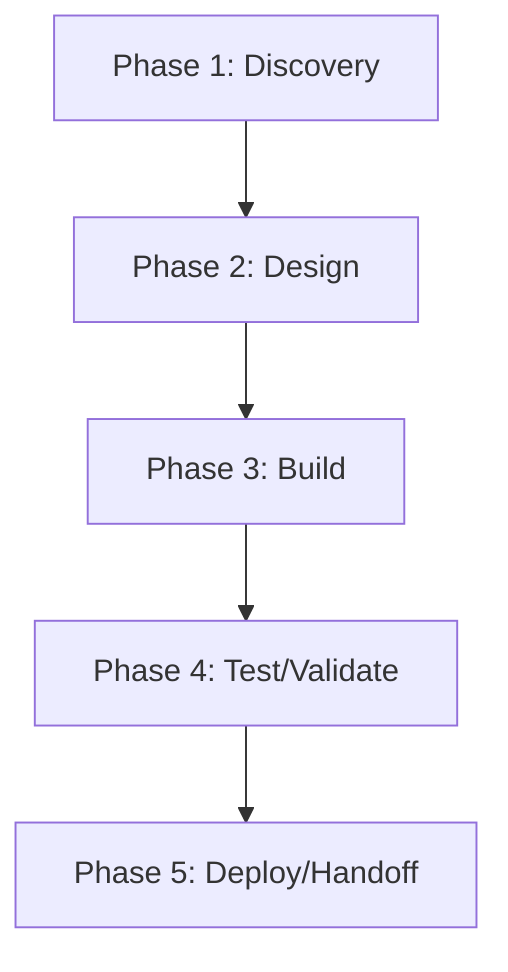

# OmniRoute — Action Plan

> **Generated 2026-06-17.** Score grid: [`FLEET-AUDIT-30-PILLAR.md`](../FLEET-AUDIT-30-PILLAR.md). Source: [`OmniRoute.json`](../../audits_data/OmniRoute.json).

## Current state

- **Language:** TypeScript
- **Mean score:** 2.05 (median 2)
- **Zero-pillar count:** 11 of 109
- **Three-pillar count:** 40 of 109
- **Blockers:** S7: threat model partial, OB4: SLOs not enforced, CN1: no race detection, CF2: no secret zeroization

## Notes

REFERENCE repo. Most mature in the fleet: 35 quality gates, SLSA L2, 7605 test files, 60/60/60/60 coverage gate, OpenAPI generation. The model for others to follow.

## Pillar distribution

| Score | Count | % |
|----|----:|----:|
| 3 (measured) | 40 | 36.7% |
| 2 (wired) | 45 | 41.3% |
| 1 (ad-hoc) | 13 | 11.9% |
| 0 (absent) | 11 | 10.1% |

## Phased WBS

### Phase 1: Discovery (≤3 tool calls per task)

- [ ] Read existing pillar evidence for each 0/1 score below
- [ ] Confirm scope of remediation with code owner

### Phase 2: Design (≤5 tool calls per task)

- [ ] Write ADR/decision record for any architectural change (A1-A5)
- [ ] Document coverage/SLO targets before writing the CI gate

### Phase 3: Build (≤15 tool calls per task)

**Tasks by role:**

#### agentic (1 tasks)

- [ ] **OMN-001** `AS2` (Agentic safety) — score 1 → target 2: Lift AS2 (Agentic safety) from 1 to ≥2. Evidence: dry-run mode partial

#### ci-ops (1 tasks)

- [ ] **OMN-018** `Q3` (Quality eng) — score 1 → target 2: Lift Q3 (Quality eng) from 1 to ≥2. Evidence: allowlist tracking minimal

#### data (2 tasks)

- [ ] **OMN-005** `DA1` (Data/contracts) — score 0 → target 2: Lift DA1 (Data/contracts) from 0 to ≥2. Evidence: N/A — no DB
- [ ] **OMN-006** `DA2` (Data/contracts) — score 0 → target 2: Lift DA2 (Data/contracts) from 0 to ≥2. Evidence: N/A — no events

#### frontend (2 tasks)

- [ ] **OMN-002** `AT5` (Accessibility & i18n) — score 1 → target 2: Lift AT5 (Accessibility & i18n) from 1 to ≥2. Evidence: RTL support in some locales
- [ ] **OMN-021** `UX3` (User experience) — score 1 → target 2: Lift UX3 (User experience) from 1 to ≥2. Evidence: gallery/list/detail partial

#### perf (3 tasks)

- [ ] **OMN-012** `P2` (Performance) — score 1 → target 2: Lift P2 (Performance) from 1 to ≥2. Evidence: profiling artifacts present
- [ ] **OMN-013** `P4` (Performance) — score 1 → target 2: Lift P4 (Performance) from 1 to ≥2. Evidence: SLOs documented; not enforced
- [ ] **OMN-014** `P5` (Performance) — score 1 → target 2: Lift P5 (Performance) from 1 to ≥2. Evidence: cache metrics present

#### rust-dev (6 tasks)

- [ ] **OMN-004** `CN1` (Concurrency) — score 0 → target 2: Lift CN1 (Concurrency) from 0 to ≥2. Evidence: no race detection tooling
- [ ] **OMN-016** `PS1` (Persistence) — score 0 → target 2: Lift PS1 (Persistence) from 0 to ≥2. Evidence: N/A
- [ ] **OMN-017** `PS2` (Persistence) — score 0 → target 2: Lift PS2 (Persistence) from 0 to ≥2. Evidence: N/A
- [ ] **OMN-022** `X3` (Code quality) — score 0 → target 2: Lift X3 (Code quality) from 0 to ≥2. Evidence: no complexity gate
- [ ] **OMN-023** `X4` (Code quality) — score 0 → target 2: Lift X4 (Code quality) from 0 to ≥2. Evidence: no duplication
- [ ] **OMN-024** `X5` (Code quality) — score 0 → target 2: Lift X5 (Code quality) from 0 to ≥2. Evidence: no dead code

#### security (3 tasks)

- [ ] **OMN-003** `CF2` (Config) — score 1 → target 2: Lift CF2 (Config) from 1 to ≥2. Evidence: secrets in env; no zeroization
- [ ] **OMN-015** `PR2` (Privacy) — score 1 → target 2: Lift PR2 (Privacy) from 1 to ≥2. Evidence: retention policy partial
- [ ] **OMN-020** `S7` (Security) — score 1 → target 2: Lift S7 (Security) from 1 to ≥2. Evidence: threat model partial; in ADRs

#### sre (6 tasks)

- [ ] **OMN-007** `O3` (Operations) — score 0 → target 2: Lift O3 (Operations) from 0 to ≥2. Evidence: N/A for OSS
- [ ] **OMN-008** `O4` (Operations) — score 0 → target 2: Lift O4 (Operations) from 0 to ≥2. Evidence: N/A for OSS
- [ ] **OMN-009** `O5` (Operations) — score 0 → target 2: Lift O5 (Operations) from 0 to ≥2. Evidence: N/A for OSS
- [ ] **OMN-010** `O2` (Operations) — score 1 → target 2: Lift O2 (Operations) from 1 to ≥2. Evidence: resilience guide in docs/
- [ ] **OMN-011** `OB4` (Observability) — score 1 → target 2: Lift OB4 (Observability) from 1 to ≥2. Evidence: SLOs documented; not enforced
- [ ] **OMN-019** `RL3` (Resilience) — score 1 → target 2: Lift RL3 (Resilience) from 1 to ≥2. Evidence: bulkhead partial

### Phase 4: Test/Validate (≤5 tool calls per task)

- [ ] Run the new CI gate; verify it fails when evidence is removed
- [ ] Re-score the lifted pillars; confirm the audit JSON reflects the change

### Phase 5: Deploy/Handoff (≤3 tool calls per task)

- [ ] Commit + push the gate
- [ ] Open a PR with the action plan referenced in the body

## DAG (mermaid)

## Top 5 biggest deltas (pillars to lift first)

1. **CN1** — no race detection tooling
1. **DA1** — N/A — no DB
1. **DA2** — N/A — no events
1. **O3** — N/A for OSS
1. **O4** — N/A for OSS

## Backlog of unaddressed items

Total 24 tasks across 8 roles. See "Build" phase above for the full list.
