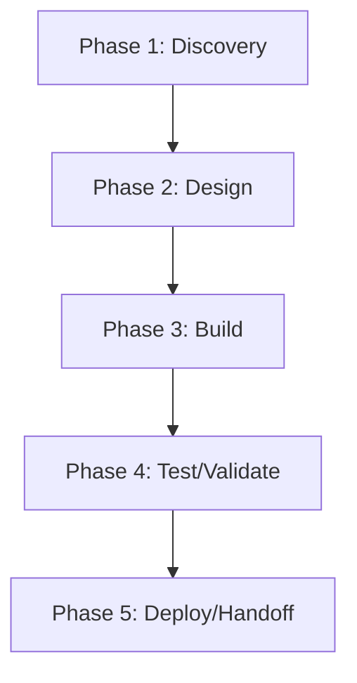

# PhenoProject — Action Plan

> **Generated 2026-06-17.** Score grid: [`FLEET-AUDIT-30-PILLAR.md`](../FLEET-AUDIT-30-PILLAR.md). Source: [`PhenoProject.json`](../../audits_data/PhenoProject.json).

## Current state

- **Language:** TypeScript
- **Mean score:** 0.72 (median 0)
- **Zero-pillar count:** 55 of 109
- **Three-pillar count:** 7 of 109
- **Blockers:** T1-T6: 27 test files but no coverage gate, D2: no journeys, S7: no threat model, Q1: minimal quality gates

## Notes

TypeScript project workspace. Has user-story traceability (45d32be). Light testing, no architecture docs.

## Pillar distribution

| Score | Count | % |
|----|----:|----:|
| 3 (measured) | 7 | 6.4% |
| 2 (wired) | 11 | 10.1% |
| 1 (ad-hoc) | 36 | 33.0% |
| 0 (absent) | 55 | 50.5% |

## Phased WBS

### Phase 1: Discovery (≤3 tool calls per task)

- [ ] Read existing pillar evidence for each 0/1 score below
- [ ] Confirm scope of remediation with code owner

### Phase 2: Design (≤5 tool calls per task)

- [ ] Write ADR/decision record for any architectural change (A1-A5)
- [ ] Document coverage/SLO targets before writing the CI gate

### Phase 3: Build (≤15 tool calls per task)

**Tasks by role:**

#### agentic (2 tasks)

- [ ] **PHE-008** `AS1` (Agentic safety) — score 0 → target 2: Lift AS1 (Agentic safety) from 0 to ≥2. Evidence: N/A
- [ ] **PHE-009** `AS2` (Agentic safety) — score 0 → target 2: Lift AS2 (Agentic safety) from 0 to ≥2. Evidence: N/A

#### api (2 tasks)

- [ ] **PHE-006** `AP1` (API surface) — score 0 → target 2: Lift AP1 (API surface) from 0 to ≥2. Evidence: N/A
- [ ] **PHE-007** `AP2` (API surface) — score 0 → target 2: Lift AP2 (API surface) from 0 to ≥2. Evidence: N/A

#### ci-ops (4 tasks)

- [ ] **PHE-053** `Q2` (Quality eng) — score 0 → target 2: Lift Q2 (Quality eng) from 0 to ≥2. Evidence: no ratchet
- [ ] **PHE-054** `Q3` (Quality eng) — score 0 → target 2: Lift Q3 (Quality eng) from 0 to ≥2. Evidence: no allowlist
- [ ] **PHE-055** `Q4` (Quality eng) — score 0 → target 2: Lift Q4 (Quality eng) from 0 to ≥2. Evidence: no coverage
- [ ] **PHE-056** `Q1` (Quality eng) — score 1 → target 2: Lift Q1 (Quality eng) from 1 to ≥2. Evidence: 4 workflows; minimal gates

#### data (3 tasks)

- [ ] **PHE-028** `DA1` (Data/contracts) — score 0 → target 2: Lift DA1 (Data/contracts) from 0 to ≥2. Evidence: N/A
- [ ] **PHE-029** `DA2` (Data/contracts) — score 0 → target 2: Lift DA2 (Data/contracts) from 0 to ≥2. Evidence: N/A
- [ ] **PHE-030** `DA3` (Data/contracts) — score 0 → target 2: Lift DA3 (Data/contracts) from 0 to ≥2. Evidence: N/A

#### docs (4 tasks)

- [ ] **PHE-024** `D2` (Documentation) — score 0 → target 2: Lift D2 (Documentation) from 0 to ≥2. Evidence: no journeys
- [ ] **PHE-025** `D5` (Documentation) — score 0 → target 2: Lift D5 (Documentation) from 0 to ≥2. Evidence: no API ref
- [ ] **PHE-026** `D6` (Documentation) — score 0 → target 2: Lift D6 (Documentation) from 0 to ≥2. Evidence: no arch map
- [ ] **PHE-027** `D3` (Documentation) — score 1 → target 2: Lift D3 (Documentation) from 1 to ≥2. Evidence: JSDoc sparse

#### frontend (12 tasks)

- [ ] **PHE-010** `AT3` (Accessibility & i18n) — score 0 → target 2: Lift AT3 (Accessibility & i18n) from 0 to ≥2. Evidence: limited aria
- [ ] **PHE-011** `AT4` (Accessibility & i18n) — score 0 → target 2: Lift AT4 (Accessibility & i18n) from 0 to ≥2. Evidence: no i18n
- [ ] **PHE-012** `AT5` (Accessibility & i18n) — score 0 → target 2: Lift AT5 (Accessibility & i18n) from 0 to ≥2. Evidence: no RTL
- [ ] **PHE-013** `AT1` (Accessibility & i18n) — score 1 → target 2: Lift AT1 (Accessibility & i18n) from 1 to ≥2. Evidence: basic a11y
- [ ] **PHE-014** `AT2` (Accessibility & i18n) — score 1 → target 2: Lift AT2 (Accessibility & i18n) from 1 to ≥2. Evidence: keyboard nav basic
- [ ] **PHE-080** `U1` (UX/Frontend) — score 1 → target 2: Lift U1 (UX/Frontend) from 1 to ≥2. Evidence: some component lib
- [ ] **PHE-081** `U2` (UX/Frontend) — score 1 → target 2: Lift U2 (UX/Frontend) from 1 to ≥2. Evidence: components in use
- [ ] **PHE-082** `U3` (UX/Frontend) — score 1 → target 2: Lift U3 (UX/Frontend) from 1 to ≥2. Evidence: dark/light partial
- [ ] **PHE-083** `U4` (UX/Frontend) — score 1 → target 2: Lift U4 (UX/Frontend) from 1 to ≥2. Evidence: monospace in code
- [ ] **PHE-084** `UX3` (User experience) — score 0 → target 2: Lift UX3 (User experience) from 0 to ≥2. Evidence: no gallery
- [ ] **PHE-085** `UX1` (User experience) — score 1 → target 2: Lift UX1 (User experience) from 1 to ≥2. Evidence: loading states basic
- [ ] **PHE-086** `UX2` (User experience) — score 1 → target 2: Lift UX2 (User experience) from 1 to ≥2. Evidence: progressive disclosure minimal

#### perf (7 tasks)

- [ ] **PHE-017** `C3` (Cost) — score 0 → target 2: Lift C3 (Cost) from 0 to ≥2. Evidence: no ratchet
- [ ] **PHE-018** `C2` (Cost) — score 1 → target 2: Lift C2 (Cost) from 1 to ≥2. Evidence: minimal cache
- [ ] **PHE-044** `P1` (Performance) — score 0 → target 2: Lift P1 (Performance) from 0 to ≥2. Evidence: no benches
- [ ] **PHE-045** `P2` (Performance) — score 0 → target 2: Lift P2 (Performance) from 0 to ≥2. Evidence: no profiling
- [ ] **PHE-046** `P3` (Performance) — score 0 → target 2: Lift P3 (Performance) from 0 to ≥2. Evidence: no bundle budget
- [ ] **PHE-047** `P4` (Performance) — score 0 → target 2: Lift P4 (Performance) from 0 to ≥2. Evidence: no SLOs
- [ ] **PHE-048** `P5` (Performance) — score 0 → target 2: Lift P5 (Performance) from 0 to ≥2. Evidence: no cache hit

#### qa (6 tasks)

- [ ] **PHE-074** `T3` (Testing) — score 0 → target 2: Lift T3 (Testing) from 0 to ≥2. Evidence: no E2E
- [ ] **PHE-075** `T4` (Testing) — score 0 → target 2: Lift T4 (Testing) from 0 to ≥2. Evidence: no contracts
- [ ] **PHE-076** `T6` (Testing) — score 0 → target 2: Lift T6 (Testing) from 0 to ≥2. Evidence: no multi-runner
- [ ] **PHE-077** `T1` (Testing) — score 1 → target 2: Lift T1 (Testing) from 1 to ≥2. Evidence: 27 test files; no coverage
- [ ] **PHE-078** `T2` (Testing) — score 1 → target 2: Lift T2 (Testing) from 1 to ≥2. Evidence: some integration
- [ ] **PHE-079** `T5` (Testing) — score 1 → target 2: Lift T5 (Testing) from 1 to ≥2. Evidence: ad-hoc bug repro

#### rust-dev (23 tasks)

- [ ] **PHE-001** `A2` (Architecture) — score 0 → target 2: Lift A2 (Architecture) from 0 to ≥2. Evidence: no ADRs
- [ ] **PHE-002** `A1` (Architecture) — score 1 → target 2: Lift A1 (Architecture) from 1 to ≥2. Evidence: TS app; minimal hex
- [ ] **PHE-003** `A3` (Architecture) — score 1 → target 2: Lift A3 (Architecture) from 1 to ≥2. Evidence: src/ structure
- [ ] **PHE-004** `A4` (Architecture) — score 1 → target 2: Lift A4 (Architecture) from 1 to ≥2. Evidence: flat modules
- [ ] **PHE-005** `A5` (Architecture) — score 1 → target 2: Lift A5 (Architecture) from 1 to ≥2. Evidence: basic types
- [ ] **PHE-021** `CN1` (Concurrency) — score 0 → target 2: Lift CN1 (Concurrency) from 0 to ≥2. Evidence: no race detection
- [ ] **PHE-022** `CN2` (Concurrency) — score 0 → target 2: Lift CN2 (Concurrency) from 0 to ≥2. Evidence: no async cancellation
- [ ] **PHE-023** `CN3` (Concurrency) — score 0 → target 2: Lift CN3 (Concurrency) from 0 to ≥2. Evidence: N/A
- [ ] **PHE-031** `DM1` (Domain model) — score 1 → target 2: Lift DM1 (Domain model) from 1 to ≥2. Evidence: basic types
- [ ] **PHE-032** `DM2` (Domain model) — score 1 → target 2: Lift DM2 (Domain model) from 1 to ≥2. Evidence: TS types
- [ ] **PHE-033** `EH1` (Error handling) — score 1 → target 2: Lift EH1 (Error handling) from 1 to ≥2. Evidence: TS errors
- [ ] **PHE-034** `EH2` (Error handling) — score 1 → target 2: Lift EH2 (Error handling) from 1 to ≥2. Evidence: basic sanitization
- [ ] **PHE-051** `PS1` (Persistence) — score 0 → target 2: Lift PS1 (Persistence) from 0 to ≥2. Evidence: N/A
- [ ] **PHE-052** `PS2` (Persistence) — score 0 → target 2: Lift PS2 (Persistence) from 0 to ≥2. Evidence: N/A
- [ ] **PHE-057** `RE1` (Reproducibility) — score 1 → target 2: Lift RE1 (Reproducibility) from 1 to ≥2. Evidence: package-lock.json committed (if present)
- [ ] **PHE-058** `RE2` (Reproducibility) — score 1 → target 2: Lift RE2 (Reproducibility) from 1 to ≥2. Evidence: build reproducible
- [ ] **PHE-062** `RT1` (Runtime compat) — score 1 → target 2: Lift RT1 (Runtime compat) from 1 to ≥2. Evidence: Node version implicit
- [ ] **PHE-063** `RT2` (Runtime compat) — score 1 → target 2: Lift RT2 (Runtime compat) from 1 to ≥2. Evidence: Linux only
- [ ] **PHE-087** `X3` (Code quality) — score 0 → target 2: Lift X3 (Code quality) from 0 to ≥2. Evidence: no complexity
- [ ] **PHE-088** `X4` (Code quality) — score 0 → target 2: Lift X4 (Code quality) from 0 to ≥2. Evidence: no duplication
- [ ] **PHE-089** `X5` (Code quality) — score 0 → target 2: Lift X5 (Code quality) from 0 to ≥2. Evidence: no dead code
- [ ] **PHE-090** `X1` (Code quality) — score 1 → target 2: Lift X1 (Code quality) from 1 to ≥2. Evidence: eslint minimal
- [ ] **PHE-091** `X6` (Code quality) — score 1 → target 2: Lift X6 (Code quality) from 1 to ≥2. Evidence: prettier configured

#### security (16 tasks)

- [ ] **PHE-015** `AU2` (Auditability) — score 0 → target 2: Lift AU2 (Auditability) from 0 to ≥2. Evidence: no ADRs
- [ ] **PHE-016** `AU1` (Auditability) — score 1 → target 2: Lift AU1 (Auditability) from 1 to ≥2. Evidence: git log
- [ ] **PHE-019** `CF2` (Config) — score 0 → target 2: Lift CF2 (Config) from 0 to ≥2. Evidence: no secrets
- [ ] **PHE-020** `CF1` (Config) — score 1 → target 2: Lift CF1 (Config) from 1 to ≥2. Evidence: env vars
- [ ] **PHE-049** `PR1` (Privacy) — score 0 → target 2: Lift PR1 (Privacy) from 0 to ≥2. Evidence: no PII
- [ ] **PHE-050** `PR2` (Privacy) — score 0 → target 2: Lift PR2 (Privacy) from 0 to ≥2. Evidence: no retention
- [ ] **PHE-064** `S7` (Security) — score 0 → target 2: Lift S7 (Security) from 0 to ≥2. Evidence: no threat model
- [ ] **PHE-065** `S8` (Security) — score 0 → target 2: Lift S8 (Security) from 0 to ≥2. Evidence: no SLSA
- [ ] **PHE-066** `S2` (Security) — score 1 → target 2: Lift S2 (Security) from 1 to ≥2. Evidence: deny.toml not present; no SCA
- [ ] **PHE-067** `S4` (Security) — score 1 → target 2: Lift S4 (Security) from 1 to ≥2. Evidence: GitHub auth
- [ ] **PHE-068** `S5` (Security) — score 1 → target 2: Lift S5 (Security) from 1 to ≥2. Evidence: CODEOWNERS gate (1 line)
- [ ] **PHE-069** `S6` (Security) — score 1 → target 2: Lift S6 (Security) from 1 to ≥2. Evidence: input validation basic
- [ ] **PHE-070** `SC2` (Supply chain) — score 0 → target 2: Lift SC2 (Supply chain) from 0 to ≥2. Evidence: no SBOM
- [ ] **PHE-071** `SC3` (Supply chain) — score 0 → target 2: Lift SC3 (Supply chain) from 0 to ≥2. Evidence: no attestation
- [ ] **PHE-072** `SC4` (Supply chain) — score 0 → target 2: Lift SC4 (Supply chain) from 0 to ≥2. Evidence: no provenance
- [ ] **PHE-073** `SC1` (Supply chain) — score 1 → target 2: Lift SC1 (Supply chain) from 1 to ≥2. Evidence: package.json versioned

#### sre (12 tasks)

- [ ] **PHE-035** `O2` (Operations) — score 0 → target 2: Lift O2 (Operations) from 0 to ≥2. Evidence: no runbooks
- [ ] **PHE-036** `O3` (Operations) — score 0 → target 2: Lift O3 (Operations) from 0 to ≥2. Evidence: N/A
- [ ] **PHE-037** `O4` (Operations) — score 0 → target 2: Lift O4 (Operations) from 0 to ≥2. Evidence: N/A
- [ ] **PHE-038** `O5` (Operations) — score 0 → target 2: Lift O5 (Operations) from 0 to ≥2. Evidence: N/A
- [ ] **PHE-039** `O1` (Operations) — score 1 → target 2: Lift O1 (Operations) from 1 to ≥2. Evidence: release flow minimal
- [ ] **PHE-040** `OB1` (Observability) — score 0 → target 2: Lift OB1 (Observability) from 0 to ≥2. Evidence: no observability
- [ ] **PHE-041** `OB2` (Observability) — score 0 → target 2: Lift OB2 (Observability) from 0 to ≥2. Evidence: no metrics
- [ ] **PHE-042** `OB3` (Observability) — score 0 → target 2: Lift OB3 (Observability) from 0 to ≥2. Evidence: no traces
- [ ] **PHE-043** `OB4` (Observability) — score 0 → target 2: Lift OB4 (Observability) from 0 to ≥2. Evidence: no SLOs
- [ ] **PHE-059** `RL1` (Resilience) — score 0 → target 2: Lift RL1 (Resilience) from 0 to ≥2. Evidence: N/A
- [ ] **PHE-060** `RL2` (Resilience) — score 0 → target 2: Lift RL2 (Resilience) from 0 to ≥2. Evidence: N/A
- [ ] **PHE-061** `RL3` (Resilience) — score 0 → target 2: Lift RL3 (Resilience) from 0 to ≥2. Evidence: N/A

### Phase 4: Test/Validate (≤5 tool calls per task)

- [ ] Run the new CI gate; verify it fails when evidence is removed
- [ ] Re-score the lifted pillars; confirm the audit JSON reflects the change

### Phase 5: Deploy/Handoff (≤3 tool calls per task)

- [ ] Commit + push the gate
- [ ] Open a PR with the action plan referenced in the body

## DAG (mermaid)

## Top 5 biggest deltas (pillars to lift first)

1. **A2** — no ADRs
1. **AP1** — N/A
1. **AP2** — N/A
1. **AS1** — N/A
1. **AS2** — N/A

## Backlog of unaddressed items

Total 91 tasks across 11 roles. See "Build" phase above for the full list.
