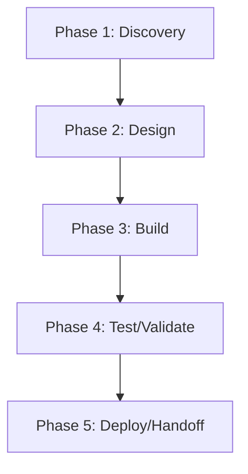

# helioscope — Action Plan

> **Generated 2026-06-17.** Score grid: [`FLEET-AUDIT-30-PILLAR.md`](../FLEET-AUDIT-30-PILLAR.md). Source: [`helioscope.json`](../../audits_data/helioscope.json).

## Current state

- **Language:** Rust (monorepo, SUPERSEDED)
- **Mean score:** 0.28 (median 0)
- **Zero-pillar count:** 84 of 109
- **Three-pillar count:** 1 of 109
- **Blockers:** A2/D/E: no architecture/journeys, T1-T6: tests exist but no CI, Q1: 1 workflow only, G1: no CODEOWNERS

## Notes

SUPERSEDED repo per README. Code lives in helios-cli now. Limited maintenance.

## Pillar distribution

| Score | Count | % |
|----|----:|----:|
| 3 (measured) | 1 | 0.9% |
| 2 (wired) | 4 | 3.7% |
| 1 (ad-hoc) | 20 | 18.3% |
| 0 (absent) | 84 | 77.1% |

## Phased WBS

### Phase 1: Discovery (≤3 tool calls per task)

- [ ] Read existing pillar evidence for each 0/1 score below
- [ ] Confirm scope of remediation with code owner

### Phase 2: Design (≤5 tool calls per task)

- [ ] Write ADR/decision record for any architectural change (A1-A5)
- [ ] Document coverage/SLO targets before writing the CI gate

### Phase 3: Build (≤15 tool calls per task)

**Tasks by role:**

#### agentic (2 tasks)

- [ ] **HEL-008** `AS1` (Agentic safety) — score 0 → target 2: Lift AS1 (Agentic safety) from 0 to ≥2. Evidence: N/A
- [ ] **HEL-009** `AS2` (Agentic safety) — score 0 → target 2: Lift AS2 (Agentic safety) from 0 to ≥2. Evidence: N/A

#### api (2 tasks)

- [ ] **HEL-006** `AP1` (API surface) — score 0 → target 2: Lift AP1 (API surface) from 0 to ≥2. Evidence: N/A
- [ ] **HEL-007** `AP2` (API surface) — score 0 → target 2: Lift AP2 (API surface) from 0 to ≥2. Evidence: N/A

#### ci-ops (9 tasks)

- [ ] **HEL-036** `E1` (Engineering practice) — score 0 → target 2: Lift E1 (Engineering practice) from 0 to ≥2. Evidence: no -wtrees/ in repos/
- [ ] **HEL-037** `E2` (Engineering practice) — score 0 → target 2: Lift E2 (Engineering practice) from 0 to ≥2. Evidence: main unprotected; deprecated repo
- [ ] **HEL-038** `E4` (Engineering practice) — score 0 → target 2: Lift E4 (Engineering practice) from 0 to ≥2. Evidence: no Co-Authored-By in many 2026 commits
- [ ] **HEL-039** `E5` (Engineering practice) — score 0 → target 2: Lift E5 (Engineering practice) from 0 to ≥2. Evidence: unknown
- [ ] **HEL-040** `E3` (Engineering practice) — score 1 → target 2: Lift E3 (Engineering practice) from 1 to ≥2. Evidence: commits present
- [ ] **HEL-063** `Q1` (Quality eng) — score 0 → target 2: Lift Q1 (Quality eng) from 0 to ≥2. Evidence: 1 workflow only
- [ ] **HEL-064** `Q2` (Quality eng) — score 0 → target 2: Lift Q2 (Quality eng) from 0 to ≥2. Evidence: no ratchet
- [ ] **HEL-065** `Q3` (Quality eng) — score 0 → target 2: Lift Q3 (Quality eng) from 0 to ≥2. Evidence: no allowlist
- [ ] **HEL-066** `Q4` (Quality eng) — score 0 → target 2: Lift Q4 (Quality eng) from 0 to ≥2. Evidence: no coverage

#### data (3 tasks)

- [ ] **HEL-031** `DA1` (Data/contracts) — score 0 → target 2: Lift DA1 (Data/contracts) from 0 to ≥2. Evidence: N/A
- [ ] **HEL-032** `DA2` (Data/contracts) — score 0 → target 2: Lift DA2 (Data/contracts) from 0 to ≥2. Evidence: N/A
- [ ] **HEL-033** `DA3` (Data/contracts) — score 0 → target 2: Lift DA3 (Data/contracts) from 0 to ≥2. Evidence: N/A

#### docs (6 tasks)

- [ ] **HEL-025** `D1` (Documentation) — score 0 → target 2: Lift D1 (Documentation) from 0 to ≥2. Evidence: no spec tracker
- [ ] **HEL-026** `D2` (Documentation) — score 0 → target 2: Lift D2 (Documentation) from 0 to ≥2. Evidence: no journeys
- [ ] **HEL-027** `D5` (Documentation) — score 0 → target 2: Lift D5 (Documentation) from 0 to ≥2. Evidence: no API ref
- [ ] **HEL-028** `D6` (Documentation) — score 0 → target 2: Lift D6 (Documentation) from 0 to ≥2. Evidence: no arch map
- [ ] **HEL-029** `D3` (Documentation) — score 1 → target 2: Lift D3 (Documentation) from 1 to ≥2. Evidence: rustdoc sparse
- [ ] **HEL-030** `D4` (Documentation) — score 1 → target 2: Lift D4 (Documentation) from 1 to ≥2. Evidence: CHANGELOG.md present

#### frontend (12 tasks)

- [ ] **HEL-010** `AT1` (Accessibility & i18n) — score 0 → target 2: Lift AT1 (Accessibility & i18n) from 0 to ≥2. Evidence: N/A
- [ ] **HEL-011** `AT2` (Accessibility & i18n) — score 0 → target 2: Lift AT2 (Accessibility & i18n) from 0 to ≥2. Evidence: N/A
- [ ] **HEL-012** `AT3` (Accessibility & i18n) — score 0 → target 2: Lift AT3 (Accessibility & i18n) from 0 to ≥2. Evidence: N/A
- [ ] **HEL-013** `AT4` (Accessibility & i18n) — score 0 → target 2: Lift AT4 (Accessibility & i18n) from 0 to ≥2. Evidence: N/A
- [ ] **HEL-014** `AT5` (Accessibility & i18n) — score 0 → target 2: Lift AT5 (Accessibility & i18n) from 0 to ≥2. Evidence: N/A
- [ ] **HEL-092** `U1` (UX/Frontend) — score 0 → target 2: Lift U1 (UX/Frontend) from 0 to ≥2. Evidence: N/A
- [ ] **HEL-093** `U2` (UX/Frontend) — score 0 → target 2: Lift U2 (UX/Frontend) from 0 to ≥2. Evidence: N/A
- [ ] **HEL-094** `U3` (UX/Frontend) — score 0 → target 2: Lift U3 (UX/Frontend) from 0 to ≥2. Evidence: N/A
- [ ] **HEL-095** `U4` (UX/Frontend) — score 0 → target 2: Lift U4 (UX/Frontend) from 0 to ≥2. Evidence: N/A
- [ ] **HEL-096** `UX1` (User experience) — score 0 → target 2: Lift UX1 (User experience) from 0 to ≥2. Evidence: N/A — CLI monorepo
- [ ] **HEL-097** `UX2` (User experience) — score 0 → target 2: Lift UX2 (User experience) from 0 to ≥2. Evidence: N/A
- [ ] **HEL-098** `UX3` (User experience) — score 0 → target 2: Lift UX3 (User experience) from 0 to ≥2. Evidence: N/A

#### governance (2 tasks)

- [ ] **HEL-043** `G1` (Governance) — score 0 → target 2: Lift G1 (Governance) from 0 to ≥2. Evidence: no CODEOWNERS
- [ ] **HEL-044** `G6` (Governance) — score 1 → target 2: Lift G6 (Governance) from 1 to ≥2. Evidence: CHANGELOG.md

#### perf (8 tasks)

- [ ] **HEL-017** `C1` (Cost) — score 0 → target 2: Lift C1 (Cost) from 0 to ≥2. Evidence: 1 workflow only; runner unknown
- [ ] **HEL-018** `C2` (Cost) — score 0 → target 2: Lift C2 (Cost) from 0 to ≥2. Evidence: no cache
- [ ] **HEL-019** `C3` (Cost) — score 0 → target 2: Lift C3 (Cost) from 0 to ≥2. Evidence: no ratchet
- [ ] **HEL-054** `P1` (Performance) — score 0 → target 2: Lift P1 (Performance) from 0 to ≥2. Evidence: no benches
- [ ] **HEL-055** `P2` (Performance) — score 0 → target 2: Lift P2 (Performance) from 0 to ≥2. Evidence: no profiling
- [ ] **HEL-056** `P3` (Performance) — score 0 → target 2: Lift P3 (Performance) from 0 to ≥2. Evidence: N/A
- [ ] **HEL-057** `P4` (Performance) — score 0 → target 2: Lift P4 (Performance) from 0 to ≥2. Evidence: no SLOs
- [ ] **HEL-058** `P5` (Performance) — score 0 → target 2: Lift P5 (Performance) from 0 to ≥2. Evidence: N/A

#### qa (6 tasks)

- [ ] **HEL-086** `T1` (Testing) — score 0 → target 2: Lift T1 (Testing) from 0 to ≥2. Evidence: 23 test files but no CI; coverage unknown
- [ ] **HEL-087** `T2` (Testing) — score 0 → target 2: Lift T2 (Testing) from 0 to ≥2. Evidence: no CI
- [ ] **HEL-088** `T3` (Testing) — score 0 → target 2: Lift T3 (Testing) from 0 to ≥2. Evidence: no E2E
- [ ] **HEL-089** `T4` (Testing) — score 0 → target 2: Lift T4 (Testing) from 0 to ≥2. Evidence: no contracts
- [ ] **HEL-090** `T5` (Testing) — score 0 → target 2: Lift T5 (Testing) from 0 to ≥2. Evidence: no bug-fix repro pattern
- [ ] **HEL-091** `T6` (Testing) — score 0 → target 2: Lift T6 (Testing) from 0 to ≥2. Evidence: no multi-runner

#### rust-dev (24 tasks)

- [ ] **HEL-001** `A2` (Architecture) — score 0 → target 2: Lift A2 (Architecture) from 0 to ≥2. Evidence: no ADRs
- [ ] **HEL-002** `A1` (Architecture) — score 1 → target 2: Lift A1 (Architecture) from 1 to ≥2. Evidence: monorepo; some module separation
- [ ] **HEL-003** `A3` (Architecture) — score 1 → target 2: Lift A3 (Architecture) from 1 to ≥2. Evidence: codex-rs sub-checkout; messy module deps
- [ ] **HEL-004** `A4` (Architecture) — score 1 → target 2: Lift A4 (Architecture) from 1 to ≥2. Evidence: codex-rs/target/ and codex-rs/ subdir suggest split
- [ ] **HEL-005** `A5` (Architecture) — score 1 → target 2: Lift A5 (Architecture) from 1 to ≥2. Evidence: Rust domain types
- [ ] **HEL-022** `CN1` (Concurrency) — score 0 → target 2: Lift CN1 (Concurrency) from 0 to ≥2. Evidence: no race detection
- [ ] **HEL-023** `CN2` (Concurrency) — score 0 → target 2: Lift CN2 (Concurrency) from 0 to ≥2. Evidence: no async
- [ ] **HEL-024** `CN3` (Concurrency) — score 0 → target 2: Lift CN3 (Concurrency) from 0 to ≥2. Evidence: N/A
- [ ] **HEL-034** `DM1` (Domain model) — score 1 → target 2: Lift DM1 (Domain model) from 1 to ≥2. Evidence: Rust types
- [ ] **HEL-035** `DM2` (Domain model) — score 1 → target 2: Lift DM2 (Domain model) from 1 to ≥2. Evidence: newtypes used
- [ ] **HEL-041** `EH2` (Error handling) — score 0 → target 2: Lift EH2 (Error handling) from 0 to ≥2. Evidence: no sanitization
- [ ] **HEL-042** `EH1` (Error handling) — score 1 → target 2: Lift EH1 (Error handling) from 1 to ≥2. Evidence: thiserror ad-hoc
- [ ] **HEL-061** `PS1` (Persistence) — score 0 → target 2: Lift PS1 (Persistence) from 0 to ≥2. Evidence: N/A
- [ ] **HEL-062** `PS2` (Persistence) — score 0 → target 2: Lift PS2 (Persistence) from 0 to ≥2. Evidence: N/A
- [ ] **HEL-067** `RE1` (Reproducibility) — score 1 → target 2: Lift RE1 (Reproducibility) from 1 to ≥2. Evidence: Cargo.lock committed
- [ ] **HEL-068** `RE2` (Reproducibility) — score 1 → target 2: Lift RE2 (Reproducibility) from 1 to ≥2. Evidence: build reproducible; minimal cache
- [ ] **HEL-072** `RT1` (Runtime compat) — score 0 → target 2: Lift RT1 (Runtime compat) from 0 to ≥2. Evidence: no MSRV
- [ ] **HEL-073** `RT2` (Runtime compat) — score 0 → target 2: Lift RT2 (Runtime compat) from 0 to ≥2. Evidence: no matrix
- [ ] **HEL-099** `X1` (Code quality) — score 0 → target 2: Lift X1 (Code quality) from 0 to ≥2. Evidence: no CI gating (1 workflow only)
- [ ] **HEL-100** `X3` (Code quality) — score 0 → target 2: Lift X3 (Code quality) from 0 to ≥2. Evidence: no complexity gate
- [ ] **HEL-101** `X4` (Code quality) — score 0 → target 2: Lift X4 (Code quality) from 0 to ≥2. Evidence: no duplication
- [ ] **HEL-102** `X5` (Code quality) — score 0 → target 2: Lift X5 (Code quality) from 0 to ≥2. Evidence: no dead-code check
- [ ] **HEL-103** `X6` (Code quality) — score 0 → target 2: Lift X6 (Code quality) from 0 to ≥2. Evidence: no fmt --check in CI
- [ ] **HEL-104** `X2` (Code quality) — score 1 → target 2: Lift X2 (Code quality) from 1 to ≥2. Evidence: rust 2021

#### security (18 tasks)

- [ ] **HEL-015** `AU2` (Auditability) — score 0 → target 2: Lift AU2 (Auditability) from 0 to ≥2. Evidence: no ADRs
- [ ] **HEL-016** `AU1` (Auditability) — score 1 → target 2: Lift AU1 (Auditability) from 1 to ≥2. Evidence: git log
- [ ] **HEL-020** `CF2` (Config) — score 0 → target 2: Lift CF2 (Config) from 0 to ≥2. Evidence: no secret handling
- [ ] **HEL-021** `CF1` (Config) — score 1 → target 2: Lift CF1 (Config) from 1 to ≥2. Evidence: env::var reads
- [ ] **HEL-059** `PR1` (Privacy) — score 0 → target 2: Lift PR1 (Privacy) from 0 to ≥2. Evidence: N/A
- [ ] **HEL-060** `PR2` (Privacy) — score 0 → target 2: Lift PR2 (Privacy) from 0 to ≥2. Evidence: N/A
- [ ] **HEL-074** `S2` (Security) — score 0 → target 2: Lift S2 (Security) from 0 to ≥2. Evidence: no cargo deny/audit
- [ ] **HEL-075** `S4` (Security) — score 0 → target 2: Lift S4 (Security) from 0 to ≥2. Evidence: no auth
- [ ] **HEL-076** `S5` (Security) — score 0 → target 2: Lift S5 (Security) from 0 to ≥2. Evidence: N/A
- [ ] **HEL-077** `S7` (Security) — score 0 → target 2: Lift S7 (Security) from 0 to ≥2. Evidence: no threat model
- [ ] **HEL-078** `S8` (Security) — score 0 → target 2: Lift S8 (Security) from 0 to ≥2. Evidence: no SLSA
- [ ] **HEL-079** `S1` (Security) — score 1 → target 2: Lift S1 (Security) from 1 to ≥2. Evidence: 1 security workflow
- [ ] **HEL-080** `S3` (Security) — score 1 → target 2: Lift S3 (Security) from 1 to ≥2. Evidence: likely trufflehog in 1 workflow
- [ ] **HEL-081** `S6` (Security) — score 1 → target 2: Lift S6 (Security) from 1 to ≥2. Evidence: input validation ad-hoc
- [ ] **HEL-082** `SC2` (Supply chain) — score 0 → target 2: Lift SC2 (Supply chain) from 0 to ≥2. Evidence: no SBOM
- [ ] **HEL-083** `SC3` (Supply chain) — score 0 → target 2: Lift SC3 (Supply chain) from 0 to ≥2. Evidence: no attestation
- [ ] **HEL-084** `SC4` (Supply chain) — score 0 → target 2: Lift SC4 (Supply chain) from 0 to ≥2. Evidence: no provenance
- [ ] **HEL-085** `SC1` (Supply chain) — score 1 → target 2: Lift SC1 (Supply chain) from 1 to ≥2. Evidence: Cargo.lock in some subdirs

#### sre (12 tasks)

- [ ] **HEL-045** `O1` (Operations) — score 0 → target 2: Lift O1 (Operations) from 0 to ≥2. Evidence: SUPERSEDED per README; no releases
- [ ] **HEL-046** `O2` (Operations) — score 0 → target 2: Lift O2 (Operations) from 0 to ≥2. Evidence: no runbooks
- [ ] **HEL-047** `O3` (Operations) — score 0 → target 2: Lift O3 (Operations) from 0 to ≥2. Evidence: N/A
- [ ] **HEL-048** `O4` (Operations) — score 0 → target 2: Lift O4 (Operations) from 0 to ≥2. Evidence: N/A
- [ ] **HEL-049** `O5` (Operations) — score 0 → target 2: Lift O5 (Operations) from 0 to ≥2. Evidence: N/A
- [ ] **HEL-050** `OB1` (Observability) — score 0 → target 2: Lift OB1 (Observability) from 0 to ≥2. Evidence: no observability
- [ ] **HEL-051** `OB2` (Observability) — score 0 → target 2: Lift OB2 (Observability) from 0 to ≥2. Evidence: no metrics
- [ ] **HEL-052** `OB3` (Observability) — score 0 → target 2: Lift OB3 (Observability) from 0 to ≥2. Evidence: no traces
- [ ] **HEL-053** `OB4` (Observability) — score 0 → target 2: Lift OB4 (Observability) from 0 to ≥2. Evidence: no SLOs
- [ ] **HEL-069** `RL1` (Resilience) — score 0 → target 2: Lift RL1 (Resilience) from 0 to ≥2. Evidence: N/A
- [ ] **HEL-070** `RL2` (Resilience) — score 0 → target 2: Lift RL2 (Resilience) from 0 to ≥2. Evidence: N/A
- [ ] **HEL-071** `RL3` (Resilience) — score 0 → target 2: Lift RL3 (Resilience) from 0 to ≥2. Evidence: N/A

### Phase 4: Test/Validate (≤5 tool calls per task)

- [ ] Run the new CI gate; verify it fails when evidence is removed
- [ ] Re-score the lifted pillars; confirm the audit JSON reflects the change

### Phase 5: Deploy/Handoff (≤3 tool calls per task)

- [ ] Commit + push the gate
- [ ] Open a PR with the action plan referenced in the body

## DAG (mermaid)

## Top 5 biggest deltas (pillars to lift first)

1. **A2** — no ADRs
1. **AP1** — N/A
1. **AP2** — N/A
1. **AS1** — N/A
1. **AS2** — N/A

## Backlog of unaddressed items

Total 104 tasks across 12 roles. See "Build" phase above for the full list.
