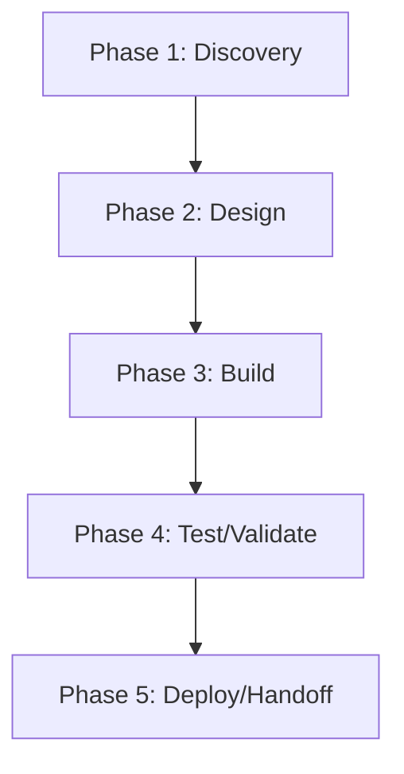

# phenodocs — Action Plan

> **Generated 2026-06-17.** Score grid: [`FLEET-AUDIT-30-PILLAR.md`](../FLEET-AUDIT-30-PILLAR.md). Source: [`phenodocs.json`](../../audits_data/phenodocs.json).

## Current state

- **Language:** TypeScript + VitePress + Python
- **Mean score:** 1.06 (median 1)
- **Zero-pillar count:** 43 of 109
- **Three-pillar count:** 14 of 109
- **Blockers:** T1-T6: no test runner configured (package.json lacks test script), P3: no bundle size budget, S7: no threat model, S8/SC2-SC4: no SLSA/SBOM/attestation, OB2-OB4: no metrics/traces/SLOs, RL1-RL3: no resilience patterns (N/A for docs site)

## Notes

VitePress + Bun + TypeScript docs site. Strong governance, weak testing, no production runtime concerns.

## Pillar distribution

| Score | Count | % |
|----|----:|----:|
| 3 (measured) | 14 | 12.8% |
| 2 (wired) | 22 | 20.2% |
| 1 (ad-hoc) | 30 | 27.5% |
| 0 (absent) | 43 | 39.4% |

## Phased WBS

### Phase 1: Discovery (≤3 tool calls per task)

- [ ] Read existing pillar evidence for each 0/1 score below
- [ ] Confirm scope of remediation with code owner

### Phase 2: Design (≤5 tool calls per task)

- [ ] Write ADR/decision record for any architectural change (A1-A5)
- [ ] Document coverage/SLO targets before writing the CI gate

### Phase 3: Build (≤15 tool calls per task)

**Tasks by role:**

#### agentic (2 tasks)

- [ ] **PHE-006** `AS1` (Agentic safety) — score 0 → target 2: Lift AS1 (Agentic safety) from 0 to ≥2. Evidence: N/A — no agentic workflows
- [ ] **PHE-007** `AS2` (Agentic safety) — score 0 → target 2: Lift AS2 (Agentic safety) from 0 to ≥2. Evidence: N/A

#### api (2 tasks)

- [ ] **PHE-004** `AP1` (API surface) — score 0 → target 2: Lift AP1 (API surface) from 0 to ≥2. Evidence: N/A — no public API
- [ ] **PHE-005** `AP2` (API surface) — score 0 → target 2: Lift AP2 (API surface) from 0 to ≥2. Evidence: N/A — no public API

#### ci-ops (2 tasks)

- [ ] **PHE-045** `Q2` (Quality eng) — score 1 → target 2: Lift Q2 (Quality eng) from 1 to ≥2. Evidence: no ratchet for coverage / complexity
- [ ] **PHE-046** `Q3` (Quality eng) — score 1 → target 2: Lift Q3 (Quality eng) from 1 to ≥2. Evidence: no eslint-disable tracking

#### data (3 tasks)

- [ ] **PHE-020** `DA1` (Data/contracts) — score 0 → target 2: Lift DA1 (Data/contracts) from 0 to ≥2. Evidence: N/A — no schema migrations (static docs)
- [ ] **PHE-021** `DA2` (Data/contracts) — score 0 → target 2: Lift DA2 (Data/contracts) from 0 to ≥2. Evidence: N/A — no events
- [ ] **PHE-022** `DA3` (Data/contracts) — score 0 → target 2: Lift DA3 (Data/contracts) from 0 to ≥2. Evidence: N/A — no API

#### docs (2 tasks)

- [ ] **PHE-018** `D5` (Documentation) — score 0 → target 2: Lift D5 (Documentation) from 0 to ≥2. Evidence: no API surface (vitepress docs site)
- [ ] **PHE-019** `D3` (Documentation) — score 1 → target 2: Lift D3 (Documentation) from 1 to ≥2. Evidence: JSDoc sparse in src/

#### frontend (9 tasks)

- [ ] **PHE-008** `AT4` (Accessibility & i18n) — score 0 → target 2: Lift AT4 (Accessibility & i18n) from 0 to ≥2. Evidence: no i18n; English only
- [ ] **PHE-009** `AT5` (Accessibility & i18n) — score 0 → target 2: Lift AT5 (Accessibility & i18n) from 0 to ≥2. Evidence: no RTL support
- [ ] **PHE-010** `AT1` (Accessibility & i18n) — score 1 → target 2: Lift AT1 (Accessibility & i18n) from 1 to ≥2. Evidence: VitePress default; no explicit WCAG audit
- [ ] **PHE-011** `AT3` (Accessibility & i18n) — score 1 → target 2: Lift AT3 (Accessibility & i18n) from 1 to ≥2. Evidence: VitePress default aria-*
- [ ] **PHE-066** `U1` (UX/Frontend) — score 1 → target 2: Lift U1 (UX/Frontend) from 1 to ≥2. Evidence: keycap-palette.css custom theme; not Radix/shadcn
- [ ] **PHE-067** `U2` (UX/Frontend) — score 1 → target 2: Lift U2 (UX/Frontend) from 1 to ≥2. Evidence: VitePress default components; no design system
- [ ] **PHE-068** `UX3` (User experience) — score 0 → target 2: Lift UX3 (User experience) from 0 to ≥2. Evidence: no gallery/list/detail view; single docs tree
- [ ] **PHE-069** `UX1` (User experience) — score 1 → target 2: Lift UX1 (User experience) from 1 to ≥2. Evidence: VitePress default empty states
- [ ] **PHE-070** `UX2` (User experience) — score 1 → target 2: Lift UX2 (User experience) from 1 to ≥2. Evidence: VitePress default progressive disclosure

#### perf (7 tasks)

- [ ] **PHE-012** `C2` (Cost) — score 1 → target 2: Lift C2 (Cost) from 1 to ≥2. Evidence: no cache hit metric tracked
- [ ] **PHE-013** `C3` (Cost) — score 1 → target 2: Lift C3 (Cost) from 1 to ≥2. Evidence: no build time ratchet
- [ ] **PHE-036** `P1` (Performance) — score 0 → target 2: Lift P1 (Performance) from 0 to ≥2. Evidence: no benchmarks
- [ ] **PHE-037** `P2` (Performance) — score 0 → target 2: Lift P2 (Performance) from 0 to ≥2. Evidence: no profiling
- [ ] **PHE-038** `P4` (Performance) — score 0 → target 2: Lift P4 (Performance) from 0 to ≥2. Evidence: no SLOs
- [ ] **PHE-039** `P5` (Performance) — score 0 → target 2: Lift P5 (Performance) from 0 to ≥2. Evidence: no cache hit metric
- [ ] **PHE-040** `P3` (Performance) — score 1 → target 2: Lift P3 (Performance) from 1 to ≥2. Evidence: VitePress build output not size-budgeted in CI

#### qa (6 tasks)

- [ ] **PHE-060** `T1` (Testing) — score 0 → target 2: Lift T1 (Testing) from 0 to ≥2. Evidence: no test runner script in package.json
- [ ] **PHE-061** `T2` (Testing) — score 0 → target 2: Lift T2 (Testing) from 0 to ≥2. Evidence: no integration tests
- [ ] **PHE-062** `T3` (Testing) — score 0 → target 2: Lift T3 (Testing) from 0 to ≥2. Evidence: no E2E tests
- [ ] **PHE-063** `T4` (Testing) — score 0 → target 2: Lift T4 (Testing) from 0 to ≥2. Evidence: no contract tests
- [ ] **PHE-064** `T5` (Testing) — score 0 → target 2: Lift T5 (Testing) from 0 to ≥2. Evidence: no bug-fix repro pattern
- [ ] **PHE-065** `T6` (Testing) — score 0 → target 2: Lift T6 (Testing) from 0 to ≥2. Evidence: no multi-runner matrix

#### rust-dev (17 tasks)

- [ ] **PHE-001** `A1` (Architecture) — score 1 → target 2: Lift A1 (Architecture) from 1 to ≥2. Evidence: no clear domain/infra boundary; vitepress app monolith
- [ ] **PHE-002** `A3` (Architecture) — score 1 → target 2: Lift A3 (Architecture) from 1 to ≥2. Evidence: vitepress theme extends docs/.vitepress/theme; no explicit module dep direction
- [ ] **PHE-003** `A5` (Architecture) — score 1 → target 2: Lift A5 (Architecture) from 1 to ≥2. Evidence: VitePress has config object; not a rich domain model
- [ ] **PHE-015** `CN1` (Concurrency) — score 0 → target 2: Lift CN1 (Concurrency) from 0 to ≥2. Evidence: N/A — single-process VitePress
- [ ] **PHE-016** `CN2` (Concurrency) — score 0 → target 2: Lift CN2 (Concurrency) from 0 to ≥2. Evidence: N/A
- [ ] **PHE-017** `CN3` (Concurrency) — score 0 → target 2: Lift CN3 (Concurrency) from 0 to ≥2. Evidence: N/A
- [ ] **PHE-023** `DM1` (Domain model) — score 1 → target 2: Lift DM1 (Domain model) from 1 to ≥2. Evidence: VitePress config; not rich domain
- [ ] **PHE-024** `DM2` (Domain model) — score 1 → target 2: Lift DM2 (Domain model) from 1 to ≥2. Evidence: basic typescript types
- [ ] **PHE-025** `EH1` (Error handling) — score 1 → target 2: Lift EH1 (Error handling) from 1 to ≥2. Evidence: vue-tsc catches type errors; not domain-typed errors
- [ ] **PHE-026** `EH2` (Error handling) — score 1 → target 2: Lift EH2 (Error handling) from 1 to ≥2. Evidence: VitePress error pages; minimal sanitization
- [ ] **PHE-043** `PS1` (Persistence) — score 0 → target 2: Lift PS1 (Persistence) from 0 to ≥2. Evidence: N/A — no database
- [ ] **PHE-044** `PS2` (Persistence) — score 0 → target 2: Lift PS2 (Persistence) from 0 to ≥2. Evidence: N/A
- [ ] **PHE-050** `RT1` (Runtime compat) — score 1 → target 2: Lift RT1 (Runtime compat) from 1 to ≥2. Evidence: Node version implicit via VitePress; no matrix
- [ ] **PHE-051** `RT2` (Runtime compat) — score 1 → target 2: Lift RT2 (Runtime compat) from 1 to ≥2. Evidence: ubuntu-24.04 only; no macOS/Windows test
- [ ] **PHE-071** `X4` (Code quality) — score 0 → target 2: Lift X4 (Code quality) from 0 to ≥2. Evidence: no duplication check
- [ ] **PHE-072** `X3` (Code quality) — score 1 → target 2: Lift X3 (Code quality) from 1 to ≥2. Evidence: no complexity gate
- [ ] **PHE-073** `X5` (Code quality) — score 1 → target 2: Lift X5 (Code quality) from 1 to ≥2. Evidence: no dead code check

#### security (11 tasks)

- [ ] **PHE-014** `CF2` (Config) — score 1 → target 2: Lift CF2 (Config) from 1 to ≥2. Evidence: no secrets in repo
- [ ] **PHE-041** `PR2` (Privacy) — score 0 → target 2: Lift PR2 (Privacy) from 0 to ≥2. Evidence: no retention policy
- [ ] **PHE-042** `PR1` (Privacy) — score 1 → target 2: Lift PR1 (Privacy) from 1 to ≥2. Evidence: GitHub OAuth; no PII handling
- [ ] **PHE-052** `S7` (Security) — score 0 → target 2: Lift S7 (Security) from 0 to ≥2. Evidence: no threat model
- [ ] **PHE-053** `S8` (Security) — score 0 → target 2: Lift S8 (Security) from 0 to ≥2. Evidence: no SLSA attestation
- [ ] **PHE-054** `S4` (Security) — score 1 → target 2: Lift S4 (Security) from 1 to ≥2. Evidence: GitHub auth only
- [ ] **PHE-055** `S5` (Security) — score 1 → target 2: Lift S5 (Security) from 1 to ≥2. Evidence: CODEOWNERS gate
- [ ] **PHE-056** `S6` (Security) — score 1 → target 2: Lift S6 (Security) from 1 to ≥2. Evidence: vitepress renders user content; no input
- [ ] **PHE-057** `SC2` (Supply chain) — score 0 → target 2: Lift SC2 (Supply chain) from 0 to ≥2. Evidence: no SBOM generation
- [ ] **PHE-058** `SC3` (Supply chain) — score 0 → target 2: Lift SC3 (Supply chain) from 0 to ≥2. Evidence: no attestation
- [ ] **PHE-059** `SC4` (Supply chain) — score 0 → target 2: Lift SC4 (Supply chain) from 0 to ≥2. Evidence: no provenance

#### sre (12 tasks)

- [ ] **PHE-027** `O2` (Operations) — score 0 → target 2: Lift O2 (Operations) from 0 to ≥2. Evidence: no runbooks
- [ ] **PHE-028** `O3` (Operations) — score 0 → target 2: Lift O3 (Operations) from 0 to ≥2. Evidence: no on-call (docs site)
- [ ] **PHE-029** `O4` (Operations) — score 0 → target 2: Lift O4 (Operations) from 0 to ≥2. Evidence: no dashboards
- [ ] **PHE-030** `O5` (Operations) — score 0 → target 2: Lift O5 (Operations) from 0 to ≥2. Evidence: no alerts
- [ ] **PHE-031** `O1` (Operations) — score 1 → target 2: Lift O1 (Operations) from 1 to ≥2. Evidence: vitepress build for docs; no versioned release flow
- [ ] **PHE-032** `OB2` (Observability) — score 0 → target 2: Lift OB2 (Observability) from 0 to ≥2. Evidence: no metrics
- [ ] **PHE-033** `OB3` (Observability) — score 0 → target 2: Lift OB3 (Observability) from 0 to ≥2. Evidence: no traces
- [ ] **PHE-034** `OB4` (Observability) — score 0 → target 2: Lift OB4 (Observability) from 0 to ≥2. Evidence: no SLOs
- [ ] **PHE-035** `OB1` (Observability) — score 1 → target 2: Lift OB1 (Observability) from 1 to ≥2. Evidence: VitePress build logs; not structured
- [ ] **PHE-047** `RL1` (Resilience) — score 0 → target 2: Lift RL1 (Resilience) from 0 to ≥2. Evidence: no downstream services
- [ ] **PHE-048** `RL2` (Resilience) — score 0 → target 2: Lift RL2 (Resilience) from 0 to ≥2. Evidence: no retries
- [ ] **PHE-049** `RL3` (Resilience) — score 0 → target 2: Lift RL3 (Resilience) from 0 to ≥2. Evidence: no bulkheads

### Phase 4: Test/Validate (≤5 tool calls per task)

- [ ] Run the new CI gate; verify it fails when evidence is removed
- [ ] Re-score the lifted pillars; confirm the audit JSON reflects the change

### Phase 5: Deploy/Handoff (≤3 tool calls per task)

- [ ] Commit + push the gate
- [ ] Open a PR with the action plan referenced in the body

## DAG (mermaid)

## Top 5 biggest deltas (pillars to lift first)

1. **AP1** — N/A — no public API
1. **AP2** — N/A — no public API
1. **AS1** — N/A — no agentic workflows
1. **AS2** — N/A
1. **AT4** — no i18n; English only

## Backlog of unaddressed items

Total 73 tasks across 11 roles. See "Build" phase above for the full list.
