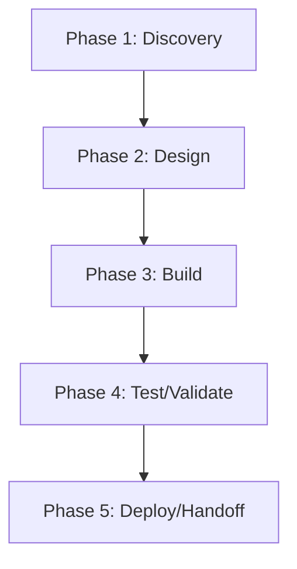

# thegent — Action Plan

> **Generated 2026-06-17.** Score grid: [`FLEET-AUDIT-30-PILLAR.md`](../FLEET-AUDIT-30-PILLAR.md). Source: [`thegent.json`](../../audits_data/thegent.json).

## Current state

- **Language:** Python
- **Mean score:** 1.16 (median 1)
- **Zero-pillar count:** 42 of 109
- **Three-pillar count:** 13 of 109
- **Blockers:** S7: no threat model, S8/SC2-SC4: no SLSA/SBOM/attestation, OB2-OB4: no metrics/traces/SLOs, AT1-AT5: N/A (CLI)

## Notes

Python agent runtime. Strong governance + 1544 test files. ADRs are a real plus. No SLSA/SBOM.

## Pillar distribution

| Score | Count | % |
|----|----:|----:|
| 3 (measured) | 13 | 11.9% |
| 2 (wired) | 33 | 30.3% |
| 1 (ad-hoc) | 21 | 19.3% |
| 0 (absent) | 42 | 38.5% |

## Phased WBS

### Phase 1: Discovery (≤3 tool calls per task)

- [ ] Read existing pillar evidence for each 0/1 score below
- [ ] Confirm scope of remediation with code owner

### Phase 2: Design (≤5 tool calls per task)

- [ ] Write ADR/decision record for any architectural change (A1-A5)
- [ ] Document coverage/SLO targets before writing the CI gate

### Phase 3: Build (≤15 tool calls per task)

**Tasks by role:**

#### agentic (1 tasks)

- [ ] **THE-004** `AS2` (Agentic safety) — score 1 → target 2: Lift AS2 (Agentic safety) from 1 to ≥2. Evidence: dry-run mode for some tools

#### api (2 tasks)

- [ ] **THE-002** `AP1` (API surface) — score 0 → target 2: Lift AP1 (API surface) from 0 to ≥2. Evidence: N/A
- [ ] **THE-003** `AP2` (API surface) — score 0 → target 2: Lift AP2 (API surface) from 0 to ≥2. Evidence: N/A

#### ci-ops (3 tasks)

- [ ] **THE-037** `Q2` (Quality eng) — score 0 → target 2: Lift Q2 (Quality eng) from 0 to ≥2. Evidence: no ratchet
- [ ] **THE-038** `Q3` (Quality eng) — score 0 → target 2: Lift Q3 (Quality eng) from 0 to ≥2. Evidence: no allowlist
- [ ] **THE-039** `Q4` (Quality eng) — score 1 → target 2: Lift Q4 (Quality eng) from 1 to ≥2. Evidence: 1 coverage workflow

#### data (3 tasks)

- [ ] **THE-017** `DA1` (Data/contracts) — score 0 → target 2: Lift DA1 (Data/contracts) from 0 to ≥2. Evidence: N/A — agent runtime
- [ ] **THE-018** `DA2` (Data/contracts) — score 0 → target 2: Lift DA2 (Data/contracts) from 0 to ≥2. Evidence: N/A
- [ ] **THE-019** `DA3` (Data/contracts) — score 0 → target 2: Lift DA3 (Data/contracts) from 0 to ≥2. Evidence: N/A

#### docs (2 tasks)

- [ ] **THE-015** `D2` (Documentation) — score 1 → target 2: Lift D2 (Documentation) from 1 to ≥2. Evidence: limited journey docs
- [ ] **THE-016** `D5` (Documentation) — score 1 → target 2: Lift D5 (Documentation) from 1 to ≥2. Evidence: no API ref deployed

#### frontend (11 tasks)

- [ ] **THE-005** `AT1` (Accessibility & i18n) — score 0 → target 2: Lift AT1 (Accessibility & i18n) from 0 to ≥2. Evidence: N/A
- [ ] **THE-006** `AT2` (Accessibility & i18n) — score 0 → target 2: Lift AT2 (Accessibility & i18n) from 0 to ≥2. Evidence: N/A
- [ ] **THE-007** `AT3` (Accessibility & i18n) — score 0 → target 2: Lift AT3 (Accessibility & i18n) from 0 to ≥2. Evidence: N/A
- [ ] **THE-008** `AT4` (Accessibility & i18n) — score 0 → target 2: Lift AT4 (Accessibility & i18n) from 0 to ≥2. Evidence: N/A
- [ ] **THE-009** `AT5` (Accessibility & i18n) — score 0 → target 2: Lift AT5 (Accessibility & i18n) from 0 to ≥2. Evidence: N/A
- [ ] **THE-054** `U1` (UX/Frontend) — score 0 → target 2: Lift U1 (UX/Frontend) from 0 to ≥2. Evidence: N/A — backend/CLI
- [ ] **THE-055** `U2` (UX/Frontend) — score 0 → target 2: Lift U2 (UX/Frontend) from 0 to ≥2. Evidence: N/A
- [ ] **THE-056** `U3` (UX/Frontend) — score 0 → target 2: Lift U3 (UX/Frontend) from 0 to ≥2. Evidence: N/A
- [ ] **THE-057** `U4` (UX/Frontend) — score 1 → target 2: Lift U4 (UX/Frontend) from 1 to ≥2. Evidence: CLI uses monospace
- [ ] **THE-058** `UX3` (User experience) — score 0 → target 2: Lift UX3 (User experience) from 0 to ≥2. Evidence: N/A
- [ ] **THE-059** `UX2` (User experience) — score 1 → target 2: Lift UX2 (User experience) from 1 to ≥2. Evidence: subcommand progressive disclosure

#### perf (6 tasks)

- [ ] **THE-010** `C3` (Cost) — score 1 → target 2: Lift C3 (Cost) from 1 to ≥2. Evidence: no ratchet
- [ ] **THE-028** `P2` (Performance) — score 0 → target 2: Lift P2 (Performance) from 0 to ≥2. Evidence: no flamegraph
- [ ] **THE-029** `P3` (Performance) — score 0 → target 2: Lift P3 (Performance) from 0 to ≥2. Evidence: N/A
- [ ] **THE-030** `P4` (Performance) — score 0 → target 2: Lift P4 (Performance) from 0 to ≥2. Evidence: no SLOs
- [ ] **THE-031** `P5` (Performance) — score 0 → target 2: Lift P5 (Performance) from 0 to ≥2. Evidence: N/A
- [ ] **THE-032** `P1` (Performance) — score 1 → target 2: Lift P1 (Performance) from 1 to ≥2. Evidence: limited profiling

#### qa (3 tasks)

- [ ] **THE-051** `T3` (Testing) — score 0 → target 2: Lift T3 (Testing) from 0 to ≥2. Evidence: no E2E
- [ ] **THE-052** `T4` (Testing) — score 0 → target 2: Lift T4 (Testing) from 0 to ≥2. Evidence: no contract tests
- [ ] **THE-053** `T6` (Testing) — score 1 → target 2: Lift T6 (Testing) from 1 to ≥2. Evidence: Linux only CI

#### rust-dev (13 tasks)

- [ ] **THE-001** `A1` (Architecture) — score 1 → target 2: Lift A1 (Architecture) from 1 to ≥2. Evidence: Python module structure; minimal hex
- [ ] **THE-012** `CN1` (Concurrency) — score 0 → target 2: Lift CN1 (Concurrency) from 0 to ≥2. Evidence: no race detection
- [ ] **THE-013** `CN2` (Concurrency) — score 1 → target 2: Lift CN2 (Concurrency) from 1 to ≥2. Evidence: asyncio cancellation in some places
- [ ] **THE-014** `CN3` (Concurrency) — score 1 → target 2: Lift CN3 (Concurrency) from 1 to ≥2. Evidence: agent tool calls have idempotency
- [ ] **THE-020** `EH2` (Error handling) — score 1 → target 2: Lift EH2 (Error handling) from 1 to ≥2. Evidence: sanitization partial
- [ ] **THE-035** `PS1` (Persistence) — score 0 → target 2: Lift PS1 (Persistence) from 0 to ≥2. Evidence: N/A
- [ ] **THE-036** `PS2` (Persistence) — score 0 → target 2: Lift PS2 (Persistence) from 0 to ≥2. Evidence: N/A
- [ ] **THE-042** `RT1` (Runtime compat) — score 1 → target 2: Lift RT1 (Runtime compat) from 1 to ≥2. Evidence: Python version pinned in pyproject.toml
- [ ] **THE-043** `RT2` (Runtime compat) — score 1 → target 2: Lift RT2 (Runtime compat) from 1 to ≥2. Evidence: Linux only
- [ ] **THE-060** `X3` (Code quality) — score 0 → target 2: Lift X3 (Code quality) from 0 to ≥2. Evidence: no complexity gate
- [ ] **THE-061** `X4` (Code quality) — score 0 → target 2: Lift X4 (Code quality) from 0 to ≥2. Evidence: no duplication
- [ ] **THE-062** `X5` (Code quality) — score 0 → target 2: Lift X5 (Code quality) from 0 to ≥2. Evidence: no dead code
- [ ] **THE-063** `X2` (Code quality) — score 1 → target 2: Lift X2 (Code quality) from 1 to ≥2. Evidence: Python type hints; not strict mypy in CI

#### security (10 tasks)

- [ ] **THE-011** `CF2` (Config) — score 1 → target 2: Lift CF2 (Config) from 1 to ≥2. Evidence: secrets stored in env, not in code
- [ ] **THE-033** `PR2` (Privacy) — score 0 → target 2: Lift PR2 (Privacy) from 0 to ≥2. Evidence: no retention policy
- [ ] **THE-034** `PR1` (Privacy) — score 1 → target 2: Lift PR1 (Privacy) from 1 to ≥2. Evidence: API keys; no PII in tool outputs
- [ ] **THE-044** `S7` (Security) — score 0 → target 2: Lift S7 (Security) from 0 to ≥2. Evidence: no threat model
- [ ] **THE-045** `S8` (Security) — score 0 → target 2: Lift S8 (Security) from 0 to ≥2. Evidence: no SLSA
- [ ] **THE-046** `S4` (Security) — score 1 → target 2: Lift S4 (Security) from 1 to ≥2. Evidence: API key auth model
- [ ] **THE-047** `S5` (Security) — score 1 → target 2: Lift S5 (Security) from 1 to ≥2. Evidence: CODEOWNERS gate (63 lines)
- [ ] **THE-048** `SC2` (Supply chain) — score 0 → target 2: Lift SC2 (Supply chain) from 0 to ≥2. Evidence: no SBOM
- [ ] **THE-049** `SC3` (Supply chain) — score 0 → target 2: Lift SC3 (Supply chain) from 0 to ≥2. Evidence: no attestation
- [ ] **THE-050** `SC4` (Supply chain) — score 0 → target 2: Lift SC4 (Supply chain) from 0 to ≥2. Evidence: no provenance

#### sre (9 tasks)

- [ ] **THE-021** `O2` (Operations) — score 0 → target 2: Lift O2 (Operations) from 0 to ≥2. Evidence: no runbooks
- [ ] **THE-022** `O3` (Operations) — score 0 → target 2: Lift O3 (Operations) from 0 to ≥2. Evidence: N/A
- [ ] **THE-023** `O4` (Operations) — score 0 → target 2: Lift O4 (Operations) from 0 to ≥2. Evidence: N/A
- [ ] **THE-024** `O5` (Operations) — score 0 → target 2: Lift O5 (Operations) from 0 to ≥2. Evidence: N/A
- [ ] **THE-025** `OB2` (Observability) — score 0 → target 2: Lift OB2 (Observability) from 0 to ≥2. Evidence: no metrics
- [ ] **THE-026** `OB3` (Observability) — score 0 → target 2: Lift OB3 (Observability) from 0 to ≥2. Evidence: no traces
- [ ] **THE-027** `OB4` (Observability) — score 0 → target 2: Lift OB4 (Observability) from 0 to ≥2. Evidence: no SLOs
- [ ] **THE-040** `RL3` (Resilience) — score 0 → target 2: Lift RL3 (Resilience) from 0 to ≥2. Evidence: no bulkheads
- [ ] **THE-041** `RL1` (Resilience) — score 1 → target 2: Lift RL1 (Resilience) from 1 to ≥2. Evidence: LLM API call retries present

### Phase 4: Test/Validate (≤5 tool calls per task)

- [ ] Run the new CI gate; verify it fails when evidence is removed
- [ ] Re-score the lifted pillars; confirm the audit JSON reflects the change

### Phase 5: Deploy/Handoff (≤3 tool calls per task)

- [ ] Commit + push the gate
- [ ] Open a PR with the action plan referenced in the body

## DAG (mermaid)

## Top 5 biggest deltas (pillars to lift first)

1. **AP1** — N/A
1. **AP2** — N/A
1. **AT1** — N/A
1. **AT2** — N/A
1. **AT3** — N/A

## Backlog of unaddressed items

Total 63 tasks across 11 roles. See "Build" phase above for the full list.
