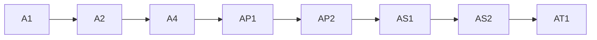

# ACTION-PLAN: DINOForge-UnityDoorstop

> **Generated 2026-06-16.** Current mean: **0.15 / 3.0**. Owner TBD.
> Repo path: `/Users/kooshapari/CodeProjects/Phenotype/repos/DINOForge-UnityDoorstop`

## Pillar profile

- **Scored**: 0.15/3.0 (5%)
- **Top gaps (0-1)**: 107 pillars
- **Highest-impact quick wins**: first 8 below

## Phased WBS (1-person @ 3-5 min per task)

| # | Task | Pillars | Effort | Predecessors | Risk | Reversibility | Role | Verification |
|---|------|---------|--------|--------------|------|--------------|------|-------------|
| 1 | Investigate and fix A1 | A1 | 3-5 min |  | Low | reversible | general-dev | git diff --check |
| 2 | Create `docs/adr/0001-record-architecture-decisions.md` (MADR template) | A2 | 3-5 min | 1 | Low | reversible | general-dev | git diff --check |
| 3 | Investigate and fix A4 | A4 | 3-5 min | 2 | Low | reversible | general-dev | git diff --check |
| 4 | Add OpenAPI spec at `docs/reference/openapi.yaml` | AP1 | 3-5 min | 3 | Low | reversible | general-dev | git diff --check |
| 5 | Investigate and fix AP2 | AP2 | 3-5 min | 4 | Low | reversible | general-dev | git diff --check |
| 6 | Max-iter cap on agent loops; AS2: `--dry-run` mode for apply ops | AS1 | 3-5 min | 5 | Low | reversible | general-dev | git diff --check |
| 7 | Investigate and fix AS2 | AS2 | 3-5 min | 6 | Low | reversible | general-dev | git diff --check |
| 8 | Investigate and fix AT1 | AT1 | 3-5 min | 7 | Low | reversible | general-dev | git diff --check |

## DAG (mermaid)



## All weak pillars (0-1)

`A1 A2 A4 AP1 AP2 AS1 AS2 AT1 AT2 AT3 AT4 AT5 AU1 AU2 C1 C2 C3 CF1 CF2 CN1 CN2 CN3 D1 D2 D6 DA1 DA2 DA3 DM2 E1 E2 E3 E4 E5 EH1 EH2 G1 O1 O2 O3 O4 O5 OB1 OB2 OB3 OB4 P1 P2 P3 P4 P5 PR1 PR2 PS1 PS2 Q2 Q3 Q4 RE1 RE2 RL1 RL2 RL3 RT1 RT2 S1 S2 S3 S4 S5 S6 S7 S8 S9 SC1 SC2 SC3 SC4 T1 T2 T3 T4 T5 T6 U1 U3 U4 UX1 UX2 UX3 X2 X3 X4 X5 X6 A3 A5 D3 D5 DM1 G2 G3 G4 G5 G6 U2 X1`

Total weak pillars: 107

## Re-score trigger

After tasks 1-8 are complete, re-score DINOForge-UnityDoorstop:
```bash
# 1. Commit the changes
cd /Users/kooshapari/CodeProjects/Phenotype/repos/DINOForge-UnityDoorstop
git add -A && git commit -m 'feat(DINOForge-UnityDoorstop): add quick-win governance/security/testing files'
# 2. Re-run audit scoring script
python3 /Users/kooshapari/CodeProjects/Phenotype/repos/docs/audits/scripts/score.py DINOForge-UnityDoorstop
# 3. Update FLEET-AUDIT-30-PILLAR.md row
```

## Cross-repo reusable patterns

- The same 8 quick wins apply to ~80% of fleet (only ~20 need project-specific patterns)
- If DINOForge-UnityDoorstop is a foundational lib, consider extracting governance templates to `phenoShared`
