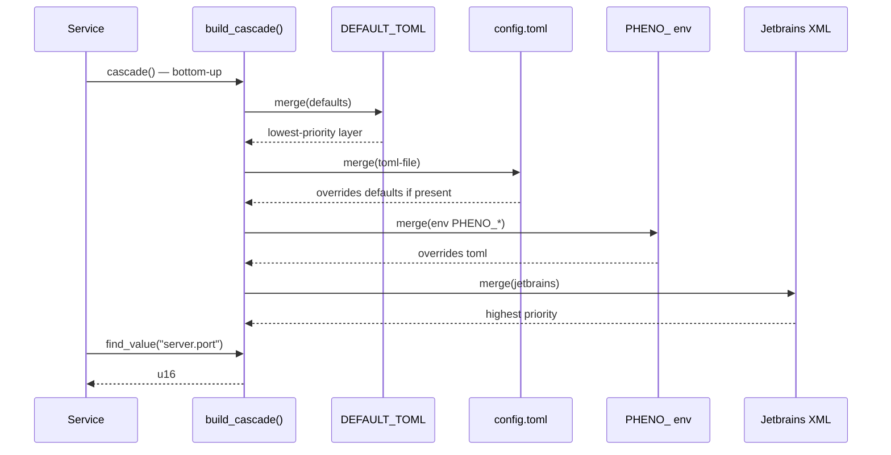

# Architecture — pheno-config

## Context

`pheno-config` is the **layered configuration cascade substrate** for the
`pheno-*` fleet. It is a thin, opinionated wrapper around
[`figment`](https://docs.rs/figment) that overlays four providers in a
fixed, fleet-wide priority order:

1. **`Jetbrains::default()`** — IntelliJ `.idea/runConfigurations/*.xml`
   (developer-machine shadow; highest priority so a developer can locally
   override a checked-in value without touching env vars or TOML).
2. **`Env::prefixed("PHENO_")`** — 12-factor env-var cascade.
3. **`Toml::file("config.toml")`** — checked-in defaults; soft-fails if
   the file is missing.
4. **`Toml::string(DEFAULT_TOML)`** — embedded compile-time defaults
   (lowest priority; always present).

The crate ships with a single public function (`build_cascade`) so every
service in the fleet reads config through the same priority chain.
`pheno-config` is a `pheno-*-lib` substrate per ADR-023 Rule 3.

The chain is built bottom-up because `Figment::merge` appends on top —
the last `merge` call wins, so the call order is
`defaults → toml-file → env → jetbrains`, which yields
`jetbrains > env > toml > default`.

## C4 — Container view

```mermaid
flowchart LR
    subgraph Sources
        Def[DEFAULT_TOML<br/>embedded compile-time string]
        Toml["config.toml"<br/>checked-in, optional"]
        EnvVars["PHENO_* env vars<br/>12-factor runtime"]
        Jet["Jetbrains run-config XML<br/>.idea/runConfigurations/"]
    end

    Cascade["build_cascade()<br/>Figment::new()<br/>.merge(...) x4"]
    Service[pheno-* service / binary]
    Config[("Typed config struct<br/>server / logging / database")]

    Def -->|priority 4| Cascade
    Toml -->|priority 3| Cascade
    EnvVars -->|priority 2| Cascade
    Jet -->|priority 1| Cascade

    Cascade -->|find_value| Service
    Service -->|deserialize| Config
```

### Cascade flow (sequence)



## Key decisions

| # | Decision | Rationale |
|---|----------|-----------|
| KD-1 | **Wrap `figment`, do not reimplement** | Battle-tested provider chain; we only add the canonical 4-provider priority + embedded `DEFAULT_TOML`. |
| KD-2 | **Priority order is fleet-wide immutable** | Any reorder breaks the "I can shadow a checked-in value in IntelliJ without touching env" invariant. ADR-022 enforces the order. |
| KD-3 | **Jetbrains provider at top** | Lets a developer override any value locally without modifying `config.toml` or shell env. Critical for the dogfood workflow (ADR-023). |
| KD-4 | **`config.toml` is optional** | Soft-fail — services must run with only `DEFAULT_TOML` + env. This keeps the substrate usable in CI and on the first commit. |
| KD-5 | **`PHENO_` env prefix** | 12-factor prefix; lets multiple Phenotype binaries coexist on one host (e.g. `PHENO_SERVER_PORT=9090` shadows `PHENO_DATABASE_PATH` cleanly). |
| KD-6 | **One public function (`build_cascade`)** | The substrate owns the chain shape; callers do not reassemble providers. Future variants (`build_cascade_from_str`) preserve the same priority. |
| KD-7 | **Zero runtime I/O at import** | The `Figment` is built lazily; `find_value` triggers the file read. This keeps CLI `--help` fast. |
| KD-8 | **No JSON Schema validation yet** | Deferred to a sibling crate (`pheno-config-schema`) — see Future state. |

## Future state

1. **`pheno-config-schema` sibling** — JSON Schema generation from
   `DEFAULT_TOML`; integrates with `pheno-llms-txt` for LLM-driven
   config authoring. Tracked under v18+.
2. **Hot-reload via `phenotype-configd`** — A federated service that
   watches `config.toml` and pushes updates to running services via
   `pheno-tracing` channels. See ADR-022.
3. **Secret scrubbing** — Integrate with `phenotype-vault` so a
   `secret://…` reference in TOML is resolved at `find_value` time
   (not stored in plain text).
4. **Config linting** — `scripts/lint-config.sh` that runs in CI and
   rejects `config.toml` files with unknown keys (catches drift from
   `DEFAULT_TOML`).
5. **Per-platform overrides** — `config.linux.toml`,
   `config.macos.toml`, `config.docker.toml` cascades on top of the
   base `config.toml` for fleet-critical platform-specific knobs.
6. **FLEET coverage** — Once a `pheno-config-schema` is in place,
   roll the cascade out to the remaining 5 substrate repos
   (config, tracing, MCP-router, observability, registry).

## Cross-references

- `pheno-config/src/cascade.rs` — implementation
- `pheno-config/tests/cascade_test.rs` — priority order proof tests
- `pheno-config/llms.txt` — LLM-facing quickstart
- ADR-022 — config consolidation policy
- ADR-023 — substrate quality bar (Rule 3.1)
