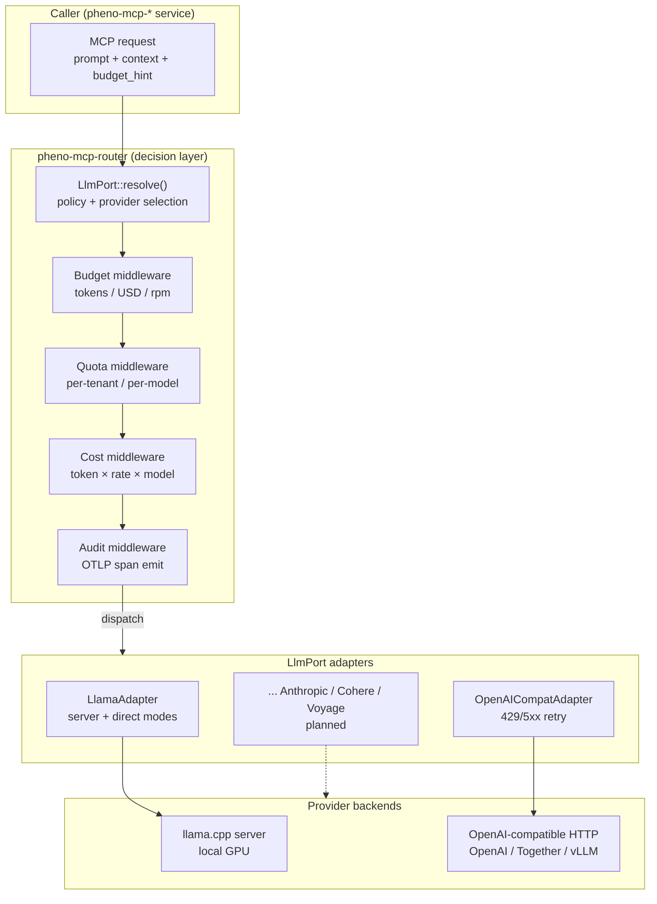
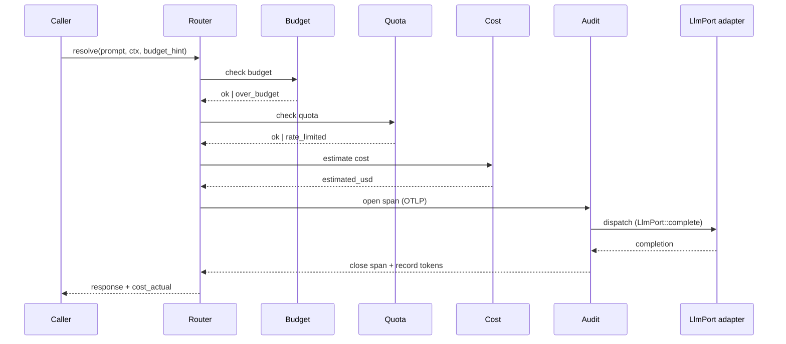

# Architecture — pheno-mcp-router

## Context

`pheno-mcp-router` is the **canonical MCP routing substrate** for the
`pheno-mcp-*` fleet. It owns the `LlmPort` trait, the provider
adapter protocol, the cost/budget/quota/audit middleware, and the
fleet-wide polyglot provider registry.

The substrate was bootstrapped from the `dispatch-mcp` W2-1 work
absorbed in the Dmouse92 → KooshaPari migration (ADR-029, L5-104.1,
3 PRs on `KooshaPari/pheno-mcp-router#1..#3`).

The router is the substrate for downstream `pheno-mcp-*` services
(per ADR-013, re-affirmed by ADR-037). It is **not** a transport
proxy; it is a **decision layer** that resolves "which LLM, at what
cost, under what budget, with what audit trail" before any request
crosses the network.

`pheno-mcp-router` is a `phenotype-*-sdk` substrate (polyglot,
cross-language, stable public API) per ADR-023 Rule 3.

## C4 — Container view

### Resolve flow (sequence)

## Key decisions

| # | Decision | Rationale |
|---|----------|-----------|
| KD-1 | **`LlmPort` is a trait, not a base class** | Polyglot — same trait shape in Python (the substrate's home language) and the Rust `pheno-mcp-*` consumers. |
| KD-2 | **Polyglot provider registry, not a hard-coded enum** | Lets the fleet add new providers (Anthropic, Cohere, Voyage, …) without modifying the router. The registry is data, not code. |
| KD-3 | **Decision layer, not a proxy** | The router is the policy boundary — cost, budget, quota, audit. It does not buffer or transform payloads beyond what the policy needs. |
| KD-4 | **OTLP audit on every dispatch** | ADR-023 Rule 3.1: every substrate ships observability. The `Audit` middleware emits a span per dispatch, with `tokens_in`, `tokens_out`, `cost_actual`, `provider`, `model`. |
| KD-5 | **429 / 5xx retry on `OpenAICompatAdapter`** | The OpenAI-compatible surface is the de-facto federation protocol; the adapter implements bounded exponential backoff (max 3 retries). |
| KD-6 | **`LlamaAdapter` supports server + direct modes** | Direct mode = subprocess + stdin/stdout; server mode = HTTP against a `llama.cpp` server. Caller chooses; the adapter shape is identical. |
| KD-7 | **Provider-specific cost model** | Cost is per-token × per-model-rate, looked up in the provider registry. The cost model is a trait so it can be swapped for Spot-pricing or commit-discount variants. |
| KD-8 | **No stateful session in the router** | Sessions are owned by the caller; the router is request-scoped. This keeps it horizontally scalable. |
| KD-9 | **Budget enforcement is fail-closed** | A request that exceeds budget is rejected *before* the adapter is invoked. This is a non-negotiable fleet policy. |

## Future state

1. **Streaming responses** — `LlmPort::stream()` returns an async
   iterator; the cost middleware meters tokens in flight. Tracked
   under v18 T-streaming.
2. **Additional providers** — `AnthropicAdapter`, `CohereAdapter`,
   `VoyageAdapter` (the latter for embeddings). v18+.
3. **Federation mTLS + OIDC** — Per ADR-046, the router authenticates
   cross-org callers via OIDC and pins the mTLS cert. v19+ work.
4. **Provider health checks** — Periodic probe (every 30s) of each
   adapter; unhealthy providers are demoted in the policy until they
   recover. v18+ observability extension.
5. **PII scrubbing** — A middleware that redacts emails, phone
   numbers, and `secret://…` references from prompts before they
   reach the provider. v19+ security work.
6. **Config-driven provider registry** — Move from
   code-registered to a `pheno-config` cascade that reads
   `providers.toml` so deployments can disable / pin providers
   without a binary rebuild.
7. **FLEET coverage** — Roll `LlmPort` adoption to the remaining 3
   downstream `pheno-mcp-*` services.

## Cross-references

- ADR-013 / ADR-037 — `pheno-mcp-router` substrate canonical
- ADR-029 / L5-104 — Dmouse92 → KooshaPari migration (3 PRs seeded
  the substrate)
- ADR-023 — substrate quality bar
- `KooshaPari/pheno-mcp-router#1` — `cost/budget/quota/audit` middleware
- `KooshaPari/pheno-mcp-router#2` — `LlamaAdapter`
- `KooshaPari/pheno-mcp-router#3` — `OpenAICompatAdapter`
- `phenotype-ops#2` — `llama-cpp` Docker compose for local dev
