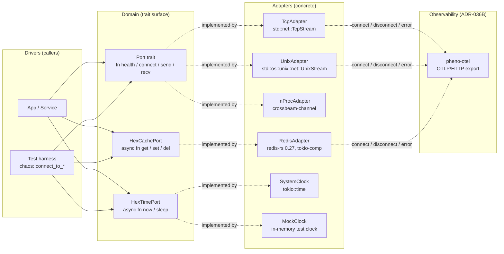
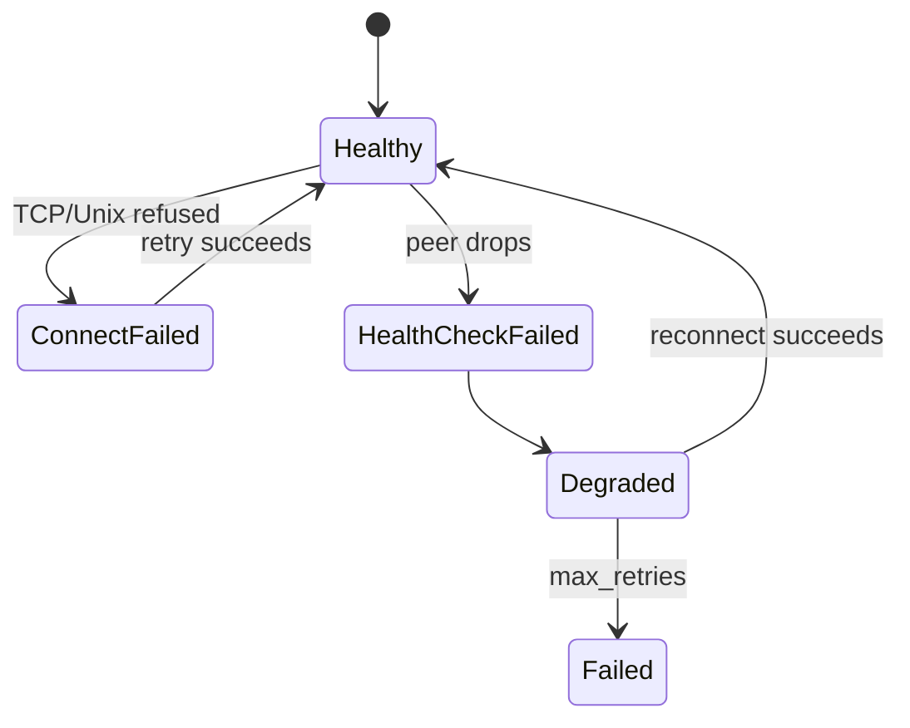
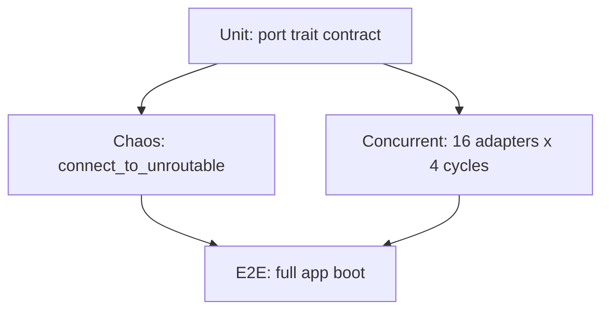

# Architecture — pheno-port-adapter

## Context

`pheno-port-adapter` is the **hexagonal port-adapter substrate** for
the `pheno-*` fleet. It owns:

- The `Port` trait shape (object-safe, `async-trait`-friendly).
- Concrete adapter implementations for the transport/cache/time
  ports: `TcpAdapter`, `UnixAdapter`, `InProcAdapter`, `RedisAdapter`,
  `SystemClock`, `MockClock`.
- Chaos / concurrency test harnesses that prove the port contract
  under failure (L11 anti-fragility, L7 subsystem convention).
- OTLP observability via `pheno-otel` (ADR-012, ADR-036B) for every
  adapter lifecycle event (connect / disconnect / error).

The substrate is a `pheno-*-lib` per ADR-023 Rule 3. Downstream
`pheno-*` crates depend on the trait, never on a concrete adapter,
so the fleet can swap `TcpAdapter` for `UnixAdapter` (or vice versa)
without changing call sites.

The port-adapter pattern is the **canonical L4 hexagonal pattern** for
the fleet (ADR-014, re-affirmed by ADR-038). A linter
(`scripts/check-hex-ports.sh`, T4 of v17) verifies that every
adapter implements `Port`.

## C4 — Container view

### Error classification (L11 anti-fragility)

### Test pyramid

## Key decisions

| # | Decision | Rationale |
|---|----------|-----------|
| KD-1 | **Hexagonal port-adapter (L4 canonical)** | Per ADR-014 / ADR-038 — every transport / cache / time boundary is a `Port` trait + concrete adapter. The fleet never depends on a concrete transport. |
| KD-2 | **`async-trait` for object-safety** | Callers hold `Box<dyn Port>` / `Box<dyn HexCachePort>` in service locators. Object-safety is non-negotiable. |
| KD-3 | **Single tokio runtime** | One executor for the whole crate. No async-std, no smol. Per the v17 async-runtime decision (T6). |
| KD-4 | **`redis-rs` with `tokio-comp` + `connection-manager`** | Auto-reconnect + tokio integration. The `RedisAdapter` returns the connection manager so reconnection is invisible to callers. |
| KD-5 | **OTLP observability via `pheno-otel`** | Every connect / disconnect / error emits a span. The substrate ships observability by default (ADR-023 Rule 3.1). |
| KD-6 | **Chaos test suite (L11)** | `tests/chaos_connect_to_unroutable.rs` and friends prove graceful degradation. Bounded retry, exponential backoff, max-retries terminal state. |
| KD-7 | **In-memory adapters (`InProcAdapter`, `MockClock`)** | Test-only adapters that never touch the network. Used by the unit + concurrent test layers. |
| KD-8 | **`#![deny(missing_docs)]` + `#![deny(unsafe_code)]`** | L12 type-safety convention. Every public item is documented; no `unsafe` in substrate code. |
| KD-9 | **Lints enforced in `Cargo.toml`** | `rust-version = "1.82"`, `rust_2018_idioms`, custom `deny.toml` for the fleet. |

## Future state

1. **More adapters** — `HttpAdapter` (reqwest), `GrpcAdapter`
   (tonic), `QuicAdapter` (quinn). v18+ when a consumer needs them.
2. **Retry middleware** — Move bounded-retry from the
   `RedisAdapter` into a generic `RetryAdapter<P: Port>` so every
   transport gets the same backoff curve.
3. **Health-check policy** — Move the `HealthCheck` state machine
   from a per-adapter concern into a `HealthCheckPolicy` trait so
   multiple adapters can share a single health verdict.
4. **Metrics port** — `HexMetricsPort` (counter / gauge / histogram)
   backed by a `PrometheusAdapter` (Pushgateway) and a
   `OtlpMetricsAdapter`. v19+.
5. **Wire-format port** — `HexWirePort` for serde-stable message
   framing across the fleet (replaces ad-hoc `bincode` / `postcard`
   call sites). v19+.
6. **Linter adoption** — Roll `scripts/check-hex-ports.sh` out to
   the remaining 4 substrate repos (config, tracing, MCP-router,
   observability).
7. **FLEET coverage** — Once `HexMetricsPort` lands, drop the
   bespoke metrics paths in 6 downstream services.

## Cross-references

- ADR-014 / ADR-038 — hexagonal port-adapter L4 policy
- ADR-012 / ADR-036B — `pheno-tracing` / OTLP observability
- ADR-023 — substrate quality bar (Rule 3.1)
- `pheno-port-adapter/src/lib.rs` — trait surface
- `pheno-port-adapter/src/adapters/` — concrete adapters
- `pheno-port-adapter/tests/chaos_*` — L11 anti-fragility tests
- v17 T4 — `scripts/check-hex-ports.sh` linter (Wave A)
- v17 T7 — chaos tests rolled to 5 critical crates
