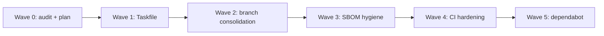

# Block-C Consolidation Plan — KooshaPari/services

**Plan date:** 2026-06-16  
**Source audit:** [`BLOCK-C-AUDIT.md`](./BLOCK-C-AUDIT.md) (2026-06-15)  
**Repo:** https://github.com/KooshaPari/services  
**Base branch:** `main` (promote to default — see W2.2)  
**Scope:** SBOM registry hygiene and governance; no application source code exists in this repo.

---

## Goal

Make `services` a trustworthy, CI-verified CycloneDX SBOM registry: valid Taskfile, no host-specific paths in SBOMs, `main` as default branch, and automated freshness/integrity checks.

---

## Wave 0 — Land audit + plan (this PR)

| ID | Deliverable |
|----|-------------|
| W0.1 | `docs/audit/BLOCK-C-AUDIT.md` (committed) |
| W0.2 | `docs/audit/BLOCK-C-CONSOLIDATION-PLAN.md` (this file) |

---

## Wave 1 — Tooling fixes (unblock `task verify`)

| ID | Task | Audit ref | Branch |
|----|------|-----------|--------|
| W1.1 | Fix `Taskfile.yml:16-17` `for: { var: SERVICES }` syntax for Task v3.x | §3, §11 rec #1 | `fix/taskfile-yaml-syntax` |
| W1.2 | Confirm `task validate` and `task verify` exit 0 | §2 | same PR |

**Exit criteria:** `task --version` + `task verify` pass locally and in CI.

---

## Wave 2 — Branch + default-branch consolidation

| ID | Task | Audit ref |
|----|------|-----------|
| W2.1 | Merge duplicate `governance/2026-06-10` and `governance/services-2026-06-10` (identical tips) | §9 |
| W2.2 | Fast-forward `main` to match `chore/dependabot-2026-06-08` tip (`0d7262c`) | §9 |
| W2.3 | Set GitHub default branch to `main` | §9 |
| W2.4 | Update `.github/workflows/ci.yml` triggers to match default branch | §9 |

**Exit criteria:** `origin/HEAD -> origin/main`; CI runs on default-branch pushes.

---

## Wave 3 — SBOM data hygiene

| ID | Task | Audit ref |
|----|------|-----------|
| W3.1 | Strip `/Users/kooshapari/...` prefixes from all `bom-ref` values in both `*.cdx.json` files | §4, rec #2 |
| W3.2 | Add CI step: fail if `path+file:///Users/` appears in any `*.cdx.json` | rec #2 |
| W3.3 | Reconcile `AGENTS.md` CycloneDX version claim with actual `specVersion` in files | §5, rec #3 |
| W3.4 | Either restore missing R3 spec or remove claim from `STATUS.md:18` | §5, rec #3 |

**Exit criteria:** SBOMs are host-agnostic; docs match file contents.

---

## Wave 4 — CI hardening

| ID | Task | Audit ref |
|----|------|-----------|
| W4.1 | Trim `dependabot.yml` to `github-actions` only (no phantom ecosystems) | rec #4 |
| W4.2 | Pin TruffleHog to release tag (not `@main`) | rec #5 |
| W4.3 | Add `osv-scanner` or equivalent SCA against SBOM purls | rec #6 |
| W4.4 | Fail CI if SBOM `metadata.timestamp` older than 7 days | rec #9 |
| W4.5 | Regression test: component count, no `Users/` strings, spec version | rec #10 |

**Exit criteria:** CI enforces freshness, path hygiene, and JSON validity.

---

## Wave 5 — Dependabot PR

| PR | Action |
|----|--------|
| #1 `actions/checkout` v4 → v6 | Merge after W2 (CI on `main` is green) |

---

## Dependency graph

---

## Success metrics

| Metric | Baseline (audit) | Target |
|--------|------------------|--------|
| Code LOC | 0 | 0 (unchanged — data registry) |
| `task verify` | exit 109 | exit 0 |
| Host paths in SBOMs | present | 0 |
| Default branch | `chore/dependabot-2026-06-08` | `main` |
| Duplicate governance branches | 2 | 0 |

---

*Companion to Tokn Block-C plan. Fleet index: see `KooshaPari/Tokn` `docs/audit/BLOCK-C-CONSOLIDATION-PLAN.md` §Out of scope.*
